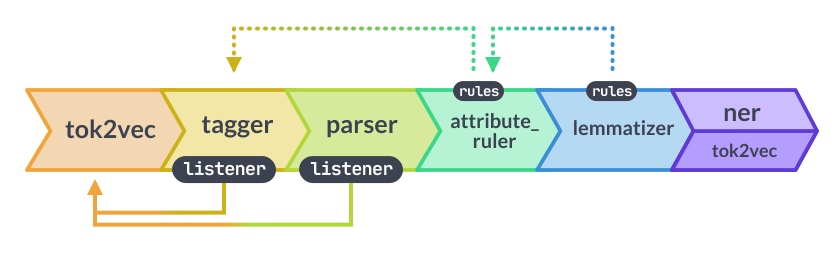

<!-- TODO: include interactive demo -->

### Quickstart {hidden="true"}

> #### 📖 Installation and usage
>
> For more details on how to use trained pipelines with spaCy, see the
> [usage guide](/usage/models).

import QuickstartModels from 'widgets/quickstart-models.js'

<QuickstartModels id="quickstart" />

## Package naming conventions {#conventions}

In general, spaCy expects all pipeline packages to follow the naming convention
of `[lang]\_[name]`. For spaCy's pipelines, we also chose to divide the name
into three components:

1. **Type:** Capabilities (e.g. `core` for general-purpose pipeline with
   tagging, parsing, lemmatization and named entity recognition, or `dep` for
   only tagging, parsing and lemmatization).
2. **Genre:** Type of text the pipeline is trained on, e.g. `web` or `news`.
3. **Size:** Package size indicator, `sm`, `md`, `lg` or `trf`.

   `sm` and `trf` pipelines have no static word vectors.

   For pipelines with default vectors, `md` has a reduced word vector table with
   20k unique vectors for ~500k words and `lg` has a large word vector table
   with ~500k entries.

   For pipelines with floret vectors, `md` vector tables have 50k entries and
   `lg` vector tables have 200k entries.

For example, [`en_core_web_sm`](/models/en#en_core_web_sm) is a small English
pipeline trained on written web text (blogs, news, comments), that includes
vocabulary, syntax and entities.

### Package versioning {#model-versioning}

Additionally, the pipeline package versioning reflects both the compatibility
with spaCy, as well as the model version. A package version `a.b.c` translates
to:

- `a`: **spaCy major version**. For example, `2` for spaCy v2.x.
- `b`: **spaCy minor version**. For example, `3` for spaCy v2.3.x.
- `c`: **Model version**. Different model config: e.g. from being trained on
  different data, with different parameters, for different numbers of
  iterations, with different vectors, etc.

For a detailed compatibility overview, see the
[`compatibility.json`](https://github.com/explosion/spacy-models/tree/master/compatibility.json).
This is also the source of spaCy's internal compatibility check, performed when
you run the [`download`](/api/cli#download) command.

## Trained pipeline design {#design}

The spaCy v3 trained pipelines are designed to be efficient and configurable.
For example, multiple components can share a common "token-to-vector" model and
it's easy to swap out or disable the lemmatizer. The pipelines are designed to
be efficient in terms of speed and size and work well when the pipeline is run
in full.

When modifying a trained pipeline, it's important to understand how the
components **depend on** each other. Unlike spaCy v2, where the `tagger`,
`parser` and `ner` components were all independent, some v3 components depend on
earlier components in the pipeline. As a result, disabling or reordering
components can affect the annotation quality or lead to warnings and errors.

Main changes from spaCy v2 models:

- The [`Tok2Vec`](/api/tok2vec) component may be a separate, shared component. A
  component like a tagger or parser can
  [listen](/api/architectures#Tok2VecListener) to an earlier `tok2vec` or
  `transformer` rather than having its own separate tok2vec layer.
- Rule-based exceptions move from individual components to the
  `attribute_ruler`. Lemma and POS exceptions move from the tokenizer exceptions
  to the attribute ruler and the tag map and morph rules move from the tagger to
  the attribute ruler.
- The lemmatizer tables and processing move from the vocab and tagger to a
  separate `lemmatizer` component.

### CNN/CPU pipeline design {#design-cnn}



In the `sm`/`md`/`lg` models:

- The `tagger`, `morphologizer` and `parser` components listen to the `tok2vec`
  component. If the lemmatizer is trainable (v3.3+), `lemmatizer` also listens
  to `tok2vec`.
- The `attribute_ruler` maps `token.tag` to `token.pos` if there is no
  `morphologizer`. The `attribute_ruler` additionally makes sure whitespace is
  tagged consistently and copies `token.pos` to `token.tag` if there is no
  tagger. For English, the attribute ruler can improve its mapping from
  `token.tag` to `token.pos` if dependency parses from a `parser` are present,
  but the parser is not required.
- The `lemmatizer` component for many languages requires `token.pos` annotation
  from either `tagger`+`attribute_ruler` or `morphologizer`.
- The `ner` component is independent with its own internal tok2vec layer.

#### CNN/CPU pipelines with floret vectors

The Finnish, Korean and Swedish `md` and `lg` pipelines use
[floret vectors](/usage/v3-2#vectors) instead of default vectors. If you're
running a trained pipeline on texts and working with [`Doc`](/api/doc) objects,
you shouldn't notice any difference with floret vectors. With floret vectors no
tokens are out-of-vocabulary, so [`Token.is_oov`](/api/token#attributes) will
return `False` for all tokens.

If you access vectors directly for similarity comparisons, there are a few
differences because floret vectors don't include a fixed word list like the
vector keys for default vectors.

- If your workflow iterates over the vector keys, you need to use an external
  word list instead:

  ```diff
  - lexemes = [nlp.vocab[orth] for orth in nlp.vocab.vectors]
  + lexemes = [nlp.vocab[word] for word in external_word_list]
  ```

- [`Vectors.most_similar`](/api/vectors#most_similar) is not supported because
  there's no fixed list of vectors to compare your vectors to.

### Transformer pipeline design {#design-trf}

In the transformer (`trf`) models, the `tagger`, `parser` and `ner` (if present)
all listen to the `transformer` component. The `attribute_ruler` and
`lemmatizer` have the same configuration as in the CNN models.

### Modifying the default pipeline {#design-modify}

For faster processing, you may only want to run a subset of the components in a
trained pipeline. The `disable` and `exclude` arguments to
[`spacy.load`](/api/top-level#spacy.load) let you control which components are
loaded and run. Disabled components are loaded in the background so it's
possible to reenable them in the same pipeline in the future with
[`nlp.enable_pipe`](/api/language/#enable_pipe). To skip loading a component
completely, use `exclude` instead of `disable`.

#### Disable part-of-speech tagging and lemmatization

To disable part-of-speech tagging and lemmatization, disable the `tagger`,
`morphologizer`, `attribute_ruler` and `lemmatizer` components.

```python
# Note: English doesn't include a morphologizer
nlp = spacy.load("en_core_web_sm", disable=["tagger", "attribute_ruler", "lemmatizer"])
nlp = spacy.load("en_core_web_trf", disable=["tagger", "attribute_ruler", "lemmatizer"])
```

<Infobox variant="warning" title="Rule-based and POS-lookup lemmatizers require
Token.pos">

The lemmatizer depends on `tagger`+`attribute_ruler` or `morphologizer` for a
number of languages. If you disable any of these components, you'll see
lemmatizer warnings unless the lemmatizer is also disabled.

**v3.3**: Catalan, English, French, Russian and Spanish

**v3.0-v3.2**: Catalan, Dutch, English, French, Greek, Italian, Macedonian,
Norwegian, Polish, Russian and Spanish

</Infobox>

#### Use senter rather than parser for fast sentence segmentation

If you need fast sentence segmentation without dependency parses, disable the
`parser` use the `senter` component instead:

```python
nlp = spacy.load("en_core_web_sm")
nlp.disable_pipe("parser")
nlp.enable_pipe("senter")
```

The `senter` component is ~10&times; faster than the parser and more accurate
than the rule-based `sentencizer`.

#### Switch from trainable lemmatizer to default lemmatizer

Since v3.3, a number of pipelines use a trainable lemmatizer. You can check whether
the lemmatizer is trainable:

```python
nlp = spacy.load("de_core_web_sm")
assert nlp.get_pipe("lemmatizer").is_trainable
```

If you'd like to switch to a non-trainable lemmatizer that's similar to v3.2 or
earlier, you can replace the trainable lemmatizer with the default non-trainable
lemmatizer:

```python
# Requirements: pip install spacy-lookups-data
nlp = spacy.load("de_core_web_sm")
# Remove existing lemmatizer
nlp.remove_pipe("lemmatizer")
# Add non-trainable lemmatizer from language defaults
# and load lemmatizer tables from spacy-lookups-data
nlp.add_pipe("lemmatizer").initialize()
```

#### Switch from rule-based to lookup lemmatization

For the Dutch, English, French, Greek, Macedonian, Norwegian and Spanish
pipelines, you can swap out a trainable or rule-based lemmatizer for a lookup
lemmatizer:

```python
# Requirements: pip install spacy-lookups-data
nlp = spacy.load("en_core_web_sm")
nlp.remove_pipe("lemmatizer")
nlp.add_pipe("lemmatizer", config={"mode": "lookup"}).initialize()
```

#### Disable everything except NER

For the non-transformer models, the `ner` component is independent, so you can
disable everything else:

```python
nlp = spacy.load("en_core_web_sm", disable=["tok2vec", "tagger", "parser", "attribute_ruler", "lemmatizer"])
```

In the transformer models, `ner` listens to the `transformer` component, so you
can disable all components related tagging, parsing, and lemmatization.

```python
nlp = spacy.load("en_core_web_trf", disable=["tagger", "parser", "attribute_ruler", "lemmatizer"])
```

#### Move NER to the end of the pipeline

<Infobox title="For v3.0.x models only" variant="warning">

As of v3.1, the NER component is at the end of the pipeline by default.

</Infobox>

For access to `POS` and `LEMMA` features in an `entity_ruler`, move `ner` to the
end of the pipeline after `attribute_ruler` and `lemmatizer`:

```python
# load without NER
nlp = spacy.load("en_core_web_sm", exclude=["ner"])

# source NER from the same pipeline package as the last component
nlp.add_pipe("ner", source=spacy.load("en_core_web_sm"))

# insert the entity ruler
nlp.add_pipe("entity_ruler", before="ner")
```
