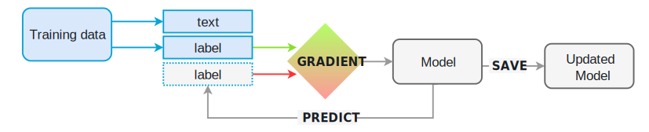

spaCy's models are **statistical** and every "decision" they make – for example,
which part-of-speech tag to assign, or whether a word is a named entity – is a
**prediction**. This prediction is based on the examples the model has seen
during **training**. To train a model, you first need training data – examples
of text, and the labels you want the model to predict. This could be a
part-of-speech tag, a named entity or any other information.

The model is then shown the unlabelled text and will make a prediction. Because
we know the correct answer, we can give the model feedback on its prediction in
the form of an **error gradient** of the **loss function** that calculates the
difference between the training example and the expected output. The greater the
difference, the more significant the gradient and the updates to our model.

> - **Training data:** Examples and their annotations.
> - **Text:** The input text the model should predict a label for.
> - **Label:** The label the model should predict.
> - **Gradient:** Gradient of the loss function calculating the difference
>   between input and expected output.

When training a model, we don't just want it to memorize our examples – we want
it to come up with theory that can be **generalized across other examples**.
After all, we don't just want the model to learn that this one instance of
"Amazon" right here is a company – we want it to learn that "Amazon", in
contexts _like this_, is most likely a company. That's why the training data
should always be representative of the data we want to process. A model trained
on Wikipedia, where sentences in the first person are extremely rare, will
likely perform badly on Twitter. Similarly, a model trained on romantic novels
will likely perform badly on legal text.

This also means that in order to know how the model is performing, and whether
it's learning the right things, you don't only need **training data** – you'll
also need **evaluation data**. If you only test the model with the data it was
trained on, you'll have no idea how well it's generalizing. If you want to train
a model from scratch, you usually need at least a few hundred examples for both
training and evaluation. To update an existing model, you can already achieve
decent results with very few examples – as long as they're representative.
