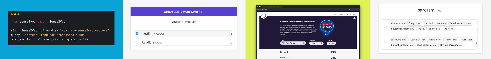

import Infobox from 'components/infobox'

Similarity is determined by comparing **word vectors** or "word embeddings",
multi-dimensional meaning representations of a word. Word vectors can be
generated using an algorithm like
[word2vec](https://en.wikipedia.org/wiki/Word2vec) and usually look like this:

```python
### banana.vector
array([2.02280000e-01,  -7.66180009e-02,   3.70319992e-01,
       3.28450017e-02,  -4.19569999e-01,   7.20689967e-02,
      -3.74760002e-01,   5.74599989e-02,  -1.24009997e-02,
       5.29489994e-01,  -5.23800015e-01,  -1.97710007e-01,
      -3.41470003e-01,   5.33169985e-01,  -2.53309999e-02,
       1.73800007e-01,   1.67720005e-01,   8.39839995e-01,
       5.51070012e-02,   1.05470002e-01,   3.78719985e-01,
       2.42750004e-01,   1.47449998e-02,   5.59509993e-01,
       1.25210002e-01,  -6.75960004e-01,   3.58420014e-01,
       # ... and so on ...
       3.66849989e-01,   2.52470002e-03,  -6.40089989e-01,
      -2.97650009e-01,   7.89430022e-01,   3.31680000e-01,
      -1.19659996e+00,  -4.71559986e-02,   5.31750023e-01], dtype=float32)
```

<Infobox title="Important note" variant="warning">

To make them compact and fast, spaCy's small [pipeline packages](/models) (all
packages that end in `sm`) **don't ship with word vectors**, and only include
context-sensitive **tensors**. This means you can still use the `similarity()`
methods to compare documents, spans and tokens – but the result won't be as
good, and individual tokens won't have any vectors assigned. So in order to use
_real_ word vectors, you need to download a larger pipeline package:

```diff
- python -m spacy download en_core_web_sm
+ python -m spacy download en_core_web_lg
```

</Infobox>

Pipeline packages that come with built-in word vectors make them available as
the [`Token.vector`](/api/token#vector) attribute.
[`Doc.vector`](/api/doc#vector) and [`Span.vector`](/api/span#vector) will
default to an average of their token vectors. You can also check if a token has
a vector assigned, and get the L2 norm, which can be used to normalize vectors.

```python
### {executable="true"}
import spacy

nlp = spacy.load("en_core_web_md")
tokens = nlp("dog cat banana afskfsd")

for token in tokens:
    print(token.text, token.has_vector, token.vector_norm, token.is_oov)
```

> - **Text**: The original token text.
> - **has vector**: Does the token have a vector representation?
> - **Vector norm**: The L2 norm of the token's vector (the square root of the
>   sum of the values squared)
> - **OOV**: Out-of-vocabulary

The words "dog", "cat" and "banana" are all pretty common in English, so they're
part of the pipeline's vocabulary, and come with a vector. The word "afskfsd" on
the other hand is a lot less common and out-of-vocabulary – so its vector
representation consists of 300 dimensions of `0`, which means it's practically
nonexistent. If your application will benefit from a **large vocabulary** with
more vectors, you should consider using one of the larger pipeline packages or
loading in a full vector package, for example,
[`en_core_web_lg`](/models/en#en_core_web_lg), which includes **685k unique
vectors**.

spaCy is able to compare two objects, and make a prediction of **how similar
they are**. Predicting similarity is useful for building recommendation systems
or flagging duplicates. For example, you can suggest a user content that's
similar to what they're currently looking at, or label a support ticket as a
duplicate if it's very similar to an already existing one.

Each [`Doc`](/api/doc), [`Span`](/api/span), [`Token`](/api/token) and
[`Lexeme`](/api/lexeme) comes with a [`.similarity`](/api/token#similarity)
method that lets you compare it with another object, and determine the
similarity. Of course similarity is always subjective – whether two words, spans
or documents are similar really depends on how you're looking at it. spaCy's
similarity implementation usually assumes a pretty general-purpose definition of
similarity.

> #### 📝 Things to try
>
> 1. Compare two different tokens and try to find the two most _dissimilar_
>    tokens in the texts with the lowest similarity score (according to the
>    vectors).
> 2. Compare the similarity of two [`Lexeme`](/api/lexeme) objects, entries in
>    the vocabulary. You can get a lexeme via the `.lex` attribute of a token.
>    You should see that the similarity results are identical to the token
>    similarity.

```python
### {executable="true"}
import spacy

nlp = spacy.load("en_core_web_md")  # make sure to use larger package!
doc1 = nlp("I like salty fries and hamburgers.")
doc2 = nlp("Fast food tastes very good.")

# Similarity of two documents
print(doc1, "<->", doc2, doc1.similarity(doc2))
# Similarity of tokens and spans
french_fries = doc1[2:4]
burgers = doc1[5]
print(french_fries, "<->", burgers, french_fries.similarity(burgers))
```

### What to expect from similarity results {#similarity-expectations}

Computing similarity scores can be helpful in many situations, but it's also
important to maintain **realistic expectations** about what information it can
provide. Words can be related to each other in many ways, so a single
"similarity" score will always be a **mix of different signals**, and vectors
trained on different data can produce very different results that may not be
useful for your purpose. Here are some important considerations to keep in mind:

- There's no objective definition of similarity. Whether "I like burgers" and "I
  like pasta" is similar **depends on your application**. Both talk about food
  preferences, which makes them very similar – but if you're analyzing mentions
  of food, those sentences are pretty dissimilar, because they talk about very
  different foods.
- The similarity of [`Doc`](/api/doc) and [`Span`](/api/span) objects defaults
  to the **average** of the token vectors. This means that the vector for "fast
  food" is the average of the vectors for "fast" and "food", which isn't
  necessarily representative of the phrase "fast food".
- Vector averaging means that the vector of multiple tokens is **insensitive to
  the order** of the words. Two documents expressing the same meaning with
  dissimilar wording will return a lower similarity score than two documents
  that happen to contain the same words while expressing different meanings.

<Infobox title="Tip: Check out sense2vec" emoji="💡">

[](https://github.com/explosion/sense2vec)

[`sense2vec`](https://github.com/explosion/sense2vec) is a library developed by
us that builds on top of spaCy and lets you train and query more interesting and
detailed word vectors. It combines noun phrases like "fast food" or "fair game"
and includes the part-of-speech tags and entity labels. The library also
includes annotation recipes for our annotation tool [Prodigy](https://prodi.gy)
that let you evaluate vectors and create terminology lists. For more details,
check out [our blog post](https://explosion.ai/blog/sense2vec-reloaded). To
explore the semantic similarities across all Reddit comments of 2015 and 2019,
see the [interactive demo](https://explosion.ai/demos/sense2vec).

</Infobox>
