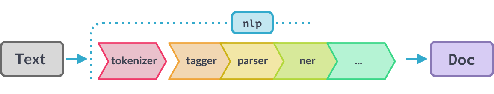

Processing raw text intelligently is difficult: most words are rare, and it's
common for words that look completely different to mean almost the same thing.
The same words in a different order can mean something completely different.
Even splitting text into useful word-like units can be difficult in many
languages. While it's possible to solve some problems starting from only the raw
characters, it's usually better to use linguistic knowledge to add useful
information. That's exactly what spaCy is designed to do: you put in raw text,
and get back a [`Doc`](/api/doc) object, that comes with a variety of
annotations.

## Part-of-speech tagging {#pos-tagging model="tagger, parser"}

import PosDeps101 from 'usage/101/\_pos-deps.md'

<PosDeps101 />

<Infobox title="Part-of-speech tag scheme" emoji="📖">

For a list of the fine-grained and coarse-grained part-of-speech tags assigned
by spaCy's models across different languages, see the label schemes documented
in the [models directory](/models).

</Infobox>

## Morphology {#morphology}

Inflectional morphology is the process by which a root form of a word is
modified by adding prefixes or suffixes that specify its grammatical function
but do not change its part-of-speech. We say that a **lemma** (root form) is
**inflected** (modified/combined) with one or more **morphological features** to
create a surface form. Here are some examples:

| Context                                  | Surface | Lemma | POS    | Morphological Features                   |
| ---------------------------------------- | ------- | ----- | ------ | ---------------------------------------- |
| I was reading the paper                  | reading | read  | `VERB` | `VerbForm=Ger`                           |
| I don't watch the news, I read the paper | read    | read  | `VERB` | `VerbForm=Fin`, `Mood=Ind`, `Tense=Pres` |
| I read the paper yesterday               | read    | read  | `VERB` | `VerbForm=Fin`, `Mood=Ind`, `Tense=Past` |

Morphological features are stored in the
[`MorphAnalysis`](/api/morphology#morphanalysis) under `Token.morph`, which
allows you to access individual morphological features.

> #### 📝 Things to try
>
> 1. Change "I" to "She". You should see that the morphological features change
>    and express that it's a pronoun in the third person.
> 2. Inspect `token.morph` for the other tokens.

```python
### {executable="true"}
import spacy

nlp = spacy.load("en_core_web_sm")
print("Pipeline:", nlp.pipe_names)
doc = nlp("I was reading the paper.")
token = doc[0]  # 'I'
print(token.morph)  # 'Case=Nom|Number=Sing|Person=1|PronType=Prs'
print(token.morph.get("PronType"))  # ['Prs']
```

### Statistical morphology {#morphologizer new="3" model="morphologizer"}

spaCy's statistical [`Morphologizer`](/api/morphologizer) component assigns the
morphological features and coarse-grained part-of-speech tags as `Token.morph`
and `Token.pos`.

```python
### {executable="true"}
import spacy

nlp = spacy.load("de_core_news_sm")
doc = nlp("Wo bist du?") # English: 'Where are you?'
print(doc[2].morph)  # 'Case=Nom|Number=Sing|Person=2|PronType=Prs'
print(doc[2].pos_) # 'PRON'
```

### Rule-based morphology {#rule-based-morphology}

For languages with relatively simple morphological systems like English, spaCy
can assign morphological features through a rule-based approach, which uses the
**token text** and **fine-grained part-of-speech tags** to produce
coarse-grained part-of-speech tags and morphological features.

1. The part-of-speech tagger assigns each token a **fine-grained part-of-speech
   tag**. In the API, these tags are known as `Token.tag`. They express the
   part-of-speech (e.g. verb) and some amount of morphological information, e.g.
   that the verb is past tense (e.g. `VBD` for a past tense verb in the Penn
   Treebank) .
2. For words whose coarse-grained POS is not set by a prior process, a
   [mapping table](#mappings-exceptions) maps the fine-grained tags to a
   coarse-grained POS tags and morphological features.

```python
### {executable="true"}
import spacy

nlp = spacy.load("en_core_web_sm")
doc = nlp("Where are you?")
print(doc[2].morph)  # 'Case=Nom|Person=2|PronType=Prs'
print(doc[2].pos_)  # 'PRON'
```

## Lemmatization {#lemmatization model="lemmatizer" new="3"}

spaCy provides two pipeline components for lemmatization:

1. The [`Lemmatizer`](/api/lemmatizer) component provides lookup and rule-based
   lemmatization methods in a configurable component. An individual language can
   extend the `Lemmatizer` as part of its [language data](#language-data).
2. The [`EditTreeLemmatizer`](/api/edittreelemmatizer)
   <Tag variant="new">3.3</Tag> component provides a trainable lemmatizer.

```python
### {executable="true"}
import spacy

# English pipelines include a rule-based lemmatizer
nlp = spacy.load("en_core_web_sm")
lemmatizer = nlp.get_pipe("lemmatizer")
print(lemmatizer.mode)  # 'rule'

doc = nlp("I was reading the paper.")
print([token.lemma_ for token in doc])
# ['I', 'be', 'read', 'the', 'paper', '.']
```

<Infobox title="Changed in v3.0" variant="warning">

Unlike spaCy v2, spaCy v3 models do _not_ provide lemmas by default or switch
automatically between lookup and rule-based lemmas depending on whether a tagger
is in the pipeline. To have lemmas in a `Doc`, the pipeline needs to include a
[`Lemmatizer`](/api/lemmatizer) component. The lemmatizer component is
configured to use a single mode such as `"lookup"` or `"rule"` on
initialization. The `"rule"` mode requires `Token.pos` to be set by a previous
component.

</Infobox>

The data for spaCy's lemmatizers is distributed in the package
[`spacy-lookups-data`](https://github.com/explosion/spacy-lookups-data). The
provided trained pipelines already include all the required tables, but if you
are creating new pipelines, you'll probably want to install `spacy-lookups-data`
to provide the data when the lemmatizer is initialized.

### Lookup lemmatizer {#lemmatizer-lookup}

For pipelines without a tagger or morphologizer, a lookup lemmatizer can be
added to the pipeline as long as a lookup table is provided, typically through
[`spacy-lookups-data`](https://github.com/explosion/spacy-lookups-data). The
lookup lemmatizer looks up the token surface form in the lookup table without
reference to the token's part-of-speech or context.

```python
# pip install -U %%SPACY_PKG_NAME[lookups]%%SPACY_PKG_FLAGS
import spacy

nlp = spacy.blank("sv")
nlp.add_pipe("lemmatizer", config={"mode": "lookup"})
```

### Rule-based lemmatizer {#lemmatizer-rule}

When training pipelines that include a component that assigns part-of-speech
tags (a morphologizer or a tagger with a [POS mapping](#mappings-exceptions)), a
rule-based lemmatizer can be added using rule tables from
[`spacy-lookups-data`](https://github.com/explosion/spacy-lookups-data):

```python
# pip install -U %%SPACY_PKG_NAME[lookups]%%SPACY_PKG_FLAGS
import spacy

nlp = spacy.blank("de")
# Morphologizer (note: model is not yet trained!)
nlp.add_pipe("morphologizer")
# Rule-based lemmatizer
nlp.add_pipe("lemmatizer", config={"mode": "rule"})
```

The rule-based deterministic lemmatizer maps the surface form to a lemma in
light of the previously assigned coarse-grained part-of-speech and morphological
information, without consulting the context of the token. The rule-based
lemmatizer also accepts list-based exception files. For English, these are
acquired from [WordNet](https://wordnet.princeton.edu/).

### Trainable lemmatizer

The [`EditTreeLemmatizer`](/api/edittreelemmatizer) can learn form-to-lemma
transformations from a training corpus that includes lemma annotations. This
removes the need to write language-specific rules and can (in many cases)
provide higher accuracies than lookup and rule-based lemmatizers.

```python
import spacy

nlp = spacy.blank("de")
nlp.add_pipe("trainable_lemmatizer", name="lemmatizer")
```

## Dependency Parsing {#dependency-parse model="parser"}

spaCy features a fast and accurate syntactic dependency parser, and has a rich
API for navigating the tree. The parser also powers the sentence boundary
detection, and lets you iterate over base noun phrases, or "chunks". You can
check whether a [`Doc`](/api/doc) object has been parsed by calling
`doc.has_annotation("DEP")`, which checks whether the attribute `Token.dep` has
been set returns a boolean value. If the result is `False`, the default sentence
iterator will raise an exception.

<Infobox title="Dependency label scheme" emoji="📖">

For a list of the syntactic dependency labels assigned by spaCy's models across
different languages, see the label schemes documented in the
[models directory](/models).

</Infobox>

### Noun chunks {#noun-chunks}

Noun chunks are "base noun phrases" – flat phrases that have a noun as their
head. You can think of noun chunks as a noun plus the words describing the noun
– for example, "the lavish green grass" or "the world’s largest tech fund". To
get the noun chunks in a document, simply iterate over
[`Doc.noun_chunks`](/api/doc#noun_chunks).

```python
### {executable="true"}
import spacy

nlp = spacy.load("en_core_web_sm")
doc = nlp("Autonomous cars shift insurance liability toward manufacturers")
for chunk in doc.noun_chunks:
    print(chunk.text, chunk.root.text, chunk.root.dep_,
            chunk.root.head.text)
```

> - **Text:** The original noun chunk text.
> - **Root text:** The original text of the word connecting the noun chunk to
>   the rest of the parse.
> - **Root dep:** Dependency relation connecting the root to its head.
> - **Root head text:** The text of the root token's head.

| Text                | root.text     | root.dep\_ | root.head.text |
| ------------------- | ------------- | ---------- | -------------- |
| Autonomous cars     | cars          | `nsubj`    | shift          |
| insurance liability | liability     | `dobj`     | shift          |
| manufacturers       | manufacturers | `pobj`     | toward         |

### Navigating the parse tree {#navigating}

spaCy uses the terms **head** and **child** to describe the words **connected by
a single arc** in the dependency tree. The term **dep** is used for the arc
label, which describes the type of syntactic relation that connects the child to
the head. As with other attributes, the value of `.dep` is a hash value. You can
get the string value with `.dep_`.

```python
### {executable="true"}
import spacy

nlp = spacy.load("en_core_web_sm")
doc = nlp("Autonomous cars shift insurance liability toward manufacturers")
for token in doc:
    print(token.text, token.dep_, token.head.text, token.head.pos_,
            [child for child in token.children])
```

> - **Text:** The original token text.
> - **Dep:** The syntactic relation connecting child to head.
> - **Head text:** The original text of the token head.
> - **Head POS:** The part-of-speech tag of the token head.
> - **Children:** The immediate syntactic dependents of the token.

| Text          | Dep        | Head text | Head POS | Children                |
| ------------- | ---------- | --------- | -------- | ----------------------- |
| Autonomous    | `amod`     | cars      | `NOUN`   |                         |
| cars          | `nsubj`    | shift     | `VERB`   | Autonomous              |
| shift         | `ROOT`     | shift     | `VERB`   | cars, liability, toward |
| insurance     | `compound` | liability | `NOUN`   |                         |
| liability     | `dobj`     | shift     | `VERB`   | insurance               |
| toward        | `prep`     | shift     | `NOUN`   | manufacturers           |
| manufacturers | `pobj`     | toward    | `ADP`    |                         |

import DisplaCyLong2Html from 'images/displacy-long2.html'

<Iframe title="displaCy visualization of dependencies and entities 2" html={DisplaCyLong2Html} height={450} />

Because the syntactic relations form a tree, every word has **exactly one
head**. You can therefore iterate over the arcs in the tree by iterating over
the words in the sentence. This is usually the best way to match an arc of
interest – from below:

```python
### {executable="true"}
import spacy
from spacy.symbols import nsubj, VERB

nlp = spacy.load("en_core_web_sm")
doc = nlp("Autonomous cars shift insurance liability toward manufacturers")

# Finding a verb with a subject from below — good
verbs = set()
for possible_subject in doc:
    if possible_subject.dep == nsubj and possible_subject.head.pos == VERB:
        verbs.add(possible_subject.head)
print(verbs)
```

If you try to match from above, you'll have to iterate twice. Once for the head,
and then again through the children:

```python
# Finding a verb with a subject from above — less good
verbs = []
for possible_verb in doc:
    if possible_verb.pos == VERB:
        for possible_subject in possible_verb.children:
            if possible_subject.dep == nsubj:
                verbs.append(possible_verb)
                break
```

To iterate through the children, use the `token.children` attribute, which
provides a sequence of [`Token`](/api/token) objects.

#### Iterating around the local tree {#navigating-around}

A few more convenience attributes are provided for iterating around the local
tree from the token. [`Token.lefts`](/api/token#lefts) and
[`Token.rights`](/api/token#rights) attributes provide sequences of syntactic
children that occur before and after the token. Both sequences are in sentence
order. There are also two integer-typed attributes,
[`Token.n_lefts`](/api/token#n_lefts) and
[`Token.n_rights`](/api/token#n_rights) that give the number of left and right
children.

```python
### {executable="true"}
import spacy

nlp = spacy.load("en_core_web_sm")
doc = nlp("bright red apples on the tree")
print([token.text for token in doc[2].lefts])  # ['bright', 'red']
print([token.text for token in doc[2].rights])  # ['on']
print(doc[2].n_lefts)  # 2
print(doc[2].n_rights)  # 1
```

```python
### {executable="true"}
import spacy

nlp = spacy.load("de_core_news_sm")
doc = nlp("schöne rote Äpfel auf dem Baum")
print([token.text for token in doc[2].lefts])  # ['schöne', 'rote']
print([token.text for token in doc[2].rights])  # ['auf']
```

You can get a whole phrase by its syntactic head using the
[`Token.subtree`](/api/token#subtree) attribute. This returns an ordered
sequence of tokens. You can walk up the tree with the
[`Token.ancestors`](/api/token#ancestors) attribute, and check dominance with
[`Token.is_ancestor`](/api/token#is_ancestor)

> #### Projective vs. non-projective
>
> For the [default English pipelines](/models/en), the parse tree is
> **projective**, which means that there are no crossing brackets. The tokens
> returned by `.subtree` are therefore guaranteed to be contiguous. This is not
> true for the German pipelines, which have many
> [non-projective dependencies](https://explosion.ai/blog/german-model#word-order).

```python
### {executable="true"}
import spacy

nlp = spacy.load("en_core_web_sm")
doc = nlp("Credit and mortgage account holders must submit their requests")

root = [token for token in doc if token.head == token][0]
subject = list(root.lefts)[0]
for descendant in subject.subtree:
    assert subject is descendant or subject.is_ancestor(descendant)
    print(descendant.text, descendant.dep_, descendant.n_lefts,
            descendant.n_rights,
            [ancestor.text for ancestor in descendant.ancestors])
```

| Text     | Dep        | n_lefts | n_rights | ancestors                        |
| -------- | ---------- | ------- | -------- | -------------------------------- |
| Credit   | `nmod`     | `0`     | `2`      | holders, submit                  |
| and      | `cc`       | `0`     | `0`      | holders, submit                  |
| mortgage | `compound` | `0`     | `0`      | account, Credit, holders, submit |
| account  | `conj`     | `1`     | `0`      | Credit, holders, submit          |
| holders  | `nsubj`    | `1`     | `0`      | submit                           |

Finally, the `.left_edge` and `.right_edge` attributes can be especially useful,
because they give you the first and last token of the subtree. This is the
easiest way to create a `Span` object for a syntactic phrase. Note that
`.right_edge` gives a token **within** the subtree – so if you use it as the
end-point of a range, don't forget to `+1`!

```python
### {executable="true"}
import spacy

nlp = spacy.load("en_core_web_sm")
doc = nlp("Credit and mortgage account holders must submit their requests")
span = doc[doc[4].left_edge.i : doc[4].right_edge.i+1]
with doc.retokenize() as retokenizer:
    retokenizer.merge(span)
for token in doc:
    print(token.text, token.pos_, token.dep_, token.head.text)
```

| Text                                | POS    | Dep     | Head text |
| ----------------------------------- | ------ | ------- | --------- |
| Credit and mortgage account holders | `NOUN` | `nsubj` | submit    |
| must                                | `VERB` | `aux`   | submit    |
| submit                              | `VERB` | `ROOT`  | submit    |
| their                               | `ADJ`  | `poss`  | requests  |
| requests                            | `NOUN` | `dobj`  | submit    |

The dependency parse can be a useful tool for **information extraction**,
especially when combined with other predictions like
[named entities](#named-entities). The following example extracts money and
currency values, i.e. entities labeled as `MONEY`, and then uses the dependency
parse to find the noun phrase they are referring to – for example `"Net income"`
&rarr; `"$9.4 million"`.

```python
### {executable="true"}
import spacy

nlp = spacy.load("en_core_web_sm")
# Merge noun phrases and entities for easier analysis
nlp.add_pipe("merge_entities")
nlp.add_pipe("merge_noun_chunks")

TEXTS = [
    "Net income was $9.4 million compared to the prior year of $2.7 million.",
    "Revenue exceeded twelve billion dollars, with a loss of $1b.",
]
for doc in nlp.pipe(TEXTS):
    for token in doc:
        if token.ent_type_ == "MONEY":
            # We have an attribute and direct object, so check for subject
            if token.dep_ in ("attr", "dobj"):
                subj = [w for w in token.head.lefts if w.dep_ == "nsubj"]
                if subj:
                    print(subj[0], "-->", token)
            # We have a prepositional object with a preposition
            elif token.dep_ == "pobj" and token.head.dep_ == "prep":
                print(token.head.head, "-->", token)
```

<Infobox title="Combining models and rules" emoji="📖">

For more examples of how to write rule-based information extraction logic that
takes advantage of the model's predictions produced by the different components,
see the usage guide on
[combining models and rules](/usage/rule-based-matching#models-rules).

</Infobox>

### Visualizing dependencies {#displacy}

The best way to understand spaCy's dependency parser is interactively. To make
this easier, spaCy comes with a visualization module. You can pass a `Doc` or a
list of `Doc` objects to displaCy and run
[`displacy.serve`](/api/top-level#displacy.serve) to run the web server, or
[`displacy.render`](/api/top-level#displacy.render) to generate the raw markup.
If you want to know how to write rules that hook into some type of syntactic
construction, just plug the sentence into the visualizer and see how spaCy
annotates it.

```python
### {executable="true"}
import spacy
from spacy import displacy

nlp = spacy.load("en_core_web_sm")
doc = nlp("Autonomous cars shift insurance liability toward manufacturers")
# Since this is an interactive Jupyter environment, we can use displacy.render here
displacy.render(doc, style='dep')
```

<Infobox>

For more details and examples, see the
[usage guide on visualizing spaCy](/usage/visualizers). You can also test
displaCy in our [online demo](https://explosion.ai/demos/displacy)..

</Infobox>

### Disabling the parser {#disabling}

In the [trained pipelines](/models) provided by spaCy, the parser is loaded and
enabled by default as part of the
[standard processing pipeline](/usage/processing-pipelines). If you don't need
any of the syntactic information, you should disable the parser. Disabling the
parser will make spaCy load and run much faster. If you want to load the parser,
but need to disable it for specific documents, you can also control its use on
the `nlp` object. For more details, see the usage guide on
[disabling pipeline components](/usage/processing-pipelines/#disabling).

```python
nlp = spacy.load("en_core_web_sm", disable=["parser"])
```

## Named Entity Recognition {#named-entities}

spaCy features an extremely fast statistical entity recognition system, that
assigns labels to contiguous spans of tokens. The default
[trained pipelines](/models) can identify a variety of named and numeric
entities, including companies, locations, organizations and products. You can
add arbitrary classes to the entity recognition system, and update the model
with new examples.

### Named Entity Recognition 101 {#named-entities-101}

import NER101 from 'usage/101/\_named-entities.md'

<NER101 />

### Accessing entity annotations and labels {#accessing-ner}

The standard way to access entity annotations is the [`doc.ents`](/api/doc#ents)
property, which produces a sequence of [`Span`](/api/span) objects. The entity
type is accessible either as a hash value or as a string, using the attributes
`ent.label` and `ent.label_`. The `Span` object acts as a sequence of tokens, so
you can iterate over the entity or index into it. You can also get the text form
of the whole entity, as though it were a single token.

You can also access token entity annotations using the
[`token.ent_iob`](/api/token#attributes) and
[`token.ent_type`](/api/token#attributes) attributes. `token.ent_iob` indicates
whether an entity starts, continues or ends on the tag. If no entity type is set
on a token, it will return an empty string.

> #### IOB Scheme
>
> - `I` – Token is **inside** an entity.
> - `O` – Token is **outside** an entity.
> - `B` – Token is the **beginning** of an entity.
>
> #### BILUO Scheme
>
> - `B` – Token is the **beginning** of a multi-token entity.
> - `I` – Token is **inside** a multi-token entity.
> - `L` – Token is the **last** token of a multi-token entity.
> - `U` – Token is a single-token **unit** entity.
> - `O` – Token is **outside** an entity.

```python
### {executable="true"}
import spacy

nlp = spacy.load("en_core_web_sm")
doc = nlp("San Francisco considers banning sidewalk delivery robots")

# document level
ents = [(e.text, e.start_char, e.end_char, e.label_) for e in doc.ents]
print(ents)

# token level
ent_san = [doc[0].text, doc[0].ent_iob_, doc[0].ent_type_]
ent_francisco = [doc[1].text, doc[1].ent_iob_, doc[1].ent_type_]
print(ent_san)  # ['San', 'B', 'GPE']
print(ent_francisco)  # ['Francisco', 'I', 'GPE']
```

| Text      | ent_iob | ent_iob\_ | ent_type\_ | Description            |
| --------- | ------- | --------- | ---------- | ---------------------- |
| San       | `3`     | `B`       | `"GPE"`    | beginning of an entity |
| Francisco | `1`     | `I`       | `"GPE"`    | inside an entity       |
| considers | `2`     | `O`       | `""`       | outside an entity      |
| banning   | `2`     | `O`       | `""`       | outside an entity      |
| sidewalk  | `2`     | `O`       | `""`       | outside an entity      |
| delivery  | `2`     | `O`       | `""`       | outside an entity      |
| robots    | `2`     | `O`       | `""`       | outside an entity      |

### Setting entity annotations {#setting-entities}

To ensure that the sequence of token annotations remains consistent, you have to
set entity annotations **at the document level**. However, you can't write
directly to the `token.ent_iob` or `token.ent_type` attributes, so the easiest
way to set entities is to use the [`doc.set_ents`](/api/doc#set_ents) function
and create the new entity as a [`Span`](/api/span).

```python
### {executable="true"}
import spacy
from spacy.tokens import Span

nlp = spacy.load("en_core_web_sm")
doc = nlp("fb is hiring a new vice president of global policy")
ents = [(e.text, e.start_char, e.end_char, e.label_) for e in doc.ents]
print('Before', ents)
# The model didn't recognize "fb" as an entity :(

# Create a span for the new entity
fb_ent = Span(doc, 0, 1, label="ORG")
orig_ents = list(doc.ents)

# Option 1: Modify the provided entity spans, leaving the rest unmodified
doc.set_ents([fb_ent], default="unmodified")

# Option 2: Assign a complete list of ents to doc.ents
doc.ents = orig_ents + [fb_ent]

ents = [(e.text, e.start, e.end, e.label_) for e in doc.ents]
print('After', ents)
# [('fb', 0, 1, 'ORG')] 🎉
```

Keep in mind that `Span` is initialized with the start and end **token**
indices, not the character offsets. To create a span from character offsets, use
[`Doc.char_span`](/api/doc#char_span):

```python
fb_ent = doc.char_span(0, 2, label="ORG")
```

#### Setting entity annotations from array {#setting-from-array}

You can also assign entity annotations using the
[`doc.from_array`](/api/doc#from_array) method. To do this, you should include
both the `ENT_TYPE` and the `ENT_IOB` attributes in the array you're importing
from.

```python
### {executable="true"}
import numpy
import spacy
from spacy.attrs import ENT_IOB, ENT_TYPE

nlp = spacy.load("en_core_web_sm")
doc = nlp.make_doc("London is a big city in the United Kingdom.")
print("Before", doc.ents)  # []

header = [ENT_IOB, ENT_TYPE]
attr_array = numpy.zeros((len(doc), len(header)), dtype="uint64")
attr_array[0, 0] = 3  # B
attr_array[0, 1] = doc.vocab.strings["GPE"]
doc.from_array(header, attr_array)
print("After", doc.ents)  # [London]
```

#### Setting entity annotations in Cython {#setting-cython}

Finally, you can always write to the underlying struct if you compile a
[Cython](http://cython.org/) function. This is easy to do, and allows you to
write efficient native code.

```python
# cython: infer_types=True
from spacy.typedefs cimport attr_t
from spacy.tokens.doc cimport Doc

cpdef set_entity(Doc doc, int start, int end, attr_t ent_type):
    for i in range(start, end):
        doc.c[i].ent_type = ent_type
    doc.c[start].ent_iob = 3
    for i in range(start+1, end):
        doc.c[i].ent_iob = 2
```

Obviously, if you write directly to the array of `TokenC*` structs, you'll have
responsibility for ensuring that the data is left in a consistent state.

### Built-in entity types {#entity-types}

> #### Tip: Understanding entity types
>
> You can also use `spacy.explain()` to get the description for the string
> representation of an entity label. For example, `spacy.explain("LANGUAGE")`
> will return "any named language".

<Infobox title="Annotation scheme">

For details on the entity types available in spaCy's trained pipelines, see the
"label scheme" sections of the individual models in the
[models directory](/models).

</Infobox>

### Visualizing named entities {#displacy}

The
[displaCy <sup>ENT</sup> visualizer](https://explosion.ai/demos/displacy-ent)
lets you explore an entity recognition model's behavior interactively. If you're
training a model, it's very useful to run the visualization yourself. To help
you do that, spaCy comes with a visualization module. You can pass a `Doc` or a
list of `Doc` objects to displaCy and run
[`displacy.serve`](/api/top-level#displacy.serve) to run the web server, or
[`displacy.render`](/api/top-level#displacy.render) to generate the raw markup.

For more details and examples, see the
[usage guide on visualizing spaCy](/usage/visualizers).

```python
### Named Entity example
import spacy
from spacy import displacy

text = "When Sebastian Thrun started working on self-driving cars at Google in 2007, few people outside of the company took him seriously."

nlp = spacy.load("en_core_web_sm")
doc = nlp(text)
displacy.serve(doc, style="ent")
```

import DisplacyEntHtml from 'images/displacy-ent2.html'

<Iframe title="displaCy visualizer for entities" html={DisplacyEntHtml} height={180} />

## Entity Linking {#entity-linking}

To ground the named entities into the "real world", spaCy provides functionality
to perform entity linking, which resolves a textual entity to a unique
identifier from a knowledge base (KB). You can create your own
[`KnowledgeBase`](/api/kb) and [train](/usage/training) a new
[`EntityLinker`](/api/entitylinker) using that custom knowledge base.

### Accessing entity identifiers {#entity-linking-accessing model="entity linking"}

The annotated KB identifier is accessible as either a hash value or as a string,
using the attributes `ent.kb_id` and `ent.kb_id_` of a [`Span`](/api/span)
object, or the `ent_kb_id` and `ent_kb_id_` attributes of a
[`Token`](/api/token) object.

```python
import spacy

nlp = spacy.load("my_custom_el_pipeline")
doc = nlp("Ada Lovelace was born in London")

# Document level
ents = [(e.text, e.label_, e.kb_id_) for e in doc.ents]
print(ents)  # [('Ada Lovelace', 'PERSON', 'Q7259'), ('London', 'GPE', 'Q84')]

# Token level
ent_ada_0 = [doc[0].text, doc[0].ent_type_, doc[0].ent_kb_id_]
ent_ada_1 = [doc[1].text, doc[1].ent_type_, doc[1].ent_kb_id_]
ent_london_5 = [doc[5].text, doc[5].ent_type_, doc[5].ent_kb_id_]
print(ent_ada_0)  # ['Ada', 'PERSON', 'Q7259']
print(ent_ada_1)  # ['Lovelace', 'PERSON', 'Q7259']
print(ent_london_5)  # ['London', 'GPE', 'Q84']
```

## Tokenization {#tokenization}

Tokenization is the task of splitting a text into meaningful segments, called
_tokens_. The input to the tokenizer is a unicode text, and the output is a
[`Doc`](/api/doc) object. To construct a `Doc` object, you need a
[`Vocab`](/api/vocab) instance, a sequence of `word` strings, and optionally a
sequence of `spaces` booleans, which allow you to maintain alignment of the
tokens into the original string.

<Infobox title="Important note" variant="warning">

spaCy's tokenization is **non-destructive**, which means that you'll always be
able to reconstruct the original input from the tokenized output. Whitespace
information is preserved in the tokens and no information is added or removed
during tokenization. This is kind of a core principle of spaCy's `Doc` object:
`doc.text == input_text` should always hold true.

</Infobox>

import Tokenization101 from 'usage/101/\_tokenization.md'

<Tokenization101 />

<Accordion title="Algorithm details: How spaCy's tokenizer works" id="how-tokenizer-works" spaced>

spaCy introduces a novel tokenization algorithm that gives a better balance
between performance, ease of definition and ease of alignment into the original
string.

After consuming a prefix or suffix, we consult the special cases again. We want
the special cases to handle things like "don't" in English, and we want the same
rule to work for "(don't)!". We do this by splitting off the open bracket, then
the exclamation, then the closed bracket, and finally matching the special case.
Here's an implementation of the algorithm in Python optimized for readability
rather than performance:

```python
def tokenizer_pseudo_code(
    text,
    special_cases,
    prefix_search,
    suffix_search,
    infix_finditer,
    token_match,
    url_match
):
    tokens = []
    for substring in text.split():
        suffixes = []
        while substring:
            if substring in special_cases:
                tokens.extend(special_cases[substring])
                substring = ""
                continue
            while prefix_search(substring) or suffix_search(substring):
                if token_match(substring):
                    tokens.append(substring)
                    substring = ""
                    break
                if substring in special_cases:
                    tokens.extend(special_cases[substring])
                    substring = ""
                    break
                if prefix_search(substring):
                    split = prefix_search(substring).end()
                    tokens.append(substring[:split])
                    substring = substring[split:]
                    if substring in special_cases:
                        continue
                if suffix_search(substring):
                    split = suffix_search(substring).start()
                    suffixes.append(substring[split:])
                    substring = substring[:split]
            if token_match(substring):
                tokens.append(substring)
                substring = ""
            elif url_match(substring):
                tokens.append(substring)
                substring = ""
            elif substring in special_cases:
                tokens.extend(special_cases[substring])
                substring = ""
            elif list(infix_finditer(substring)):
                infixes = infix_finditer(substring)
                offset = 0
                for match in infixes:
                    if offset == 0 and match.start() == 0:
                        continue
                    tokens.append(substring[offset : match.start()])
                    tokens.append(substring[match.start() : match.end()])
                    offset = match.end()
                if substring[offset:]:
                    tokens.append(substring[offset:])
                substring = ""
            elif substring:
                tokens.append(substring)
                substring = ""
        tokens.extend(reversed(suffixes))
    for match in matcher(special_cases, text):
        tokens.replace(match, special_cases[match])
    return tokens
```

The algorithm can be summarized as follows:

1. Iterate over space-separated substrings.
2. Check whether we have an explicitly defined special case for this substring.
   If we do, use it.
3. Look for a token match. If there is a match, stop processing and keep this
   token.
4. Check whether we have an explicitly defined special case for this substring.
   If we do, use it.
5. Otherwise, try to consume one prefix. If we consumed a prefix, go back to #3,
   so that the token match and special cases always get priority.
6. If we didn't consume a prefix, try to consume a suffix and then go back to
   #3.
7. If we can't consume a prefix or a suffix, look for a URL match.
8. If there's no URL match, then look for a special case.
9. Look for "infixes" – stuff like hyphens etc. and split the substring into
   tokens on all infixes.
10. Once we can't consume any more of the string, handle it as a single token.
11. Make a final pass over the text to check for special cases that include
    spaces or that were missed due to the incremental processing of affixes.

</Accordion>

**Global** and **language-specific** tokenizer data is supplied via the language
data in [`spacy/lang`](%%GITHUB_SPACY/spacy/lang). The tokenizer exceptions
define special cases like "don't" in English, which needs to be split into two
tokens: `{ORTH: "do"}` and `{ORTH: "n't", NORM: "not"}`. The prefixes, suffixes
and infixes mostly define punctuation rules – for example, when to split off
periods (at the end of a sentence), and when to leave tokens containing periods
intact (abbreviations like "U.S.").

<Accordion title="Should I change the language data or add custom tokenizer rules?" id="lang-data-vs-tokenizer">

Tokenization rules that are specific to one language, but can be **generalized
across that language**, should ideally live in the language data in
[`spacy/lang`](%%GITHUB_SPACY/spacy/lang) – we always appreciate pull requests!
Anything that's specific to a domain or text type – like financial trading
abbreviations or Bavarian youth slang – should be added as a special case rule
to your tokenizer instance. If you're dealing with a lot of customizations, it
might make sense to create an entirely custom subclass.

</Accordion>

---

### Adding special case tokenization rules {#special-cases}

Most domains have at least some idiosyncrasies that require custom tokenization
rules. This could be very certain expressions, or abbreviations only used in
this specific field. Here's how to add a special case rule to an existing
[`Tokenizer`](/api/tokenizer) instance:

```python
### {executable="true"}
import spacy
from spacy.symbols import ORTH

nlp = spacy.load("en_core_web_sm")
doc = nlp("gimme that")  # phrase to tokenize
print([w.text for w in doc])  # ['gimme', 'that']

# Add special case rule
special_case = [{ORTH: "gim"}, {ORTH: "me"}]
nlp.tokenizer.add_special_case("gimme", special_case)

# Check new tokenization
print([w.text for w in nlp("gimme that")])  # ['gim', 'me', 'that']
```

The special case doesn't have to match an entire whitespace-delimited substring.
The tokenizer will incrementally split off punctuation, and keep looking up the
remaining substring. The special case rules also have precedence over the
punctuation splitting.

```python
assert "gimme" not in [w.text for w in nlp("gimme!")]
assert "gimme" not in [w.text for w in nlp('("...gimme...?")')]

nlp.tokenizer.add_special_case("...gimme...?", [{"ORTH": "...gimme...?"}])
assert len(nlp("...gimme...?")) == 1
```

#### Debugging the tokenizer {#tokenizer-debug new="2.2.3"}

A working implementation of the pseudo-code above is available for debugging as
[`nlp.tokenizer.explain(text)`](/api/tokenizer#explain). It returns a list of
tuples showing which tokenizer rule or pattern was matched for each token. The
tokens produced are identical to `nlp.tokenizer()` except for whitespace tokens:

> #### Expected output
>
> ```
> "      PREFIX
> Let    SPECIAL-1
> 's     SPECIAL-2
> go     TOKEN
> !      SUFFIX
> "      SUFFIX
> ```

```python
### {executable="true"}
from spacy.lang.en import English

nlp = English()
text = '''"Let's go!"'''
doc = nlp(text)
tok_exp = nlp.tokenizer.explain(text)
assert [t.text for t in doc if not t.is_space] == [t[1] for t in tok_exp]
for t in tok_exp:
    print(t[1], "\\t", t[0])
```

### Customizing spaCy's Tokenizer class {#native-tokenizers}

Let's imagine you wanted to create a tokenizer for a new language or specific
domain. There are six things you may need to define:

1. A dictionary of **special cases**. This handles things like contractions,
   units of measurement, emoticons, certain abbreviations, etc.
2. A function `prefix_search`, to handle **preceding punctuation**, such as open
   quotes, open brackets, etc.
3. A function `suffix_search`, to handle **succeeding punctuation**, such as
   commas, periods, close quotes, etc.
4. A function `infix_finditer`, to handle non-whitespace separators, such as
   hyphens etc.
5. An optional boolean function `token_match` matching strings that should never
   be split, overriding the infix rules. Useful for things like numbers.
6. An optional boolean function `url_match`, which is similar to `token_match`
   except that prefixes and suffixes are removed before applying the match.

You shouldn't usually need to create a `Tokenizer` subclass. Standard usage is
to use `re.compile()` to build a regular expression object, and pass its
`.search()` and `.finditer()` methods:

```python
### {executable="true"}
import re
import spacy
from spacy.tokenizer import Tokenizer

special_cases = {":)": [{"ORTH": ":)"}]}
prefix_re = re.compile(r'''^[\\[\\("']''')
suffix_re = re.compile(r'''[\\]\\)"']$''')
infix_re = re.compile(r'''[-~]''')
simple_url_re = re.compile(r'''^https?://''')

def custom_tokenizer(nlp):
    return Tokenizer(nlp.vocab, rules=special_cases,
                                prefix_search=prefix_re.search,
                                suffix_search=suffix_re.search,
                                infix_finditer=infix_re.finditer,
                                url_match=simple_url_re.match)

nlp = spacy.load("en_core_web_sm")
nlp.tokenizer = custom_tokenizer(nlp)
doc = nlp("hello-world. :)")
print([t.text for t in doc]) # ['hello', '-', 'world.', ':)']
```

If you need to subclass the tokenizer instead, the relevant methods to
specialize are `find_prefix`, `find_suffix` and `find_infix`.

<Infobox title="Important note" variant="warning">

When customizing the prefix, suffix and infix handling, remember that you're
passing in **functions** for spaCy to execute, e.g. `prefix_re.search` – not
just the regular expressions. This means that your functions also need to define
how the rules should be applied. For example, if you're adding your own prefix
rules, you need to make sure they're only applied to characters at the
**beginning of a token**, e.g. by adding `^`. Similarly, suffix rules should
only be applied at the **end of a token**, so your expression should end with a
`$`.

</Infobox>

#### Modifying existing rule sets {#native-tokenizer-additions}

In many situations, you don't necessarily need entirely custom rules. Sometimes
you just want to add another character to the prefixes, suffixes or infixes. The
default prefix, suffix and infix rules are available via the `nlp` object's
`Defaults` and the `Tokenizer` attributes such as
[`Tokenizer.suffix_search`](/api/tokenizer#attributes) are writable, so you can
overwrite them with compiled regular expression objects using modified default
rules. spaCy ships with utility functions to help you compile the regular
expressions – for example,
[`compile_suffix_regex`](/api/top-level#util.compile_suffix_regex):

```python
suffixes = nlp.Defaults.suffixes + [r'''-+$''',]
suffix_regex = spacy.util.compile_suffix_regex(suffixes)
nlp.tokenizer.suffix_search = suffix_regex.search
```

Similarly, you can remove a character from the default suffixes:

```python
suffixes = list(nlp.Defaults.suffixes)
suffixes.remove("\\\\[")
suffix_regex = spacy.util.compile_suffix_regex(suffixes)
nlp.tokenizer.suffix_search = suffix_regex.search
```

The `Tokenizer.suffix_search` attribute should be a function which takes a
unicode string and returns a **regex match object** or `None`. Usually we use
the `.search` attribute of a compiled regex object, but you can use some other
function that behaves the same way.

<Infobox title="Important note" variant="warning">

If you've loaded a trained pipeline, writing to the
[`nlp.Defaults`](/api/language#defaults) or `English.Defaults` directly won't
work, since the regular expressions are read from the pipeline data and will be
compiled when you load it. If you modify `nlp.Defaults`, you'll only see the
effect if you call [`spacy.blank`](/api/top-level#spacy.blank). If you want to
modify the tokenizer loaded from a trained pipeline, you should modify
`nlp.tokenizer` directly. If you're training your own pipeline, you can register
[callbacks](/usage/training/#custom-code-nlp-callbacks) to modify the `nlp`
object before training.

</Infobox>

The prefix, infix and suffix rule sets include not only individual characters
but also detailed regular expressions that take the surrounding context into
account. For example, there is a regular expression that treats a hyphen between
letters as an infix. If you do not want the tokenizer to split on hyphens
between letters, you can modify the existing infix definition from
[`lang/punctuation.py`](%%GITHUB_SPACY/spacy/lang/punctuation.py):

```python
### {executable="true"}
import spacy
from spacy.lang.char_classes import ALPHA, ALPHA_LOWER, ALPHA_UPPER
from spacy.lang.char_classes import CONCAT_QUOTES, LIST_ELLIPSES, LIST_ICONS
from spacy.util import compile_infix_regex

# Default tokenizer
nlp = spacy.load("en_core_web_sm")
doc = nlp("mother-in-law")
print([t.text for t in doc]) # ['mother', '-', 'in', '-', 'law']

# Modify tokenizer infix patterns
infixes = (
    LIST_ELLIPSES
    + LIST_ICONS
    + [
        r"(?<=[0-9])[+\\-\\*^](?=[0-9-])",
        r"(?<=[{al}{q}])\\.(?=[{au}{q}])".format(
            al=ALPHA_LOWER, au=ALPHA_UPPER, q=CONCAT_QUOTES
        ),
        r"(?<=[{a}]),(?=[{a}])".format(a=ALPHA),
        # ✅ Commented out regex that splits on hyphens between letters:
        # r"(?<=[{a}])(?:{h})(?=[{a}])".format(a=ALPHA, h=HYPHENS),
        r"(?<=[{a}0-9])[:<>=/](?=[{a}])".format(a=ALPHA),
    ]
)

infix_re = compile_infix_regex(infixes)
nlp.tokenizer.infix_finditer = infix_re.finditer
doc = nlp("mother-in-law")
print([t.text for t in doc]) # ['mother-in-law']
```

For an overview of the default regular expressions, see
[`lang/punctuation.py`](%%GITHUB_SPACY/spacy/lang/punctuation.py) and
language-specific definitions such as
[`lang/de/punctuation.py`](%%GITHUB_SPACY/spacy/lang/de/punctuation.py) for
German.

### Hooking a custom tokenizer into the pipeline {#custom-tokenizer}

The tokenizer is the first component of the processing pipeline and the only one
that can't be replaced by writing to `nlp.pipeline`. This is because it has a
different signature from all the other components: it takes a text and returns a
[`Doc`](/api/doc), whereas all other components expect to already receive a
tokenized `Doc`.



To overwrite the existing tokenizer, you need to replace `nlp.tokenizer` with a
custom function that takes a text and returns a [`Doc`](/api/doc).

> #### Creating a Doc
>
> Constructing a [`Doc`](/api/doc) object manually requires at least two
> arguments: the shared `Vocab` and a list of words. Optionally, you can pass in
> a list of `spaces` values indicating whether the token at this position is
> followed by a space (default `True`). See the section on
> [pre-tokenized text](#own-annotations) for more info.
>
> ```python
> words = ["Let", "'s", "go", "!"]
> spaces = [False, True, False, False]
> doc = Doc(nlp.vocab, words=words, spaces=spaces)
> ```

```python
nlp = spacy.blank("en")
nlp.tokenizer = my_tokenizer
```

| Argument    | Type              | Description               |
| ----------- | ----------------- | ------------------------- |
| `text`      | `str`             | The raw text to tokenize. |
| **RETURNS** | [`Doc`](/api/doc) | The tokenized document.   |

#### Example 1: Basic whitespace tokenizer {#custom-tokenizer-example}

Here's an example of the most basic whitespace tokenizer. It takes the shared
vocab, so it can construct `Doc` objects. When it's called on a text, it returns
a `Doc` object consisting of the text split on single space characters. We can
then overwrite the `nlp.tokenizer` attribute with an instance of our custom
tokenizer.

```python
### {executable="true"}
import spacy
from spacy.tokens import Doc

class WhitespaceTokenizer:
    def __init__(self, vocab):
        self.vocab = vocab

    def __call__(self, text):
        words = text.split(" ")
        spaces = [True] * len(words)
        # Avoid zero-length tokens
        for i, word in enumerate(words):
            if word == "":
                words[i] = " "
                spaces[i] = False
        # Remove the final trailing space
        if words[-1] == " ":
            words = words[0:-1]
            spaces = spaces[0:-1]
        else:
           spaces[-1] = False

        return Doc(self.vocab, words=words, spaces=spaces)

nlp = spacy.blank("en")
nlp.tokenizer = WhitespaceTokenizer(nlp.vocab)
doc = nlp("What's happened to me? he thought. It wasn't a dream.")
print([token.text for token in doc])
```

#### Example 2: Third-party tokenizers (BERT word pieces) {#custom-tokenizer-example2}

You can use the same approach to plug in any other third-party tokenizers. Your
custom callable just needs to return a `Doc` object with the tokens produced by
your tokenizer. In this example, the wrapper uses the **BERT word piece
tokenizer**, provided by the
[`tokenizers`](https://github.com/huggingface/tokenizers) library. The tokens
available in the `Doc` object returned by spaCy now match the exact word pieces
produced by the tokenizer.

> #### 💡 Tip: spacy-transformers
>
> If you're working with transformer models like BERT, check out the
> [`spacy-transformers`](https://github.com/explosion/spacy-transformers)
> extension package and [documentation](/usage/embeddings-transformers). It
> includes a pipeline component for using pretrained transformer weights and
> **training transformer models** in spaCy, as well as helpful utilities for
> aligning word pieces to linguistic tokenization.

```python
### Custom BERT word piece tokenizer
from tokenizers import BertWordPieceTokenizer
from spacy.tokens import Doc
import spacy

class BertTokenizer:
    def __init__(self, vocab, vocab_file, lowercase=True):
        self.vocab = vocab
        self._tokenizer = BertWordPieceTokenizer(vocab_file, lowercase=lowercase)

    def __call__(self, text):
        tokens = self._tokenizer.encode(text)
        words = []
        spaces = []
        for i, (text, (start, end)) in enumerate(zip(tokens.tokens, tokens.offsets)):
            words.append(text)
            if i < len(tokens.tokens) - 1:
                # If next start != current end we assume a space in between
                next_start, next_end = tokens.offsets[i + 1]
                spaces.append(next_start > end)
            else:
                spaces.append(True)
        return Doc(self.vocab, words=words, spaces=spaces)

nlp = spacy.blank("en")
nlp.tokenizer = BertTokenizer(nlp.vocab, "bert-base-uncased-vocab.txt")
doc = nlp("Justin Drew Bieber is a Canadian singer, songwriter, and actor.")
print(doc.text, [token.text for token in doc])
# [CLS]justin drew bi##eber is a canadian singer, songwriter, and actor.[SEP]
# ['[CLS]', 'justin', 'drew', 'bi', '##eber', 'is', 'a', 'canadian', 'singer',
#  ',', 'songwriter', ',', 'and', 'actor', '.', '[SEP]']
```

<Infobox title="Important note on tokenization and models" variant="warning">

Keep in mind that your models' results may be less accurate if the tokenization
during training differs from the tokenization at runtime. So if you modify a
trained pipeline's tokenization afterwards, it may produce very different
predictions. You should therefore train your pipeline with the **same
tokenizer** it will be using at runtime. See the docs on
[training with custom tokenization](#custom-tokenizer-training) for details.

</Infobox>

#### Training with custom tokenization {#custom-tokenizer-training new="3"}

spaCy's [training config](/usage/training#config) describes the settings,
hyperparameters, pipeline and tokenizer used for constructing and training the
pipeline. The `[nlp.tokenizer]` block refers to a **registered function** that
takes the `nlp` object and returns a tokenizer. Here, we're registering a
function called `whitespace_tokenizer` in the
[`@tokenizers` registry](/api/top-level#registry). To make sure spaCy knows how
to construct your tokenizer during training, you can pass in your Python file by
setting `--code functions.py` when you run [`spacy train`](/api/cli#train).

> #### config.cfg
>
> ```ini
> [nlp.tokenizer]
> @tokenizers = "whitespace_tokenizer"
> ```

```python
### functions.py {highlight="1"}
@spacy.registry.tokenizers("whitespace_tokenizer")
def create_whitespace_tokenizer():
    def create_tokenizer(nlp):
        return WhitespaceTokenizer(nlp.vocab)

    return create_tokenizer
```

Registered functions can also take arguments that are then passed in from the
config. This allows you to quickly change and keep track of different settings.
Here, the registered function called `bert_word_piece_tokenizer` takes two
arguments: the path to a vocabulary file and whether to lowercase the text. The
Python type hints `str` and `bool` ensure that the received values have the
correct type.

> #### config.cfg
>
> ```ini
> [nlp.tokenizer]
> @tokenizers = "bert_word_piece_tokenizer"
> vocab_file = "bert-base-uncased-vocab.txt"
> lowercase = true
> ```

```python
### functions.py {highlight="1"}
@spacy.registry.tokenizers("bert_word_piece_tokenizer")
def create_whitespace_tokenizer(vocab_file: str, lowercase: bool):
    def create_tokenizer(nlp):
        return BertWordPieceTokenizer(nlp.vocab, vocab_file, lowercase)

    return create_tokenizer
```

To avoid hard-coding local paths into your config file, you can also set the
vocab path on the CLI by using the `--nlp.tokenizer.vocab_file`
[override](/usage/training#config-overrides) when you run
[`spacy train`](/api/cli#train). For more details on using registered functions,
see the docs in [training with custom code](/usage/training#custom-code).

<Infobox variant="warning">

Remember that a registered function should always be a function that spaCy
**calls to create something**, not the "something" itself. In this case, it
**creates a function** that takes the `nlp` object and returns a callable that
takes a text and returns a `Doc`.

</Infobox>

#### Using pre-tokenized text {#own-annotations}

spaCy generally assumes by default that your data is **raw text**. However,
sometimes your data is partially annotated, e.g. with pre-existing tokenization,
part-of-speech tags, etc. The most common situation is that you have
**pre-defined tokenization**. If you have a list of strings, you can create a
[`Doc`](/api/doc) object directly. Optionally, you can also specify a list of
boolean values, indicating whether each word is followed by a space.

> #### ✏️ Things to try
>
> 1. Change a boolean value in the list of `spaces`. You should see it reflected
>    in the `doc.text` and whether the token is followed by a space.
> 2. Remove `spaces=spaces` from the `Doc`. You should see that every token is
>    now followed by a space.
> 3. Copy-paste a random sentence from the internet and manually construct a
>    `Doc` with `words` and `spaces` so that the `doc.text` matches the original
>    input text.

```python
### {executable="true"}
import spacy
from spacy.tokens import Doc

nlp = spacy.blank("en")
words = ["Hello", ",", "world", "!"]
spaces = [False, True, False, False]
doc = Doc(nlp.vocab, words=words, spaces=spaces)
print(doc.text)
print([(t.text, t.text_with_ws, t.whitespace_) for t in doc])
```

If provided, the spaces list must be the **same length** as the words list. The
spaces list affects the `doc.text`, `span.text`, `token.idx`, `span.start_char`
and `span.end_char` attributes. If you don't provide a `spaces` sequence, spaCy
will assume that all words are followed by a space. Once you have a
[`Doc`](/api/doc) object, you can write to its attributes to set the
part-of-speech tags, syntactic dependencies, named entities and other
attributes.

#### Aligning tokenization {#aligning-tokenization}

spaCy's tokenization is non-destructive and uses language-specific rules
optimized for compatibility with treebank annotations. Other tools and resources
can sometimes tokenize things differently – for example, `"I'm"` →
`["I", "'", "m"]` instead of `["I", "'m"]`.

In situations like that, you often want to align the tokenization so that you
can merge annotations from different sources together, or take vectors predicted
by a
[pretrained BERT model](https://github.com/huggingface/pytorch-transformers) and
apply them to spaCy tokens. spaCy's [`Alignment`](/api/example#alignment-object)
object allows the one-to-one mappings of token indices in both directions as
well as taking into account indices where multiple tokens align to one single
token.

> #### ✏️ Things to try
>
> 1. Change the capitalization in one of the token lists – for example,
>    `"obama"` to `"Obama"`. You'll see that the alignment is case-insensitive.
> 2. Change `"podcasts"` in `other_tokens` to `"pod", "casts"`. You should see
>    that there are now two tokens of length 2 in `y2x`, one corresponding to
>    "'s", and one to "podcasts".
> 3. Make `other_tokens` and `spacy_tokens` identical. You'll see that all
>    tokens now correspond 1-to-1.

```python
### {executable="true"}
from spacy.training import Alignment

other_tokens = ["i", "listened", "to", "obama", "'", "s", "podcasts", "."]
spacy_tokens = ["i", "listened", "to", "obama", "'s", "podcasts", "."]
align = Alignment.from_strings(other_tokens, spacy_tokens)
print(f"a -> b, lengths: {align.x2y.lengths}")  # array([1, 1, 1, 1, 1, 1, 1, 1])
print(f"a -> b, mapping: {align.x2y.dataXd}")  # array([0, 1, 2, 3, 4, 4, 5, 6]) : two tokens both refer to "'s"
print(f"b -> a, lengths: {align.y2x.lengths}")  # array([1, 1, 1, 1, 2, 1, 1])   : the token "'s" refers to two tokens
print(f"b -> a, mappings: {align.y2x.dataXd}")  # array([0, 1, 2, 3, 4, 5, 6, 7])
```

Here are some insights from the alignment information generated in the example
above:

- The one-to-one mappings for the first four tokens are identical, which means
  they map to each other. This makes sense because they're also identical in the
  input: `"i"`, `"listened"`, `"to"` and `"obama"`.
- The value of `x2y.dataXd[6]` is `5`, which means that `other_tokens[6]`
  (`"podcasts"`) aligns to `spacy_tokens[5]` (also `"podcasts"`).
- `x2y.dataXd[4]` and `x2y.dataXd[5]` are both `4`, which means that both tokens
  4 and 5 of `other_tokens` (`"'"` and `"s"`) align to token 4 of `spacy_tokens`
  (`"'s"`).

<Infobox title="Important note" variant="warning">

The current implementation of the alignment algorithm assumes that both
tokenizations add up to the same string. For example, you'll be able to align
`["I", "'", "m"]` and `["I", "'m"]`, which both add up to `"I'm"`, but not
`["I", "'m"]` and `["I", "am"]`.

</Infobox>

## Merging and splitting {#retokenization new="2.1"}

The [`Doc.retokenize`](/api/doc#retokenize) context manager lets you merge and
split tokens. Modifications to the tokenization are stored and performed all at
once when the context manager exits. To merge several tokens into one single
token, pass a `Span` to [`retokenizer.merge`](/api/doc#retokenizer.merge). An
optional dictionary of `attrs` lets you set attributes that will be assigned to
the merged token – for example, the lemma, part-of-speech tag or entity type. By
default, the merged token will receive the same attributes as the merged span's
root.

> #### ✏️ Things to try
>
> 1. Inspect the `token.lemma_` attribute with and without setting the `attrs`.
>    You'll see that the lemma defaults to "New", the lemma of the span's root.
> 2. Overwrite other attributes like the `"ENT_TYPE"`. Since "New York" is also
>    recognized as a named entity, this change will also be reflected in the
>    `doc.ents`.

```python
### {executable="true"}
import spacy

nlp = spacy.load("en_core_web_sm")
doc = nlp("I live in New York")
print("Before:", [token.text for token in doc])

with doc.retokenize() as retokenizer:
    retokenizer.merge(doc[3:5], attrs={"LEMMA": "new york"})
print("After:", [token.text for token in doc])
```

> #### Tip: merging entities and noun phrases
>
> If you need to merge named entities or noun chunks, check out the built-in
> [`merge_entities`](/api/pipeline-functions#merge_entities) and
> [`merge_noun_chunks`](/api/pipeline-functions#merge_noun_chunks) pipeline
> components. When added to your pipeline using `nlp.add_pipe`, they'll take
> care of merging the spans automatically.

If an attribute in the `attrs` is a context-dependent token attribute, it will
be applied to the underlying [`Token`](/api/token). For example `LEMMA`, `POS`
or `DEP` only apply to a word in context, so they're token attributes. If an
attribute is a context-independent lexical attribute, it will be applied to the
underlying [`Lexeme`](/api/lexeme), the entry in the vocabulary. For example,
`LOWER` or `IS_STOP` apply to all words of the same spelling, regardless of the
context.

<Infobox variant="warning" title="Note on merging overlapping spans">

If you're trying to merge spans that overlap, spaCy will raise an error because
it's unclear how the result should look. Depending on the application, you may
want to match the shortest or longest possible span, so it's up to you to filter
them. If you're looking for the longest non-overlapping span, you can use the
[`util.filter_spans`](/api/top-level#util.filter_spans) helper:

```python
doc = nlp("I live in Berlin Kreuzberg")
spans = [doc[3:5], doc[3:4], doc[4:5]]
filtered_spans = filter_spans(spans)
```

</Infobox>

### Splitting tokens

The [`retokenizer.split`](/api/doc#retokenizer.split) method allows splitting
one token into two or more tokens. This can be useful for cases where
tokenization rules alone aren't sufficient. For example, you might want to split
"its" into the tokens "it" and "is" – but not the possessive pronoun "its". You
can write rule-based logic that can find only the correct "its" to split, but by
that time, the `Doc` will already be tokenized.

This process of splitting a token requires more settings, because you need to
specify the text of the individual tokens, optional per-token attributes and how
the tokens should be attached to the existing syntax tree. This can be done by
supplying a list of `heads` – either the token to attach the newly split token
to, or a `(token, subtoken)` tuple if the newly split token should be attached
to another subtoken. In this case, "New" should be attached to "York" (the
second split subtoken) and "York" should be attached to "in".

> #### ✏️ Things to try
>
> 1. Assign different attributes to the subtokens and compare the result.
> 2. Change the heads so that "New" is attached to "in" and "York" is attached
>    to "New".
> 3. Split the token into three tokens instead of two – for example,
>    `["New", "Yo", "rk"]`.

```python
### {executable="true"}
import spacy
from spacy import displacy

nlp = spacy.load("en_core_web_sm")
doc = nlp("I live in NewYork")
print("Before:", [token.text for token in doc])
displacy.render(doc)  # displacy.serve if you're not in a Jupyter environment

with doc.retokenize() as retokenizer:
    heads = [(doc[3], 1), doc[2]]
    attrs = {"POS": ["PROPN", "PROPN"], "DEP": ["pobj", "compound"]}
    retokenizer.split(doc[3], ["New", "York"], heads=heads, attrs=attrs)
print("After:", [token.text for token in doc])
displacy.render(doc)  # displacy.serve if you're not in a Jupyter environment
```

Specifying the heads as a list of `token` or `(token, subtoken)` tuples allows
attaching split subtokens to other subtokens, without having to keep track of
the token indices after splitting.

| Token    | Head          | Description                                                                                         |
| -------- | ------------- | --------------------------------------------------------------------------------------------------- |
| `"New"`  | `(doc[3], 1)` | Attach this token to the second subtoken (index `1`) that `doc[3]` will be split into, i.e. "York". |
| `"York"` | `doc[2]`      | Attach this token to `doc[1]` in the original `Doc`, i.e. "in".                                     |

If you don't care about the heads (for example, if you're only running the
tokenizer and not the parser), you can attach each subtoken to itself:

```python
### {highlight="3"}
doc = nlp("I live in NewYorkCity")
with doc.retokenize() as retokenizer:
    heads = [(doc[3], 0), (doc[3], 1), (doc[3], 2)]
    retokenizer.split(doc[3], ["New", "York", "City"], heads=heads)
```

<Infobox title="Important note" variant="warning">

When splitting tokens, the subtoken texts always have to match the original
token text – or, put differently `"".join(subtokens) == token.text` always needs
to hold true. If this wasn't the case, splitting tokens could easily end up
producing confusing and unexpected results that would contradict spaCy's
non-destructive tokenization policy.

```diff
doc = nlp("I live in L.A.")
with doc.retokenize() as retokenizer:
-    retokenizer.split(doc[3], ["Los", "Angeles"], heads=[(doc[3], 1), doc[2]])
+    retokenizer.split(doc[3], ["L.", "A."], heads=[(doc[3], 1), doc[2]])
```

</Infobox>

### Overwriting custom extension attributes {#retokenization-extensions}

If you've registered custom
[extension attributes](/usage/processing-pipelines#custom-components-attributes),
you can overwrite them during tokenization by providing a dictionary of
attribute names mapped to new values as the `"_"` key in the `attrs`. For
merging, you need to provide one dictionary of attributes for the resulting
merged token. For splitting, you need to provide a list of dictionaries with
custom attributes, one per split subtoken.

<Infobox title="Important note" variant="warning">

To set extension attributes during retokenization, the attributes need to be
**registered** using the [`Token.set_extension`](/api/token#set_extension)
method and they need to be **writable**. This means that they should either have
a default value that can be overwritten, or a getter _and_ setter. Method
extensions or extensions with only a getter are computed dynamically, so their
values can't be overwritten. For more details, see the
[extension attribute docs](/usage/processing-pipelines/#custom-components-attributes).

</Infobox>

> #### ✏️ Things to try
>
> 1. Add another custom extension – maybe `"music_style"`? – and overwrite it.
> 2. Change the extension attribute to use only a `getter` function. You should
>    see that spaCy raises an error, because the attribute is not writable
>    anymore.
> 3. Rewrite the code to split a token with `retokenizer.split`. Remember that
>    you need to provide a list of extension attribute values as the `"_"`
>    property, one for each split subtoken.

```python
### {executable="true"}
import spacy
from spacy.tokens import Token

# Register a custom token attribute, token._.is_musician
Token.set_extension("is_musician", default=False)

nlp = spacy.load("en_core_web_sm")
doc = nlp("I like David Bowie")
print("Before:", [(token.text, token._.is_musician) for token in doc])

with doc.retokenize() as retokenizer:
    retokenizer.merge(doc[2:4], attrs={"_": {"is_musician": True}})
print("After:", [(token.text, token._.is_musician) for token in doc])
```

## Sentence Segmentation {#sbd}

A [`Doc`](/api/doc) object's sentences are available via the `Doc.sents`
property. To view a `Doc`'s sentences, you can iterate over the `Doc.sents`, a
generator that yields [`Span`](/api/span) objects. You can check whether a `Doc`
has sentence boundaries by calling
[`Doc.has_annotation`](/api/doc#has_annotation) with the attribute name
`"SENT_START"`.

```python
### {executable="true"}
import spacy

nlp = spacy.load("en_core_web_sm")
doc = nlp("This is a sentence. This is another sentence.")
assert doc.has_annotation("SENT_START")
for sent in doc.sents:
    print(sent.text)
```

spaCy provides four alternatives for sentence segmentation:

1. [Dependency parser](#sbd-parser): the statistical
   [`DependencyParser`](/api/dependencyparser) provides the most accurate
   sentence boundaries based on full dependency parses.
2. [Statistical sentence segmenter](#sbd-senter): the statistical
   [`SentenceRecognizer`](/api/sentencerecognizer) is a simpler and faster
   alternative to the parser that only sets sentence boundaries.
3. [Rule-based pipeline component](#sbd-component): the rule-based
   [`Sentencizer`](/api/sentencizer) sets sentence boundaries using a
   customizable list of sentence-final punctuation.
4. [Custom function](#sbd-custom): your own custom function added to the
   processing pipeline can set sentence boundaries by writing to
   `Token.is_sent_start`.

### Default: Using the dependency parse {#sbd-parser model="parser"}

Unlike other libraries, spaCy uses the dependency parse to determine sentence
boundaries. This is usually the most accurate approach, but it requires a
**trained pipeline** that provides accurate predictions. If your texts are
closer to general-purpose news or web text, this should work well out-of-the-box
with spaCy's provided trained pipelines. For social media or conversational text
that doesn't follow the same rules, your application may benefit from a custom
trained or rule-based component.

```python
### {executable="true"}
import spacy

nlp = spacy.load("en_core_web_sm")
doc = nlp("This is a sentence. This is another sentence.")
for sent in doc.sents:
    print(sent.text)
```

spaCy's dependency parser respects already set boundaries, so you can preprocess
your `Doc` using custom components _before_ it's parsed. Depending on your text,
this may also improve parse accuracy, since the parser is constrained to predict
parses consistent with the sentence boundaries.

### Statistical sentence segmenter {#sbd-senter model="senter" new="3"}

The [`SentenceRecognizer`](/api/sentencerecognizer) is a simple statistical
component that only provides sentence boundaries. Along with being faster and
smaller than the parser, its primary advantage is that it's easier to train
because it only requires annotated sentence boundaries rather than full
dependency parses. spaCy's [trained pipelines](/models) include both a parser
and a trained sentence segmenter, which is
[disabled](/usage/processing-pipelines#disabling) by default. If you only need
sentence boundaries and no parser, you can use the `exclude` or `disable`
argument on [`spacy.load`](/api/top-level#spacy.load) to load the pipeline
without the parser and then enable the sentence recognizer explicitly with
[`nlp.enable_pipe`](/api/language#enable_pipe).

> #### senter vs. parser
>
> The recall for the `senter` is typically slightly lower than for the parser,
> which is better at predicting sentence boundaries when punctuation is not
> present.

```python
### {executable="true"}
import spacy

nlp = spacy.load("en_core_web_sm", exclude=["parser"])
nlp.enable_pipe("senter")
doc = nlp("This is a sentence. This is another sentence.")
for sent in doc.sents:
    print(sent.text)
```

### Rule-based pipeline component {#sbd-component}

The [`Sentencizer`](/api/sentencizer) component is a
[pipeline component](/usage/processing-pipelines) that splits sentences on
punctuation like `.`, `!` or `?`. You can plug it into your pipeline if you only
need sentence boundaries without dependency parses.

```python
### {executable="true"}
import spacy
from spacy.lang.en import English

nlp = English()  # just the language with no pipeline
nlp.add_pipe("sentencizer")
doc = nlp("This is a sentence. This is another sentence.")
for sent in doc.sents:
    print(sent.text)
```

### Custom rule-based strategy {id="sbd-custom"}

If you want to implement your own strategy that differs from the default
rule-based approach of splitting on sentences, you can also create a
[custom pipeline component](/usage/processing-pipelines#custom-components) that
takes a `Doc` object and sets the `Token.is_sent_start` attribute on each
individual token. If set to `False`, the token is explicitly marked as _not_ the
start of a sentence. If set to `None` (default), it's treated as a missing value
and can still be overwritten by the parser.

<Infobox title="Important note" variant="warning">

To prevent inconsistent state, you can only set boundaries **before** a document
is parsed (and `doc.has_annotation("DEP")` is `False`). To ensure that your
component is added in the right place, you can set `before='parser'` or
`first=True` when adding it to the pipeline using
[`nlp.add_pipe`](/api/language#add_pipe).

</Infobox>

Here's an example of a component that implements a pre-processing rule for
splitting on `"..."` tokens. The component is added before the parser, which is
then used to further segment the text. That's possible, because `is_sent_start`
is only set to `True` for some of the tokens – all others still specify `None`
for unset sentence boundaries. This approach can be useful if you want to
implement **additional** rules specific to your data, while still being able to
take advantage of dependency-based sentence segmentation.

```python
### {executable="true"}
from spacy.language import Language
import spacy

text = "this is a sentence...hello...and another sentence."

nlp = spacy.load("en_core_web_sm")
doc = nlp(text)
print("Before:", [sent.text for sent in doc.sents])

@Language.component("set_custom_boundaries")
def set_custom_boundaries(doc):
    for token in doc[:-1]:
        if token.text == "...":
            doc[token.i + 1].is_sent_start = True
    return doc

nlp.add_pipe("set_custom_boundaries", before="parser")
doc = nlp(text)
print("After:", [sent.text for sent in doc.sents])
```

## Mappings & Exceptions {#mappings-exceptions new="3"}

The [`AttributeRuler`](/api/attributeruler) manages **rule-based mappings and
exceptions** for all token-level attributes. As the number of
[pipeline components](/api/#architecture-pipeline) has grown from spaCy v2 to
v3, handling rules and exceptions in each component individually has become
impractical, so the `AttributeRuler` provides a single component with a unified
pattern format for all token attribute mappings and exceptions.

The `AttributeRuler` uses
[`Matcher` patterns](/usage/rule-based-matching#adding-patterns) to identify
tokens and then assigns them the provided attributes. If needed, the
[`Matcher`](/api/matcher) patterns can include context around the target token.
For example, the attribute ruler can:

- provide exceptions for any **token attributes**
- map **fine-grained tags** to **coarse-grained tags** for languages without
  statistical morphologizers (replacing the v2.x `tag_map` in the
  [language data](#language-data))
- map token **surface form + fine-grained tags** to **morphological features**
  (replacing the v2.x `morph_rules` in the [language data](#language-data))
- specify the **tags for space tokens** (replacing hard-coded behavior in the
  tagger)

The following example shows how the tag and POS `NNP`/`PROPN` can be specified
for the phrase `"The Who"`, overriding the tags provided by the statistical
tagger and the POS tag map.

```python
### {executable="true"}
import spacy

nlp = spacy.load("en_core_web_sm")
text = "I saw The Who perform. Who did you see?"
doc1 = nlp(text)
print(doc1[2].tag_, doc1[2].pos_)  # DT DET
print(doc1[3].tag_, doc1[3].pos_)  # WP PRON

# Add attribute ruler with exception for "The Who" as NNP/PROPN NNP/PROPN
ruler = nlp.get_pipe("attribute_ruler")
# Pattern to match "The Who"
patterns = [[{"LOWER": "the"}, {"TEXT": "Who"}]]
# The attributes to assign to the matched token
attrs = {"TAG": "NNP", "POS": "PROPN"}
# Add rules to the attribute ruler
ruler.add(patterns=patterns, attrs=attrs, index=0)  # "The" in "The Who"
ruler.add(patterns=patterns, attrs=attrs, index=1)  # "Who" in "The Who"

doc2 = nlp(text)
print(doc2[2].tag_, doc2[2].pos_)  # NNP PROPN
print(doc2[3].tag_, doc2[3].pos_)  # NNP PROPN
# The second "Who" remains unmodified
print(doc2[5].tag_, doc2[5].pos_)  # WP PRON
```

<Infobox variant="warning" title="Migrating from spaCy v2.x">

The [`AttributeRuler`](/api/attributeruler) can import a **tag map and morph
rules** in the v2.x format via its built-in methods or when the component is
initialized before training. See the
[migration guide](/usage/v3#migrating-training-mappings-exceptions) for details.

</Infobox>

## Word vectors and semantic similarity {#vectors-similarity}

import Vectors101 from 'usage/101/\_vectors-similarity.md'

<Vectors101 />

### Adding word vectors {#adding-vectors}

Custom word vectors can be trained using a number of open-source libraries, such
as [Gensim](https://radimrehurek.com/gensim), [FastText](https://fasttext.cc),
or Tomas Mikolov's original
[Word2vec implementation](https://code.google.com/archive/p/word2vec/). Most
word vector libraries output an easy-to-read text-based format, where each line
consists of the word followed by its vector. For everyday use, we want to
convert the vectors into a binary format that loads faster and takes up less
space on disk. The easiest way to do this is the
[`init vectors`](/api/cli#init-vectors) command-line utility. This will output a
blank spaCy pipeline in the directory `/tmp/la_vectors_wiki_lg`, giving you
access to some nice Latin vectors. You can then pass the directory path to
[`spacy.load`](/api/top-level#spacy.load) or use it in the
[`[initialize]`](/api/data-formats#config-initialize) of your config when you
[train](/usage/training) a model.

> #### Usage example
>
> ```python
> nlp_latin = spacy.load("/tmp/la_vectors_wiki_lg")
> doc1 = nlp_latin("Caecilius est in horto")
> doc2 = nlp_latin("servus est in atrio")
> doc1.similarity(doc2)
> ```

```cli
$ wget https://dl.fbaipublicfiles.com/fasttext/vectors-crawl/cc.la.300.vec.gz
$ python -m spacy init vectors en cc.la.300.vec.gz /tmp/la_vectors_wiki_lg
```

<Accordion title="How to optimize vector coverage" id="custom-vectors-coverage" spaced>

To help you strike a good balance between coverage and memory usage, spaCy's
[`Vectors`](/api/vectors) class lets you map **multiple keys** to the **same
row** of the table. If you're using the
[`spacy init vectors`](/api/cli#init-vectors) command to create a vocabulary,
pruning the vectors will be taken care of automatically if you set the `--prune`
flag. You can also do it manually in the following steps:

1. Start with a **word vectors package** that covers a huge vocabulary. For
   instance, the [`en_core_web_lg`](/models/en#en_core_web_lg) package provides
   300-dimensional GloVe vectors for 685k terms of English.
2. If your vocabulary has values set for the `Lexeme.prob` attribute, the
   lexemes will be sorted by descending probability to determine which vectors
   to prune. Otherwise, lexemes will be sorted by their order in the `Vocab`.
3. Call [`Vocab.prune_vectors`](/api/vocab#prune_vectors) with the number of
   vectors you want to keep.

```python
nlp = spacy.load("en_core_web_lg")
n_vectors = 105000  # number of vectors to keep
removed_words = nlp.vocab.prune_vectors(n_vectors)

assert len(nlp.vocab.vectors) <= n_vectors  # unique vectors have been pruned
assert nlp.vocab.vectors.n_keys > n_vectors  # but not the total entries
```

[`Vocab.prune_vectors`](/api/vocab#prune_vectors) reduces the current vector
table to a given number of unique entries, and returns a dictionary containing
the removed words, mapped to `(string, score)` tuples, where `string` is the
entry the removed word was mapped to and `score` the similarity score between
the two words.

```python
### Removed words
{
    "Shore": ("coast", 0.732257),
    "Precautionary": ("caution", 0.490973),
    "hopelessness": ("sadness", 0.742366),
    "Continous": ("continuous", 0.732549),
    "Disemboweled": ("corpse", 0.499432),
    "biostatistician": ("scientist", 0.339724),
    "somewheres": ("somewheres", 0.402736),
    "observing": ("observe", 0.823096),
    "Leaving": ("leaving", 1.0),
}
```

In the example above, the vector for "Shore" was removed and remapped to the
vector of "coast", which is deemed about 73% similar. "Leaving" was remapped to
the vector of "leaving", which is identical. If you're using the
[`init vectors`](/api/cli#init-vectors) command, you can set the `--prune`
option to easily reduce the size of the vectors as you add them to a spaCy
pipeline:

```cli
$ python -m spacy init vectors en la.300d.vec.tgz /tmp/la_vectors_web_md --prune 10000
```

This will create a blank spaCy pipeline with vectors for the first 10,000 words
in the vectors. All other words in the vectors are mapped to the closest vector
among those retained.

</Accordion>

### Adding vectors individually {#adding-individual-vectors}

The `vector` attribute is a **read-only** numpy or cupy array (depending on
whether you've configured spaCy to use GPU memory), with dtype `float32`. The
array is read-only so that spaCy can avoid unnecessary copy operations where
possible. You can modify the vectors via the [`Vocab`](/api/vocab) or
[`Vectors`](/api/vectors) table. Using the
[`Vocab.set_vector`](/api/vocab#set_vector) method is often the easiest approach
if you have vectors in an arbitrary format, as you can read in the vectors with
your own logic, and just set them with a simple loop. This method is likely to
be slower than approaches that work with the whole vectors table at once, but
it's a great approach for once-off conversions before you save out your `nlp`
object to disk.

```python
### Adding vectors
from spacy.vocab import Vocab

vector_data = {
    "dog": numpy.random.uniform(-1, 1, (300,)),
    "cat": numpy.random.uniform(-1, 1, (300,)),
    "orange": numpy.random.uniform(-1, 1, (300,))
}
vocab = Vocab()
for word, vector in vector_data.items():
    vocab.set_vector(word, vector)
```

## Language Data {#language-data}

import LanguageData101 from 'usage/101/\_language-data.md'

<LanguageData101 />

### Creating a custom language subclass {#language-subclass}

If you want to customize multiple components of the language data or add support
for a custom language or domain-specific "dialect", you can also implement your
own language subclass. The subclass should define two attributes: the `lang`
(unique language code) and the `Defaults` defining the language data. For an
overview of the available attributes that can be overwritten, see the
[`Language.Defaults`](/api/language#defaults) documentation.

```python
### {executable="true"}
from spacy.lang.en import English

class CustomEnglishDefaults(English.Defaults):
    stop_words = set(["custom", "stop"])

class CustomEnglish(English):
    lang = "custom_en"
    Defaults = CustomEnglishDefaults

nlp1 = English()
nlp2 = CustomEnglish()

print(nlp1.lang, [token.is_stop for token in nlp1("custom stop")])
print(nlp2.lang, [token.is_stop for token in nlp2("custom stop")])
```

The [`@spacy.registry.languages`](/api/top-level#registry) decorator lets you
register a custom language class and assign it a string name. This means that
you can call [`spacy.blank`](/api/top-level#spacy.blank) with your custom
language name, and even train pipelines with it and refer to it in your
[training config](/usage/training#config).

> #### Config usage
>
> After registering your custom language class using the `languages` registry,
> you can refer to it in your [training config](/usage/training#config). This
> means spaCy will train your pipeline using the custom subclass.
>
> ```ini
> [nlp]
> lang = "custom_en"
> ```
>
> In order to resolve `"custom_en"` to your subclass, the registered function
> needs to be available during training. You can load a Python file containing
> the code using the `--code` argument:
>
> ```cli
> python -m spacy train config.cfg --code code.py
> ```

```python
### Registering a custom language {highlight="7,12-13"}
import spacy
from spacy.lang.en import English

class CustomEnglishDefaults(English.Defaults):
    stop_words = set(["custom", "stop"])

@spacy.registry.languages("custom_en")
class CustomEnglish(English):
    lang = "custom_en"
    Defaults = CustomEnglishDefaults

# This now works! 🎉
nlp = spacy.blank("custom_en")
```
