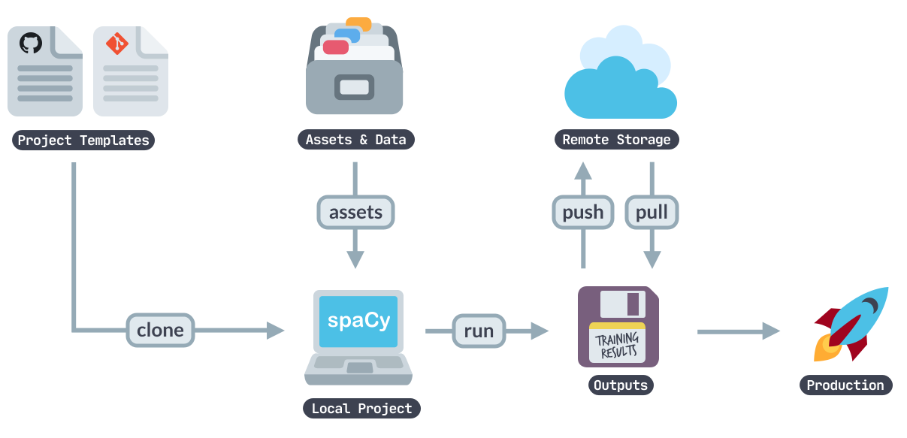
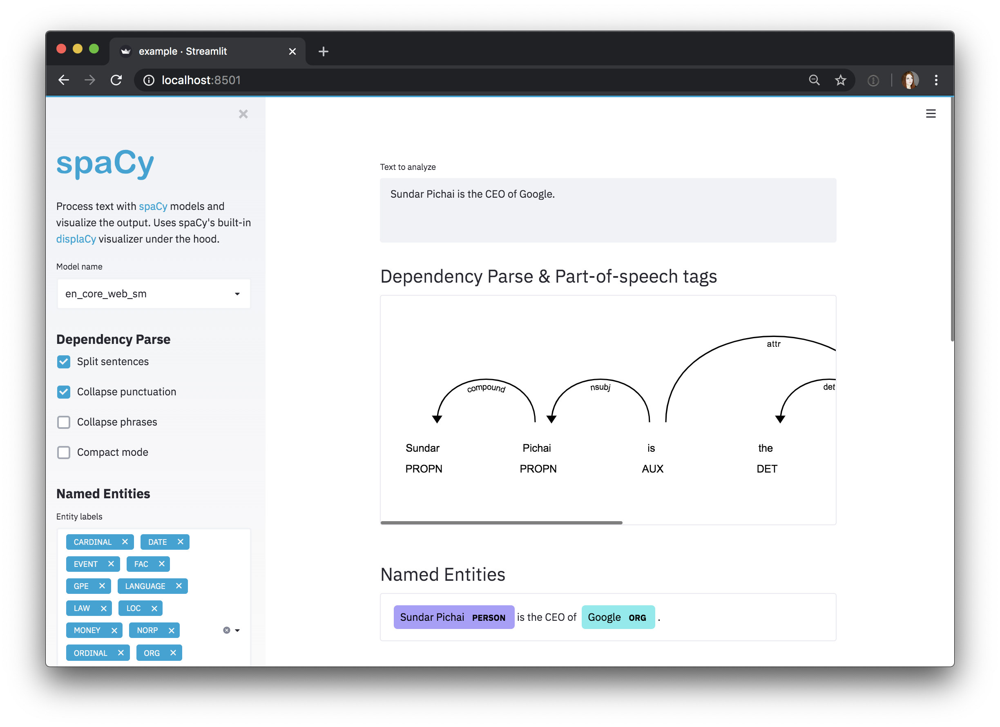
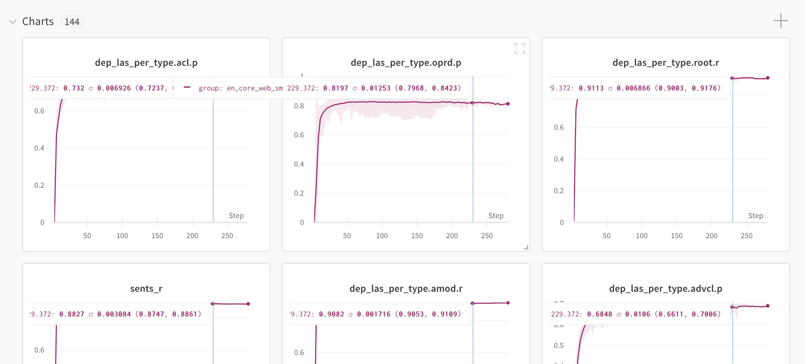

## Introduction and workflow {#intro hidden="true"}

> #### 🪐 Project templates
>
> Our [`projects`](https://github.com/explosion/projects) repo includes various
> project templates for different NLP tasks, models, workflows and integrations
> that you can clone and run. The easiest way to get started is to pick a
> template, clone it and start modifying it!

spaCy projects let you manage and share **end-to-end spaCy workflows** for
different **use cases and domains**, and orchestrate training, packaging and
serving your custom pipelines. You can start off by cloning a pre-defined
project template, adjust it to fit your needs, load in your data, train a
pipeline, export it as a Python package, upload your outputs to a remote storage
and share your results with your team. spaCy projects can be used via the new
[`spacy project`](/api/cli#project) command and we provide templates in our
[`projects`](https://github.com/explosion/projects) repo.



<Project id="pipelines/tagger_parser_ud">

The easiest way to get started is to clone a project template and run it – for
example, this end-to-end template that lets you train a **part-of-speech
tagger** and **dependency parser** on a Universal Dependencies treebank.

</Project>

spaCy projects make it easy to integrate with many other **awesome tools** in
the data science and machine learning ecosystem to track and manage your data
and experiments, iterate on demos and prototypes and ship your models into
production.

<Grid narrow cols={3}>
<Integration title="DVC" logo="dvc" url="#dvc">Manage and version your data</Integration>
<Integration title="Prodigy" logo="prodigy" url="#prodigy">Create labelled training data</Integration>
<Integration title="Streamlit" logo="streamlit" url="#streamlit">Visualize and demo your pipelines</Integration>
<Integration title="FastAPI" logo="fastapi" url="#fastapi">Serve your models and host APIs</Integration>
<Integration title="Ray" logo="ray" url="#ray">Distributed and parallel training</Integration>
<Integration title="Weights &amp; Biases" logo="wandb" url="#wandb">Track your experiments and results</Integration>
<Integration title="Hugging Face Hub" logo="huggingface_hub" url="#huggingface_hub">Upload your pipelines to the Hugging Face Hub</Integration>
</Grid>

### 1. Clone a project template {#clone}

> #### Cloning under the hood
>
> To clone a project, spaCy calls into `git` and uses the "sparse checkout"
> feature to only clone the relevant directory or directories.

The [`spacy project clone`](/api/cli#project-clone) command clones an existing
project template and copies the files to a local directory. You can then run the
project, e.g. to train a pipeline and edit the commands and scripts to build
fully custom workflows.

```cli
python -m spacy project clone pipelines/tagger_parser_ud
```

By default, the project will be cloned into the current working directory. You
can specify an optional second argument to define the output directory. The
`--repo` option lets you define a custom repo to clone from if you don't want to
use the spaCy [`projects`](https://github.com/explosion/projects) repo. You can
also use any private repo you have access to with Git.

### 2. Fetch the project assets {#assets}

> #### project.yml
>
> ```yaml
> assets:
>   - dest: 'assets/training.spacy'
>     url: 'https://example.com/data.spacy'
>     checksum: '63373dd656daa1fd3043ce166a59474c'
>   - dest: 'assets/development.spacy'
>     git:
>       repo: 'https://github.com/example/repo'
>       branch: 'master'
>       path: 'path/development.spacy'
>     checksum: '5113dc04e03f079525edd8df3f4f39e3'
> ```

Assets are data files your project needs – for example, the training and
evaluation data or pretrained vectors and embeddings to initialize your model
with. Each project template comes with a `project.yml` that defines the assets
to download and where to put them. The [`spacy project assets`](/api/cli#run)
will fetch the project assets for you:

```cli
$ cd some_example_project
$ python -m spacy project assets
```

Asset URLs can be a number of different protocols: HTTP, HTTPS, FTP, SSH, and
even cloud storage such as GCS and S3. You can also fetch assets using git, by
replacing the `url` string with a `git` block. spaCy will use Git's "sparse
checkout" feature to avoid downloading the whole repository.

Sometimes your project configuration may include large assets that you don't
necessarily want to download when you run `spacy project assets`. That's why
assets can be marked as [`extra`](#data-assets-url) - by default, these assets
are not downloaded. If they should be, run `spacy project assets --extra`.

### 3. Run a command {#run}

> #### project.yml
>
> ```yaml
> commands:
>   - name: preprocess
>     help: "Convert the input data to spaCy's format"
>     script:
>       - 'python -m spacy convert assets/train.conllu corpus/'
>       - 'python -m spacy convert assets/eval.conllu corpus/'
>     deps:
>       - 'assets/train.conllu'
>       - 'assets/eval.conllu'
>     outputs:
>       - 'corpus/train.spacy'
>       - 'corpus/eval.spacy'
> ```

Commands consist of one or more steps and can be run with
[`spacy project run`](/api/cli#project-run). The following will run the command
`preprocess` defined in the `project.yml`:

```cli
$ python -m spacy project run preprocess
```

Commands can define their expected [dependencies and outputs](#deps-outputs)
using the `deps` (files the commands require) and `outputs` (files the commands
create) keys. This allows your project to track changes and determine whether a
command needs to be re-run. For instance, if your input data changes, you want
to re-run the `preprocess` command. But if nothing changed, this step can be
skipped. You can also set `--force` to force re-running a command, or `--dry` to
perform a "dry run" and see what would happen (without actually running the
script).

### 4. Run a workflow {#run-workfow}

> #### project.yml
>
> ```yaml
> workflows:
>   all:
>     - preprocess
>     - train
>     - package
> ```

Workflows are series of commands that are run in order and often depend on each
other. For instance, to generate a pipeline package, you might start by
converting your data, then run [`spacy train`](/api/cli#train) to train your
pipeline on the converted data and if that's successful, run
[`spacy package`](/api/cli#package) to turn the best trained artifact into an
installable Python package. The following command runs the workflow named `all`
defined in the `project.yml`, and executes the commands it specifies, in order:

```cli
$ python -m spacy project run all
```

Using the expected [dependencies and outputs](#deps-outputs) defined in the
commands, spaCy can determine whether to re-run a command (if its inputs or
outputs have changed) or whether to skip it. If you're looking to implement more
advanced data pipelines and track your changes in Git, check out the
[Data Version Control (DVC) integration](#dvc). The
[`spacy project dvc`](/api/cli#project-dvc) command generates a DVC config file
from a workflow defined in your `project.yml` so you can manage your spaCy
project as a DVC repo.

### 5. Optional: Push to remote storage {#push}

> ```yaml
> ### project.yml
> remotes:
>   default: 's3://my-spacy-bucket'
>   local: '/mnt/scratch/cache'
> ```

After training a pipeline, you can optionally use the
[`spacy project push`](/api/cli#project-push) command to upload your outputs to
a remote storage, using protocols like [S3](https://aws.amazon.com/s3/),
[Google Cloud Storage](https://cloud.google.com/storage) or SSH. This can help
you **export** your pipeline packages, **share** work with your team, or **cache
results** to avoid repeating work.

```cli
$ python -m spacy project push
```

The `remotes` section in your `project.yml` lets you assign names to the
different storages. To download state from a remote storage, you can use the
[`spacy project pull`](/api/cli#project-pull) command. For more details, see the
docs on [remote storage](#remote).

## Project directory and assets {#directory}

### project.yml {#project-yml}

The `project.yml` defines the assets a project depends on, like datasets and
pretrained weights, as well as a series of commands that can be run separately
or as a workflow – for instance, to preprocess the data, convert it to spaCy's
format, train a pipeline, evaluate it and export metrics, package it and spin up
a quick web demo. It looks pretty similar to a config file used to define CI
pipelines.

> #### Tip: Multi-line YAML syntax for long values
>
> YAML has [multi-line syntax](https://yaml-multiline.info/) that can be helpful
> for readability with longer values such as project descriptions or commands
> that take several arguments.

```yaml
%%GITHUB_PROJECTS/pipelines/tagger_parser_ud/project.yml
```
> #### Tip: Overriding variables on the CLI
>
> If you want to override one or more variables on the CLI and are not already specifying a
> project directory, you need to add `.` as a placeholder:
>
> ```
> python -m spacy project run test . --vars.foo bar
> ```

| Section         | Description                                                                                                                                                                                                                                                                                                                                                                                                                                                                                                  |
| --------------- | ------------------------------------------------------------------------------------------------------------------------------------------------------------------------------------------------------------------------------------------------------------------------------------------------------------------------------------------------------------------------------------------------------------------------------------------------------------------------------------------------------------ |
| `title`         | An optional project title used in `--help` message and [auto-generated docs](#custom-docs).                                                                                                                                                                                                                                                                                                                                                                                                                  |
| `description`   | An optional project description used in [auto-generated docs](#custom-docs).                                                                                                                                                                                                                                                                                                                                                                                                                                 |
| `vars`          | A dictionary of variables that can be referenced in paths, URLs and scripts and overriden on the CLI, just like [`config.cfg` variables](/usage/training#config-interpolation). For example, `${vars.name}` will use the value of the variable `name`. Variables need to be defined in the section `vars`, but can be a nested dict, so you're able to reference `${vars.model.name}`.                                                                                                                                                |
| `env`           | A dictionary of variables, mapped to the names of environment variables that will be read in when running the project. For example, `${env.name}` will use the value of the environment variable defined as `name`.                                                                                                                                                                                                                                                                                          |
| `directories`   | An optional list of [directories](#project-files) that should be created in the project for assets, training outputs, metrics etc. spaCy will make sure that these directories always exist.                                                                                                                                                                                                                                                                                                                 |
| `assets`        | A list of assets that can be fetched with the [`project assets`](/api/cli#project-assets) command. `url` defines a URL or local path, `dest` is the destination file relative to the project directory, and an optional `checksum` ensures that an error is raised if the file's checksum doesn't match. Instead of `url`, you can also provide a `git` block with the keys `repo`, `branch` and `path`, to download from a Git repo.                                                                        |
| `workflows`     | A dictionary of workflow names, mapped to a list of command names, to execute in order. Workflows can be run with the [`project run`](/api/cli#project-run) command.                                                                                                                                                                                                                                                                                                                                         |
| `commands`      | A list of named commands. A command can define an optional help message (shown in the CLI when the user adds `--help`) and the `script`, a list of commands to run. The `deps` and `outputs` let you define the created file the command depends on and produces, respectively. This lets spaCy determine whether a command needs to be re-run because its dependencies or outputs changed. Commands can be run as part of a workflow, or separately with the [`project run`](/api/cli#project-run) command. |
| `spacy_version` | Optional spaCy version range like `>=3.0.0,<3.1.0` that the project is compatible with. If it's loaded with an incompatible version, an error is raised when the project is loaded.                                                                                                                                                                                                                                                                                                                          |

### Data assets {#data-assets}

Assets are any files that your project might need, like training and development
corpora or pretrained weights for initializing your model. Assets are defined in
the `assets` block of your `project.yml` and can be downloaded using the
[`project assets`](/api/cli#project-assets) command. Defining checksums lets you
verify that someone else running your project will use the same files you used.
Asset URLs can be a number of different **protocols**: HTTP, HTTPS, FTP, SSH,
and even **cloud storage** such as GCS and S3. You can also download assets from
a **Git repo** instead.

#### Downloading from a URL or cloud storage {#data-assets-url}

Under the hood, spaCy uses the
[`smart-open`](https://github.com/RaRe-Technologies/smart_open) library so you
can use any protocol it supports. Note that you may need to install extra
dependencies to use certain protocols.

> #### project.yml
>
> ```yaml
> assets:
>   # Download from public HTTPS URL
>   - dest: 'assets/training.spacy'
>     url: 'https://example.com/data.spacy'
>     checksum: '63373dd656daa1fd3043ce166a59474c'
>   # Optional download from Google Cloud Storage bucket
>   - dest: 'assets/development.spacy'
>     extra: True
>     url: 'gs://your-bucket/corpora'
>     checksum: '5113dc04e03f079525edd8df3f4f39e3'
> ```

| Name          | Description                                                                                                                                                                      |
| ------------- | -------------------------------------------------------------------------------------------------------------------------------------------------------------------------------- |
| `dest`        | The destination path to save the downloaded asset to (relative to the project directory), including the file name.                                                               |
| `extra`       | Optional flag determining whether this asset is downloaded only if `spacy project assets` is run with `--extra`. `False` by default.                                             |
| `url`         | The URL to download from, using the respective protocol.                                                                                                                         |
| `checksum`    | Optional checksum of the file. If provided, it will be used to verify that the file matches and downloads will be skipped if a local file with the same checksum already exists. |
| `description` | Optional asset description, used in [auto-generated docs](#custom-docs).                                                                                                         |

#### Downloading from a Git repo {#data-assets-git}

If a `git` block is provided, the asset is downloaded from the given Git
repository. You can download from any repo that you have access to. Under the
hood, this uses Git's "sparse checkout" feature, so you're only downloading the
files you need and not the whole repo.

> #### project.yml
>
> ```yaml
> assets:
>   - dest: 'assets/training.spacy'
>     git:
>       repo: 'https://github.com/example/repo'
>       branch: 'master'
>       path: 'path/training.spacy'
>     checksum: '63373dd656daa1fd3043ce166a59474c'
>     description: 'The training data (5000 examples)'
> ```

| Name          | Description                                                                                                                                                                                                                           |
| ------------- | ------------------------------------------------------------------------------------------------------------------------------------------------------------------------------------------------------------------------------------- |
| `dest`        | The destination path to save the downloaded asset to (relative to the project directory), including the file name.                                                                                                                    |
| `git`         | `repo`: The URL of the repo to download from.<br />`path`: Path of the file or directory to download, relative to the repo root. "" specifies the root directory.<br />`branch`: The branch to download from. Defaults to `"master"`. |
| `checksum`    | Optional checksum of the file. If provided, it will be used to verify that the file matches and downloads will be skipped if a local file with the same checksum already exists.                                                      |
| `description` | Optional asset description, used in [auto-generated docs](#custom-docs).                                                                                                                                                              |

#### Working with private assets {#data-asets-private}

> #### project.yml
>
> ```yaml
> assets:
>   - dest: 'assets/private_training_data.json'
>     checksum: '63373dd656daa1fd3043ce166a59474c'
>   - dest: 'assets/private_vectors.bin'
>     checksum: '5113dc04e03f079525edd8df3f4f39e3'
> ```

For many projects, the datasets and weights you're working with might be
company-internal and not available over the internet. In that case, you can
specify the destination paths and a checksum, and leave out the URL. When your
teammates clone and run your project, they can place the files in the respective
directory themselves. The [`project assets`](/api/cli#project-assets) command
will alert you about missing files and mismatched checksums, so you can ensure
that others are running your project with the same data.

### Dependencies and outputs {#deps-outputs}

Each command defined in the `project.yml` can optionally define a list of
dependencies and outputs. These are the files the command requires and creates.
For example, a command for training a pipeline may depend on a
[`config.cfg`](/usage/training#config) and the training and evaluation data, and
it will export a directory `model-best`, which you can then re-use in other
commands.

<!-- prettier-ignore -->
```yaml
### project.yml
commands:
  - name: train
    help: 'Train a spaCy pipeline using the specified corpus and config'
    script:
      - 'python -m spacy train ./configs/config.cfg -o training/ --paths.train ./corpus/training.spacy --paths.dev ./corpus/evaluation.spacy'
    deps:
      - 'configs/config.cfg'
      - 'corpus/training.spacy'
      - 'corpus/evaluation.spacy'
    outputs:
      - 'training/model-best'
```

> #### Re-running vs. skipping
>
> Under the hood, spaCy uses a `project.lock` lockfile that stores the details
> for each command, as well as its dependencies and outputs and their checksums.
> It's updated on each run. If any of this information changes, the command will
> be re-run. Otherwise, it will be skipped.

If you're running a command and it depends on files that are missing, spaCy will
show you an error. If a command defines dependencies and outputs that haven't
changed since the last run, the command will be skipped. This means that you're
only re-running commands if they need to be re-run. Commands can also set
`no_skip: true` if they should never be skipped – for example commands that run
tests. Commands without outputs are also never skipped. To force re-running a
command or workflow, even if nothing changed, you can set the `--force` flag.

Note that [`spacy project`](/api/cli#project) doesn't compile any dependency
graphs based on the dependencies and outputs, and won't re-run previous steps
automatically. For instance, if you only run the command `train` that depends on
data created by `preprocess` and those files are missing, spaCy will show an
error – it won't just re-run `preprocess`. If you're looking for more advanced
data management, check out the [Data Version Control (DVC) integration](#dvc).
If you're planning on integrating your spaCy project with DVC, you can also use
`outputs_no_cache` instead of `outputs` to define outputs that won't be cached
or tracked.

### Files and directory structure {#project-files}

The `project.yml` can define a list of `directories` that should be created
within a project – for instance, `assets`, `training`, `corpus` and so on. spaCy
will make sure that these directories are always available, so your commands can
write to and read from them. Project directories will also include all files and
directories copied from the project template with
[`spacy project clone`](/api/cli#project-clone). Here's an example of a project
directory:

> #### project.yml
>
> <!-- prettier-ignore -->
> ```yaml
> directories: ['assets', 'configs', 'corpus', 'metas', 'metrics', 'notebooks', 'packages', 'scripts', 'training']
> ```

```yaml
### Example project directory
├── project.yml          # the project settings
├── project.lock         # lockfile that tracks inputs/outputs
├── assets/              # downloaded data assets
├── configs/             # pipeline config.cfg files used for training
├── corpus/              # output directory for training corpus
├── metas/               # pipeline meta.json templates used for packaging
├── metrics/             # output directory for evaluation metrics
├── notebooks/           # directory for Jupyter notebooks
├── packages/            # output directory for pipeline Python packages
├── scripts/             # directory for scripts, e.g. referenced in commands
├── training/            # output directory for trained pipelines
└── ...                  # any other files, like a requirements.txt etc.
```

If you don't want a project to create a directory, you can delete it and remove
its entry from the `project.yml` – just make sure it's not required by any of
the commands. [Custom templates](#custom) can use any directories they need –
the only file that's required for a project is the `project.yml`.

---

## Custom scripts and projects {#custom}

The `project.yml` lets you define any custom commands and run them as part of
your training, evaluation or deployment workflows. The `script` section defines
a list of commands that are called in a subprocess, in order. This lets you
execute other Python scripts or command-line tools. Let's say you've written a
few integration tests that load the best model produced by the training command
and check that it works correctly. You can now define a `test` command that
calls into [`pytest`](https://docs.pytest.org/en/latest/), runs your tests and
uses [`pytest-html`](https://github.com/pytest-dev/pytest-html) to export a test
report:

```yaml
### project.yml
commands:
  - name: test
    help: 'Test the trained pipeline'
    script:
      - 'pip install pytest pytest-html'
      - 'python -m pytest ./scripts/tests --html=metrics/test-report.html'
    deps:
      - 'training/model-best'
    outputs:
      - 'metrics/test-report.html'
    no_skip: true
```

Adding `training/model-best` to the command's `deps` lets you ensure that the
file is available. If not, spaCy will show an error and the command won't run.
Setting `no_skip: true` means that the command will always run, even if the
dependencies (the trained pipeline) haven't changed. This makes sense here,
because you typically don't want to skip your tests.

### Writing custom scripts {#custom-scripts}

Your project commands can include any custom scripts – essentially, anything you
can run from the command line. Here's an example of a custom script that uses
[`typer`](https://typer.tiangolo.com/) for quick and easy command-line arguments
that you can define via your `project.yml`:

> #### About Typer
>
> [`typer`](https://typer.tiangolo.com/) is a modern library for building Python
> CLIs using type hints. It's a dependency of spaCy, so it will already be
> pre-installed in your environment. Function arguments automatically become
> positional CLI arguments and using Python type hints, you can define the value
> types. For instance, `batch_size: int` means that the value provided via the
> command line is converted to an integer.

```python
### scripts/custom_evaluation.py
import typer

def custom_evaluation(batch_size: int = 128, model_path: str, data_path: str):
    # The arguments are now available as positional CLI arguments
    print(batch_size, model_path, data_path)

if __name__ == "__main__":
    typer.run(custom_evaluation)
```

In your `project.yml`, you can then run the script by calling
`python scripts/custom_evaluation.py` with the function arguments. You can also
use the `vars` section to define reusable variables that will be substituted in
commands, paths and URLs. In this example, the batch size is defined as a
variable will be added in place of `${vars.batch_size}` in the script. Just like
in the [training config](/usage/training##config-overrides), you can also
override settings on the command line – for example using `--vars.batch_size`.

> #### Calling into Python
>
> If any of your command scripts call into `python`, spaCy will take care of
> replacing that with your `sys.executable`, to make sure you're executing
> everything with the same Python (not some other Python installed on your
> system). It also normalizes references to `python3`, `pip3` and `pip`.

<!-- prettier-ignore -->
```yaml
### project.yml
vars:
  batch_size: 128

commands:
  - name: evaluate
    script:
      - 'python scripts/custom_evaluation.py ${vars.batch_size} ./training/model-best ./corpus/eval.json'
    deps:
      - 'training/model-best'
      - 'corpus/eval.json'
```

You can also use the `env` section to reference **environment variables** and
make their values available to the commands. This can be useful for overriding
settings on the command line and passing through system-level settings.

> #### Usage example
>
> ```bash
> export GPU_ID=1
> BATCH_SIZE=128 python -m spacy project run evaluate
> ```

```yaml
### project.yml
env:
  batch_size: BATCH_SIZE
  gpu_id: GPU_ID

commands:
  - name: evaluate
    script:
      - 'python scripts/custom_evaluation.py ${env.batch_size}'
```

### Documenting your project {#custom-docs}

> #### Readme Example
>
> For more examples, see the [`projects`](https://github.com/explosion/projects)
> repo.
>
> 

When your custom project is ready and you want to share it with others, you can
use the [`spacy project document`](/api/cli#project-document) command to
**auto-generate** a pretty, Markdown-formatted `README` file based on your
project's `project.yml`. It will list all commands, workflows and assets defined
in the project and include details on how to run the project, as well as links
to the relevant spaCy documentation to make it easy for others to get started
using your project.

```cli
$ python -m spacy project document --output README.md
```

Under the hood, hidden markers are added to identify where the auto-generated
content starts and ends. This means that you can add your own custom content
before or after it and re-running the `project document` command will **only
update the auto-generated part**. This makes it easy to keep your documentation
up to date.

<Infobox variant="warning">

Note that the contents of an existing file will be **replaced** if no existing
auto-generated docs are found. If you want spaCy to ignore a file and not update
it, you can add the comment marker `<!-- SPACY PROJECT: IGNORE -->` anywhere in
your markup.

</Infobox>

### Cloning from your own repo {#custom-repo}

The [`spacy project clone`](/api/cli#project-clone) command lets you customize
the repo to clone from using the `--repo` option. It calls into `git`, so you'll
be able to clone from any repo that you have access to, including private repos.

```cli
python -m spacy project clone your_project --repo https://github.com/you/repo
```

At a minimum, a valid project template needs to contain a
[`project.yml`](#project-yml). It can also include
[other files](/usage/projects#project-files), like custom scripts, a
`requirements.txt` listing additional dependencies,
[training configs](/usage/training#config) and model meta templates, or Jupyter
notebooks with usage examples.

<Infobox title="Important note about assets" variant="warning">

It's typically not a good idea to check large data assets, trained pipelines or
other artifacts into a Git repo and you should exclude them from your project
template by adding a `.gitignore`. If you want to version your data and models,
check out [Data Version Control](#dvc) (DVC), which integrates with spaCy
projects.

</Infobox>

## Remote Storage {#remote}

You can persist your project outputs to a remote storage using the
[`project push`](/api/cli#project-push) command. This can help you **export**
your pipeline packages, **share** work with your team, or **cache results** to
avoid repeating work. The [`project pull`](/api/cli#project-pull) command will
download any outputs that are in the remote storage and aren't available
locally.

You can list one or more remotes in the `remotes` section of your
[`project.yml`](#project-yml) by mapping a string name to the URL of the
storage. Under the hood, spaCy uses the
[`smart-open`](https://github.com/RaRe-Technologies/smart_open) library to
communicate with the remote storages, so you can use any protocol that
`smart-open` supports, including [S3](https://aws.amazon.com/s3/),
[Google Cloud Storage](https://cloud.google.com/storage), SSH and more, although
you may need to install extra dependencies to use certain protocols.

> #### Example
>
> ```cli
> $ python -m spacy project pull local
> ```

```yaml
### project.yml
remotes:
  default: 's3://my-spacy-bucket'
  local: '/mnt/scratch/cache'
  stuff: 'ssh://myserver.example.com/whatever'
```

<Infobox title="How it works" emoji="💡">

Inside the remote storage, spaCy uses a clever **directory structure** to avoid
overwriting files. The top level of the directory structure is a URL-encoded
version of the output's path. Within this directory are subdirectories named
according to a hash of the command string and the command's dependencies.
Finally, within those directories are files, named according to an MD5 hash of
their contents.

<!-- TODO: update with actual real example? -->

<!-- prettier-ignore -->
```yaml
└── urlencoded_file_path            # Path of original file
    ├── some_command_hash           # Hash of command you ran
    │   ├── some_content_hash       # Hash of file content
    │   └── another_content_hash
    └── another_command_hash
        └── third_content_hash
```

</Infobox>

For instance, let's say you had the following command in your `project.yml`:

```yaml
### project.yml
- name: train
  help: 'Train a spaCy pipeline using the specified corpus and config'
  script:
    - 'spacy train ./config.cfg --output training/'
  deps:
    - 'corpus/train'
    - 'corpus/dev'
    - 'config.cfg'
  outputs:
    - 'training/model-best'
```

> #### Example
>
> ```
> └── s3://my-spacy-bucket/training%2Fmodel-best
>     └── 1d8cb33a06cc345ad3761c6050934a1b
>         └── d8e20c3537a084c5c10d95899fe0b1ff
> ```

After you finish training, you run [`project push`](/api/cli#project-push) to
make sure the `training/model-best` output is saved to remote storage. spaCy
will then construct a hash from your command script and the listed dependencies,
`corpus/train`, `corpus/dev` and `config.cfg`, in order to identify the
execution context of your output. It would then compute an MD5 hash of the
`training/model-best` directory, and use those three pieces of information to
construct the storage URL.

```cli
$ python -m spacy project run train
$ python -m spacy project push
```

If you change the command or one of its dependencies (for instance, by editing
the [`config.cfg`](/usage/training#config) file to tune the hyperparameters, a
different creation hash will be calculated, so when you use
[`project push`](/api/cli#project-push) you won't be overwriting your previous
file. The system even supports multiple outputs for the same file and the same
context, which can happen if your training process is not deterministic, or if
you have dependencies that aren't represented in the command.

In summary, the [`spacy project`](/api/cli#project) remote storages are designed
to make a particular set of trade-offs. Priority is placed on **convenience**,
**correctness** and **avoiding data loss**. You can use
[`project push`](/api/cli#project-push) freely, as you'll never overwrite remote
state, and you don't have to come up with names or version numbers. However,
it's up to you to manage the size of your remote storage, and to remove files
that are no longer relevant to you.

## Integrations {#integrations}

### Data Version Control (DVC) {#dvc} <IntegrationLogo name="dvc" title="DVC" width={70} height="auto" align="right" />

Data assets like training corpora or pretrained weights are at the core of any
NLP project, but they're often difficult to manage: you can't just check them
into your Git repo to version and keep track of them. And if you have multiple
steps that depend on each other, like a preprocessing step that generates your
training data, you need to make sure the data is always up-to-date, and re-run
all steps of your process every time, just to be safe.

[Data Version Control](https://dvc.org) (DVC) is a standalone open-source tool
that integrates into your workflow like Git, builds a dependency graph for your
data pipelines and tracks and caches your data files. If you're downloading data
from an external source, like a storage bucket, DVC can tell whether the
resource has changed. It can also determine whether to re-run a step, depending
on whether its input have changed or not. All metadata can be checked into a Git
repo, so you'll always be able to reproduce your experiments.

To set up DVC, install the package and initialize your spaCy project as a Git
and DVC repo. You can also
[customize your DVC installation](https://dvc.org/doc/install/macos#install-with-pip)
to include support for remote storage like Google Cloud Storage, S3, Azure, SSH
and more.

```bash
$ pip install dvc   # Install DVC
$ git init          # Initialize a Git repo
$ dvc init          # Initialize a DVC project
```

<Infobox title="Important note on privacy" variant="warning">

DVC enables usage analytics by default, so if you're working in a
privacy-sensitive environment, make sure to
[**opt-out manually**](https://dvc.org/doc/user-guide/analytics#opting-out).

</Infobox>

The [`spacy project dvc`](/api/cli#project-dvc) command creates a `dvc.yaml`
config file based on a workflow defined in your `project.yml`. Whenever you
update your project, you can re-run the command to update your DVC config. You
can then manage your spaCy project like any other DVC project, run
[`dvc add`](https://dvc.org/doc/command-reference/add) to add and track assets
and [`dvc repro`](https://dvc.org/doc/command-reference/repro) to reproduce the
workflow or individual commands.

```cli
$ python -m spacy project dvc [workflow_name]
```

<Infobox title="Important note for multiple workflows" variant="warning">

DVC currently expects a single workflow per project, so when creating the config
with [`spacy project dvc`](/api/cli#project-dvc), you need to specify the name
of a workflow defined in your `project.yml`. You can still use multiple
workflows, but only one can be tracked by DVC.

</Infobox>

<!-- TODO: <Project id="integrations/dvc">

</Project> -->

---

### Prodigy {#prodigy} <IntegrationLogo name="prodigy" width={100} height="auto" align="right" />

[Prodigy](https://prodi.gy) is a modern annotation tool for creating training
data for machine learning models, developed by us. It integrates with spaCy
out-of-the-box and provides many different
[annotation recipes](https://prodi.gy/docs/recipes) for a variety of NLP tasks,
with and without a model in the loop. If Prodigy is installed in your project,
you can start the annotation server from your `project.yml` for a tight feedback
loop between data development and training.

<Infobox variant="warning">

This integration requires [Prodigy v1.11](https://prodi.gy/docs/changelog#v1.11)
or higher. If you're using an older version of Prodigy, you can still use your
annotations in spaCy v3 by exporting your data with
[`data-to-spacy`](https://prodi.gy/docs/recipes#data-to-spacy) and running
[`spacy convert`](/api/cli#convert) to convert it to the binary format.

</Infobox>

The following example shows a workflow for merging and exporting NER annotations
collected with Prodigy and training a spaCy pipeline:

> #### Example usage
>
> ```cli
> $ python -m spacy project run all
> ```

<!-- prettier-ignore -->
```yaml
### project.yml
vars:
  prodigy:
    train_dataset: "fashion_brands_training"
    eval_dataset: "fashion_brands_eval"

workflows:
  all:
    - data-to-spacy
    - train_spacy

commands:
  - name: "data-to-spacy"
    help: "Merge your annotations and create data in spaCy's binary format"
    script:
      - "python -m prodigy data-to-spacy corpus/ --ner ${vars.prodigy.train_dataset},eval:${vars.prodigy.eval_dataset}"
    outputs:
      - "corpus/train.spacy"
      - "corpus/dev.spacy"
  - name: "train_spacy"
    help: "Train a named entity recognition model with spaCy"
    script:
      - "python -m spacy train configs/config.cfg --output training/ --paths.train corpus/train.spacy --paths.dev corpus/dev.spacy"
    deps:
      - "corpus/train.spacy"
      - "corpus/dev.spacy"
    outputs:
      - "training/model-best"
```

> #### Example train curve output
>
> [](https://prodi.gy/docs/recipes#train-curve)

The [`train-curve`](https://prodi.gy/docs/recipes#train-curve) recipe is another
cool workflow you can include in your project. It will run the training with
different portions of the data, e.g. 25%, 50%, 75% and 100%. As a rule of thumb,
if accuracy increases in the last segment, this could indicate that collecting
more annotations of the same type might improve the model further.

<!-- prettier-ignore -->
```yaml
### project.yml (excerpt)
- name: "train_curve"
    help: "Train the model with Prodigy by using different portions of training examples to evaluate if more annotations can potentially improve the performance"
    script:
      - "python -m prodigy train-curve --ner ${vars.prodigy.train_dataset},eval:${vars.prodigy.eval_dataset} --config configs/${vars.config} --show-plot"
```

You can use the same approach for various types of projects and annotation
workflows, including
[named entity recognition](https://prodi.gy/docs/named-entity-recognition),
[span categorization](https://prodi.gy/docs/span-categorization),
[text classification](https://prodi.gy/docs/text-classification),
[dependency parsing](https://prodi.gy/docs/dependencies-relations),
[part-of-speech tagging](https://prodi.gy/docs/recipes#pos) or fully
[custom recipes](https://prodi.gy/docs/custom-recipes). You can also use spaCy
project templates to quickly start the annotation server to collect more
annotations and add them to your Prodigy dataset.

<Project id="integrations/prodigy">

Get started with spaCy and Prodigy using our project template. It includes
commands to create a merged training corpus from your Prodigy annotations,
training and packaging a spaCy pipeline and analyzing if more annotations may
improve performance.

</Project>

---

### Streamlit {#streamlit} <IntegrationLogo name="streamlit" width={150} height="auto" align="right" />

[Streamlit](https://streamlit.io) is a Python framework for building interactive
data apps. The [`spacy-streamlit`](https://github.com/explosion/spacy-streamlit)
package helps you integrate spaCy visualizations into your Streamlit apps and
quickly spin up demos to explore your pipelines interactively. It includes a
full embedded visualizer, as well as individual components.

<!-- TODO: update once version is stable -->

> #### Installation
>
> ```bash
> $ pip install spacy-streamlit --pre
> ```



Using [`spacy-streamlit`](https://github.com/explosion/spacy-streamlit), your
projects can easily define their own scripts that spin up an interactive
visualizer, using the latest pipeline you trained, or a selection of pipelines
so you can compare their results.

<Project id="integrations/streamlit">

Get started with spaCy and Streamlit using our project template. It includes a
script to spin up a custom visualizer and commands you can adjust to showcase
and explore your own custom trained pipelines.

</Project>

> #### Example usage
>
> ```cli
> $ python -m spacy project run visualize
> ```

<!-- prettier-ignore -->
```yaml
### project.yml
commands:
  - name: visualize
    help: "Visualize the pipeline's output interactively using Streamlit"
    script:
      - 'streamlit run ./scripts/visualize.py ./training/model-best "I like Adidas shoes."'
    deps:
      - "training/model-best"
```

The following script is called from the `project.yml` and takes two positional
command-line argument: a comma-separated list of paths or packages to load the
pipelines from and an example text to use as the default text.

```python
https://github.com/explosion/projects/blob/v3/integrations/streamlit/scripts/visualize.py
```

---

### FastAPI {#fastapi} <IntegrationLogo name="fastapi" width={100} height="auto" align="right" />

[FastAPI](https://fastapi.tiangolo.com/) is a modern high-performance framework
for building REST APIs with Python, based on Python
[type hints](https://fastapi.tiangolo.com/python-types/). It's become a popular
library for serving machine learning models and you can use it in your spaCy
projects to quickly serve up a trained pipeline and make it available behind a
REST API.

<Project id="integrations/fastapi">

Get started with spaCy and FastAPI using our project template. It includes a
simple REST API for processing batches of text, and usage examples for how to
query your API from Python and JavaScript (Vanilla JS and React).

</Project>

> #### Example usage
>
> ```cli
> $ python -m spacy project run serve
> ```

<!-- prettier-ignore -->
```yaml
### project.yml
  - name: "serve"
    help: "Serve the models via a FastAPI REST API using the given host and port"
    script:
      - "uvicorn scripts.main:app --reload --host 127.0.0.1 --port 5000"
    deps:
      - "scripts/main.py"
    no_skip: true
```

The script included in the template shows a simple REST API with a `POST`
endpoint that accepts batches of texts and returns batches of predictions, e.g.
named entities found in the documents. Type hints and
[`pydantic`](https://github.com/samuelcolvin/pydantic) are used to define the
expected data types.

```python
https://github.com/explosion/projects/blob/v3/integrations/fastapi/scripts/main.py
```

---

### Ray {#ray} <IntegrationLogo name="ray" width={100} height="auto" align="right" />

> #### Installation
>
> ```cli
> $ pip install -U %%SPACY_PKG_NAME[ray]%%SPACY_PKG_FLAGS
> # Check that the CLI is registered
> $ python -m spacy ray --help
> ```

[Ray](https://ray.io/) is a fast and simple framework for building and running
**distributed applications**. You can use Ray for parallel and distributed
training with spaCy via our lightweight
[`spacy-ray`](https://github.com/explosion/spacy-ray) extension package. If the
package is installed in the same environment as spaCy, it will automatically add
[`spacy ray`](/api/cli#ray) commands to your spaCy CLI. See the usage guide on
[parallel training](/usage/training#parallel-training) for more details on how
it works under the hood.

<Project id="integrations/ray">

Get started with parallel training using our project template. It trains a
simple model on a Universal Dependencies Treebank and lets you parallelize the
training with Ray.

</Project>

You can integrate [`spacy ray train`](/api/cli#ray-train) into your
`project.yml` just like the regular training command and pass it the config, and
optional output directory or remote storage URL and config overrides if needed.

<!-- prettier-ignore -->
```yaml
### project.yml
commands:
  - name: "ray"
    help: "Train a model via parallel training with Ray"
    script:
      - "python -m spacy ray train configs/config.cfg -o training/ --paths.train corpus/train.spacy --paths.dev corpus/dev.spacy"
    deps:
      - "corpus/train.spacy"
      - "corpus/dev.spacy"
    outputs:
      - "training/model-best"
```

---

### Weights & Biases {#wandb} <IntegrationLogo name="wandb" width={175} height="auto" align="right" />

[Weights & Biases](https://www.wandb.com/) is a popular platform for experiment
tracking. spaCy integrates with it out-of-the-box via the
[`WandbLogger`](https://github.com/explosion/spacy-loggers#wandblogger), which
you can add as the `[training.logger]` block of your training
[config](/usage/training#config). The results of each step are then logged in
your project, together with the full **training config**. This means that
_every_ hyperparameter, registered function name and argument will be tracked
and you'll be able to see the impact it has on your results.

> #### Example config
>
> ```ini
> [training.logger]
> @loggers = "spacy.WandbLogger.v3"
> project_name = "monitor_spacy_training"
> remove_config_values = ["paths.train", "paths.dev", "corpora.train.path", "corpora.dev.path"]
> log_dataset_dir = "corpus"
> model_log_interval = 1000
> ```




<Project id="integrations/wandb">

Get started with tracking your spaCy training runs in Weights & Biases using our
project template. It trains on the IMDB Movie Review Dataset and includes a
simple config with the built-in `WandbLogger`, as well as a custom example of
creating variants of the config for a simple hyperparameter grid search and
logging the results.

</Project>

---

### Hugging Face Hub {#huggingface_hub} <IntegrationLogo name="huggingface_hub" width={175} height="auto" align="right" />

The [Hugging Face Hub](https://huggingface.co/) lets you upload models and share
them with others. It hosts models as Git-based repositories which are storage
spaces that can contain all your files. It support versioning, branches and
custom metadata out-of-the-box, and provides browser-based visualizers for
exploring your models interactively, as well as an API for production use. The
[`spacy-huggingface-hub`](https://github.com/explosion/spacy-huggingface-hub)
package automatically adds the `huggingface-hub` command to your `spacy` CLI if
it's installed.

> #### Installation
>
> ```cli
> $ pip install spacy-huggingface-hub
> # Check that the CLI is registered
> $ python -m spacy huggingface-hub --help
> ```

You can then upload any pipeline packaged with
[`spacy package`](/api/cli#package). Make sure to set `--build wheel` to output
a binary `.whl` file. The uploader will read all metadata from the pipeline
package, including the auto-generated pretty `README.md` and the model details
available in the `meta.json`. For examples, check out the
[spaCy pipelines](https://huggingface.co/spacy) we've uploaded.

```cli
$ huggingface-cli login
$ python -m spacy package ./en_ner_fashion ./output --build wheel
$ cd ./output/en_ner_fashion-0.0.0/dist
$ python -m spacy huggingface-hub push en_ner_fashion-0.0.0-py3-none-any.whl
```

After uploading, you will see the live URL of your pipeline packages, as well as
the direct URL to the model wheel you can install via `pip install`. You'll also
be able to test your pipeline interactively from your browser:


In your `project.yml`, you can add a command that uploads your trained and
packaged pipeline to the hub. You can either run this as a manual step, or
automatically as part of a workflow. Make sure to set `--build wheel` when
running `spacy package` to build a wheel file for your pipeline package.

<!-- prettier-ignore -->
```yaml
### project.yml
- name: "push_to_hub"
  help: "Upload the trained model to the Hugging Face Hub"
  script:
    - "python -m spacy huggingface-hub push packages/en_${vars.name}-${vars.version}/dist/en_${vars.name}-${vars.version}-py3-none-any.whl"
  deps:
    - "packages/en_${vars.name}-${vars.version}/dist/en_${vars.name}-${vars.version}-py3-none-any.whl"
```

<Project id="integrations/huggingface_hub">

Get started with uploading your models to the Hugging Face hub using our project
template. It trains a simple pipeline, packages it and uploads it if the
packaged model has changed. This makes it easy to deploy your models end-to-end.

</Project>
