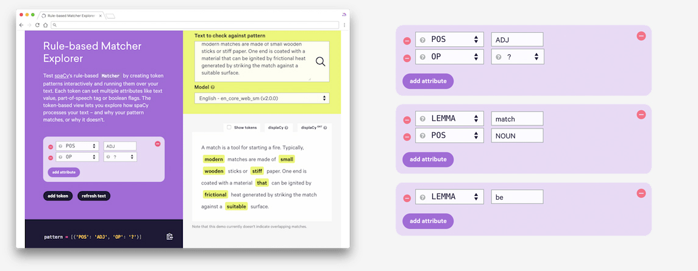
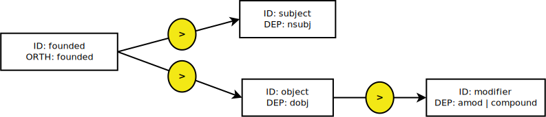

Compared to using regular expressions on raw text, spaCy's rule-based matcher
engines and components not only let you find the words and phrases you're
looking for – they also give you access to the tokens within the document and
their relationships. This means you can easily access and analyze the
surrounding tokens, merge spans into single tokens or add entries to the named
entities in `doc.ents`.

<Accordion title="Should I use rules or train a model?" id="rules-vs-model">

For complex tasks, it's usually better to train a statistical entity recognition
model. However, statistical models require training data, so for many
situations, rule-based approaches are more practical. This is especially true at
the start of a project: you can use a rule-based approach as part of a data
collection process, to help you "bootstrap" a statistical model.

Training a model is useful if you have some examples and you want your system to
be able to **generalize** based on those examples. It works especially well if
there are clues in the _local context_. For instance, if you're trying to detect
person or company names, your application may benefit from a statistical named
entity recognition model.

Rule-based systems are a good choice if there's a more or less **finite number**
of examples that you want to find in the data, or if there's a very **clear,
structured pattern** you can express with token rules or regular expressions.
For instance, country names, IP addresses or URLs are things you might be able
to handle well with a purely rule-based approach.

You can also combine both approaches and improve a statistical model with rules
to handle very specific cases and boost accuracy. For details, see the section
on [rule-based entity recognition](#entityruler).

</Accordion>

<Accordion title="When should I use the token matcher vs. the phrase matcher?" id="matcher-vs-phrase-matcher">

The `PhraseMatcher` is useful if you already have a large terminology list or
gazetteer consisting of single or multi-token phrases that you want to find
exact instances of in your data. As of spaCy v2.1.0, you can also match on the
`LOWER` attribute for fast and case-insensitive matching.

The `Matcher` isn't as blazing fast as the `PhraseMatcher`, since it compares
across individual token attributes. However, it allows you to write very
abstract representations of the tokens you're looking for, using lexical
attributes, linguistic features predicted by the model, operators, set
membership and rich comparison. For example, you can find a noun, followed by a
verb with the lemma "love" or "like", followed by an optional determiner and
another token that's at least 10 characters long.

</Accordion>

## Token-based matching {#matcher}

spaCy features a rule-matching engine, the [`Matcher`](/api/matcher), that
operates over tokens, similar to regular expressions. The rules can refer to
token annotations (e.g. the token `text` or `tag_`, and flags like `IS_PUNCT`).
The rule matcher also lets you pass in a custom callback to act on matches – for
example, to merge entities and apply custom labels. You can also associate
patterns with entity IDs, to allow some basic entity linking or disambiguation.
To match large terminology lists, you can use the
[`PhraseMatcher`](/api/phrasematcher), which accepts `Doc` objects as match
patterns.

### Adding patterns {#adding-patterns}

Let's say we want to enable spaCy to find a combination of three tokens:

1. A token whose **lowercase form matches "hello"**, e.g. "Hello" or "HELLO".
2. A token whose **`is_punct` flag is set to `True`**, i.e. any punctuation.
3. A token whose **lowercase form matches "world"**, e.g. "World" or "WORLD".

```python
[{"LOWER": "hello"}, {"IS_PUNCT": True}, {"LOWER": "world"}]
```

<Infobox title="Important note" variant="danger">

When writing patterns, keep in mind that **each dictionary** represents **one
token**. If spaCy's tokenization doesn't match the tokens defined in a pattern,
the pattern is not going to produce any results. When developing complex
patterns, make sure to check examples against spaCy's tokenization:

```python
doc = nlp("A complex-example,!")
print([token.text for token in doc])
```

</Infobox>

First, we initialize the `Matcher` with a vocab. The matcher must always share
the same vocab with the documents it will operate on. We can now call
[`matcher.add()`](/api/matcher#add) with an ID and a list of patterns.

```python
### {executable="true"}
import spacy
from spacy.matcher import Matcher

nlp = spacy.load("en_core_web_sm")
matcher = Matcher(nlp.vocab)
# Add match ID "HelloWorld" with no callback and one pattern
pattern = [{"LOWER": "hello"}, {"IS_PUNCT": True}, {"LOWER": "world"}]
matcher.add("HelloWorld", [pattern])

doc = nlp("Hello, world! Hello world!")
matches = matcher(doc)
for match_id, start, end in matches:
    string_id = nlp.vocab.strings[match_id]  # Get string representation
    span = doc[start:end]  # The matched span
    print(match_id, string_id, start, end, span.text)
```

The matcher returns a list of `(match_id, start, end)` tuples – in this case,
`[('15578876784678163569', 0, 3)]`, which maps to the span `doc[0:3]` of our
original document. The `match_id` is the [hash value](/usage/spacy-101#vocab) of
the string ID "HelloWorld". To get the string value, you can look up the ID in
the [`StringStore`](/api/stringstore).

```python
for match_id, start, end in matches:
    string_id = nlp.vocab.strings[match_id]  # 'HelloWorld'
    span = doc[start:end]                    # The matched span
```

Optionally, we could also choose to add more than one pattern, for example to
also match sequences without punctuation between "hello" and "world":

```python
patterns = [
    [{"LOWER": "hello"}, {"IS_PUNCT": True}, {"LOWER": "world"}],
    [{"LOWER": "hello"}, {"LOWER": "world"}]
]
matcher.add("HelloWorld", patterns)
```

By default, the matcher will only return the matches and **not do anything
else**, like merge entities or assign labels. This is all up to you and can be
defined individually for each pattern, by passing in a callback function as the
`on_match` argument on `add()`. This is useful, because it lets you write
entirely custom and **pattern-specific logic**. For example, you might want to
merge _some_ patterns into one token, while adding entity labels for other
pattern types. You shouldn't have to create different matchers for each of those
processes.

#### Available token attributes {#adding-patterns-attributes}

The available token pattern keys correspond to a number of
[`Token` attributes](/api/token#attributes). The supported attributes for
rule-based matching are:

| Attribute                                      | Description                                                                                                                                                                                                                                                                                               |
| ---------------------------------------------- | --------------------------------------------------------------------------------------------------------------------------------------------------------------------------------------------------------------------------------------------------------------------------------------------------------- |
| `ORTH`                                         | The exact verbatim text of a token. ~~str~~                                                                                                                                                                                                                                                               |
| `TEXT` <Tag variant="new">2.1</Tag>            | The exact verbatim text of a token. ~~str~~                                                                                                                                                                                                                                                               |
| `NORM`                                         | The normalized form of the token text. ~~str~~                                                                                                                                                                                                                                                            |
| `LOWER`                                        | The lowercase form of the token text. ~~str~~                                                                                                                                                                                                                                                             |
| `LENGTH`                                       | The length of the token text. ~~int~~                                                                                                                                                                                                                                                                     |
| `IS_ALPHA`, `IS_ASCII`, `IS_DIGIT`             | Token text consists of alphabetic characters, ASCII characters, digits. ~~bool~~                                                                                                                                                                                                                          |
| `IS_LOWER`, `IS_UPPER`, `IS_TITLE`             | Token text is in lowercase, uppercase, titlecase. ~~bool~~                                                                                                                                                                                                                                                |
| `IS_PUNCT`, `IS_SPACE`, `IS_STOP`              | Token is punctuation, whitespace, stop word. ~~bool~~                                                                                                                                                                                                                                                     |
| `IS_SENT_START`                                | Token is start of sentence. ~~bool~~                                                                                                                                                                                                                                                                      |
| `LIKE_NUM`, `LIKE_URL`, `LIKE_EMAIL`           | Token text resembles a number, URL, email. ~~bool~~                                                                                                                                                                                                                                                       |
| `SPACY`                                        | Token has a trailing space. ~~bool~~                                                                                                                                                                                                                                                                      |
| `POS`, `TAG`, `MORPH`, `DEP`, `LEMMA`, `SHAPE` | The token's simple and extended part-of-speech tag, morphological analysis, dependency label, lemma, shape. Note that the values of these attributes are case-sensitive. For a list of available part-of-speech tags and dependency labels, see the [Annotation Specifications](/api/annotation). ~~str~~ |
| `ENT_TYPE`                                     | The token's entity label. ~~str~~                                                                                                                                                                                                                                                                         |
| `_` <Tag variant="new">2.1</Tag>               | Properties in [custom extension attributes](/usage/processing-pipelines#custom-components-attributes). ~~Dict[str, Any]~~                                                                                                                                                                                 |
| `OP`                                           | [Operator or quantifier](#quantifiers) to determine how often to match a token pattern. ~~str~~                                                                                                                                                                                                           |

<Accordion title="Does it matter if the attribute names are uppercase or lowercase?">

No, it shouldn't. spaCy will normalize the names internally and
`{"LOWER": "text"}` and `{"lower": "text"}` will both produce the same result.
Using the uppercase version is mostly a convention to make it clear that the
attributes are "special" and don't exactly map to the token attributes like
`Token.lower` and `Token.lower_`.

</Accordion>

<Accordion title="Why are not all token attributes supported?">

spaCy can't provide access to all of the attributes because the `Matcher` loops
over the Cython data, not the Python objects. Inside the matcher, we're dealing
with a [`TokenC` struct](/api/cython-structs#tokenc) – we don't have an instance
of [`Token`](/api/token). This means that all of the attributes that refer to
computed properties can't be accessed.

The uppercase attribute names like `LOWER` or `IS_PUNCT` refer to symbols from
the [`spacy.attrs`](%%GITHUB_SPACY/spacy/attrs.pyx) enum table. They're passed
into a function that essentially is a big case/switch statement, to figure out
which struct field to return. The same attribute identifiers are used in
[`Doc.to_array`](/api/doc#to_array), and a few other places in the code where
you need to describe fields like this.

</Accordion>

---

<Infobox title="Tip: Try the interactive matcher explorer">

[](https://explosion.ai/demos/matcher)

The [Matcher Explorer](https://explosion.ai/demos/matcher) lets you test the
rule-based `Matcher` by creating token patterns interactively and running them
over your text. Each token can set multiple attributes like text value,
part-of-speech tag or boolean flags. The token-based view lets you explore how
spaCy processes your text – and why your pattern matches, or why it doesn't.

</Infobox>

#### Extended pattern syntax and attributes {#adding-patterns-attributes-extended new="2.1"}

Instead of mapping to a single value, token patterns can also map to a
**dictionary of properties**. For example, to specify that the value of a lemma
should be part of a list of values, or to set a minimum character length. The
following rich comparison attributes are available:

> #### Example
>
> ```python
> # Matches "love cats" or "likes flowers"
> pattern1 = [{"LEMMA": {"IN": ["like", "love"]}},
>             {"POS": "NOUN"}]
>
> # Matches tokens of length >= 10
> pattern2 = [{"LENGTH": {">=": 10}}]
>
> # Match based on morph attributes
> pattern3 = [{"MORPH": {"IS_SUBSET": ["Number=Sing", "Gender=Neut"]}}]
> # "", "Number=Sing" and "Number=Sing|Gender=Neut" will match as subsets
> # "Number=Plur|Gender=Neut" will not match
> # "Number=Sing|Gender=Neut|Polite=Infm" will not match because it's a superset
> ```

| Attribute                  | Description                                                                                               |
| -------------------------- | --------------------------------------------------------------------------------------------------------- |
| `IN`                       | Attribute value is member of a list. ~~Any~~                                                              |
| `NOT_IN`                   | Attribute value is _not_ member of a list. ~~Any~~                                                        |
| `IS_SUBSET`                | Attribute value (for `MORPH` or custom list attributes) is a subset of a list. ~~Any~~                    |
| `IS_SUPERSET`              | Attribute value (for `MORPH` or custom list attributes) is a superset of a list. ~~Any~~                  |
| `INTERSECTS`               | Attribute value (for `MORPH` or custom list attributes) has a non-empty intersection with a list. ~~Any~~ |
| `==`, `>=`, `<=`, `>`, `<` | Attribute value is equal, greater or equal, smaller or equal, greater or smaller. ~~Union[int, float]~~   |

#### Regular expressions {#regex new="2.1"}

In some cases, only matching tokens and token attributes isn't enough – for
example, you might want to match different spellings of a word, without having
to add a new pattern for each spelling.

```python
pattern = [{"TEXT": {"REGEX": "^[Uu](\\.?|nited)$"}},
           {"TEXT": {"REGEX": "^[Ss](\\.?|tates)$"}},
           {"LOWER": "president"}]
```

The `REGEX` operator allows defining rules for any attribute string value,
including custom attributes. It always needs to be applied to an attribute like
`TEXT`, `LOWER` or `TAG`:

```python
# Match different spellings of token texts
pattern = [{"TEXT": {"REGEX": "deff?in[ia]tely"}}]

# Match tokens with fine-grained POS tags starting with 'V'
pattern = [{"TAG": {"REGEX": "^V"}}]

# Match custom attribute values with regular expressions
pattern = [{"_": {"country": {"REGEX": "^[Uu](nited|\\.?) ?[Ss](tates|\\.?)$"}}}]
```

<Infobox title="Important note" variant="warning">

When using the `REGEX` operator, keep in mind that it operates on **single
tokens**, not the whole text. Each expression you provide will be matched on a
token. If you need to match on the whole text instead, see the details on
[regex matching on the whole text](#regex-text).

</Infobox>

##### Matching regular expressions on the full text {#regex-text}

If your expressions apply to multiple tokens, a simple solution is to match on
the `doc.text` with `re.finditer` and use the
[`Doc.char_span`](/api/doc#char_span) method to create a `Span` from the
character indices of the match. If the matched characters don't map to one or
more valid tokens, `Doc.char_span` returns `None`.

> #### What's a valid token sequence?
>
> In the example, the expression will also match `"US"` in `"USA"`. However,
> `"USA"` is a single token and `Span` objects are **sequences of tokens**. So
> `"US"` cannot be its own span, because it does not end on a token boundary.

```python
### {executable="true"}
import spacy
import re

nlp = spacy.load("en_core_web_sm")
doc = nlp("The United States of America (USA) are commonly known as the United States (U.S. or US) or America.")

expression = r"[Uu](nited|\\.?) ?[Ss](tates|\\.?)"
for match in re.finditer(expression, doc.text):
    start, end = match.span()
    span = doc.char_span(start, end)
    # This is a Span object or None if match doesn't map to valid token sequence
    if span is not None:
        print("Found match:", span.text)
```

<Accordion title="How can I expand the match to a valid token sequence?">

In some cases, you might want to expand the match to the closest token
boundaries, so you can create a `Span` for `"USA"`, even though only the
substring `"US"` is matched. You can calculate this using the character offsets
of the tokens in the document, available as
[`Token.idx`](/api/token#attributes). This lets you create a list of valid token
start and end boundaries and leaves you with a rather basic algorithmic problem:
Given a number, find the next lowest (start token) or the next highest (end
token) number that's part of a given list of numbers. This will be the closest
valid token boundary.

There are many ways to do this and the most straightforward one is to create a
dict keyed by characters in the `Doc`, mapped to the token they're part of. It's
easy to write and less error-prone, and gives you a constant lookup time: you
only ever need to create the dict once per `Doc`.

```python
chars_to_tokens = {}
for token in doc:
    for i in range(token.idx, token.idx + len(token.text)):
        chars_to_tokens[i] = token.i
```

You can then look up character at a given position, and get the index of the
corresponding token that the character is part of. Your span would then be
`doc[token_start:token_end]`. If a character isn't in the dict, it means it's
the (white)space tokens are split on. That hopefully shouldn't happen, though,
because it'd mean your regex is producing matches with leading or trailing
whitespace.

```python
### {highlight="5-8"}
span = doc.char_span(start, end)
if span is not None:
    print("Found match:", span.text)
else:
    start_token = chars_to_tokens.get(start)
    end_token = chars_to_tokens.get(end)
    if start_token is not None and end_token is not None:
        span = doc[start_token:end_token + 1]
        print("Found closest match:", span.text)
```

</Accordion>

---

#### Operators and quantifiers {#quantifiers}

The matcher also lets you use quantifiers, specified as the `'OP'` key.
Quantifiers let you define sequences of tokens to be matched, e.g. one or more
punctuation marks, or specify optional tokens. Note that there are no nested or
scoped quantifiers – instead, you can build those behaviors with `on_match`
callbacks.

| OP      | Description                                                            |
|---------|------------------------------------------------------------------------|
| `!`     | Negate the pattern, by requiring it to match exactly 0 times.          |
| `?`     | Make the pattern optional, by allowing it to match 0 or 1 times.       |
| `+`     | Require the pattern to match 1 or more times.                          |
| `*`     | Allow the pattern to match zero or more times.                         |
| `{n}`   | Require the pattern to match exactly _n_ times.                        |
| `{n,m}` | Require the pattern to match at least _n_ but not more than _m_ times. |
| `{n,}`  | Require the pattern to match at least _n_ times.                       |
| `{,m}`  | Require the pattern to match at most _m_ times.                        |

> #### Example
>
> ```python
> pattern = [{"LOWER": "hello"},
>            {"IS_PUNCT": True, "OP": "?"}]
> ```

<Infobox title="Note on operator behaviour" variant="warning">

In versions before v2.1.0, the semantics of the `+` and `*` operators behave
inconsistently. They were usually interpreted "greedily", i.e. longer matches
are returned where possible. However, if you specify two `+` and `*` patterns in
a row and their matches overlap, the first operator will behave non-greedily.
This quirk in the semantics is corrected in spaCy v2.1.0.

</Infobox>

#### Using wildcard token patterns {#adding-patterns-wildcard new="2"}

While the token attributes offer many options to write highly specific patterns,
you can also use an empty dictionary, `{}` as a wildcard representing **any
token**. This is useful if you know the context of what you're trying to match,
but very little about the specific token and its characters. For example, let's
say you're trying to extract people's user names from your data. All you know is
that they are listed as "User name: {username}". The name itself may contain any
character, but no whitespace – so you'll know it will be handled as one token.

```python
[{"ORTH": "User"}, {"ORTH": "name"}, {"ORTH": ":"}, {}]
```

#### Validating and debugging patterns {#pattern-validation new="2.1"}

The `Matcher` can validate patterns against a JSON schema with the option
`validate=True`. This is useful for debugging patterns during development, in
particular for catching unsupported attributes.

```python
### {executable="true"}
import spacy
from spacy.matcher import Matcher

nlp = spacy.load("en_core_web_sm")
matcher = Matcher(nlp.vocab, validate=True)
# Add match ID "HelloWorld" with unsupported attribute CASEINSENSITIVE
pattern = [{"LOWER": "hello"}, {"IS_PUNCT": True}, {"CASEINSENSITIVE": "world"}]
matcher.add("HelloWorld", [pattern])
# 🚨 Raises an error:
# MatchPatternError: Invalid token patterns for matcher rule 'HelloWorld'
# Pattern 0:
# - [pattern -> 2 -> CASEINSENSITIVE] extra fields not permitted

```

### Adding on_match rules {#on_match}

To move on to a more realistic example, let's say you're working with a large
corpus of blog articles, and you want to match all mentions of "Google I/O"
(which spaCy tokenizes as `['Google', 'I', '/', 'O'`]). To be safe, you only
match on the uppercase versions, avoiding matches with phrases such as "Google
i/o".

```python
### {executable="true"}
from spacy.lang.en import English
from spacy.matcher import Matcher
from spacy.tokens import Span

nlp = English()
matcher = Matcher(nlp.vocab)

def add_event_ent(matcher, doc, i, matches):
    # Get the current match and create tuple of entity label, start and end.
    # Append entity to the doc's entity. (Don't overwrite doc.ents!)
    match_id, start, end = matches[i]
    entity = Span(doc, start, end, label="EVENT")
    doc.ents += (entity,)
    print(entity.text)

pattern = [{"ORTH": "Google"}, {"ORTH": "I"}, {"ORTH": "/"}, {"ORTH": "O"}]
matcher.add("GoogleIO", [pattern], on_match=add_event_ent)
doc = nlp("This is a text about Google I/O")
matches = matcher(doc)
```

A very similar logic has been implemented in the built-in
[`EntityRuler`](/api/entityruler) by the way. It also takes care of handling
overlapping matches, which you would otherwise have to take care of yourself.

> #### Tip: Visualizing matches
>
> When working with entities, you can use [displaCy](/api/top-level#displacy) to
> quickly generate a NER visualization from your updated `Doc`, which can be
> exported as an HTML file:
>
> ```python
> from spacy import displacy
> html = displacy.render(doc, style="ent", page=True,
>                        options={"ents": ["EVENT"]})
> ```
>
> For more info and examples, see the usage guide on
> [visualizing spaCy](/usage/visualizers).

We can now call the matcher on our documents. The patterns will be matched in
the order they occur in the text. The matcher will then iterate over the
matches, look up the callback for the match ID that was matched, and invoke it.

```python
doc = nlp(YOUR_TEXT_HERE)
matcher(doc)
```

When the callback is invoked, it is passed four arguments: the matcher itself,
the document, the position of the current match, and the total list of matches.
This allows you to write callbacks that consider the entire set of matched
phrases, so that you can resolve overlaps and other conflicts in whatever way
you prefer.

| Argument  | Description                                                                                                                                       |
| --------- | ------------------------------------------------------------------------------------------------------------------------------------------------- |
| `matcher` | The matcher instance. ~~Matcher~~                                                                                                                 |
| `doc`     | The document the matcher was used on. ~~Doc~~                                                                                                     |
| `i`       | Index of the current match (`matches[i`]). ~~int~~                                                                                                |
| `matches` | A list of `(match_id, start, end)` tuples, describing the matches. A match tuple describes a span `doc[start:end`]. ~~List[Tuple[int, int int]]~~ |

### Creating spans from matches {#matcher-spans}

Creating [`Span`](/api/span) objects from the returned matches is a very common
use case. spaCy makes this easy by giving you access to the `start` and `end`
token of each match, which you can use to construct a new span with an optional
label. As of spaCy v3.0, you can also set `as_spans=True` when calling the
matcher on a `Doc`, which will return a list of [`Span`](/api/span) objects
using the `match_id` as the span label.

```python
### {executable="true"}
import spacy
from spacy.matcher import Matcher
from spacy.tokens import Span

nlp = spacy.blank("en")
matcher = Matcher(nlp.vocab)
matcher.add("PERSON", [[{"lower": "barack"}, {"lower": "obama"}]])
doc = nlp("Barack Obama was the 44th president of the United States")

# 1. Return (match_id, start, end) tuples
matches = matcher(doc)
for match_id, start, end in matches:
    # Create the matched span and assign the match_id as a label
    span = Span(doc, start, end, label=match_id)
    print(span.text, span.label_)

# 2. Return Span objects directly
matches = matcher(doc, as_spans=True)
for span in matches:
    print(span.text, span.label_)
```

### Using custom pipeline components {#matcher-pipeline}

Let's say your data also contains some annoying pre-processing artifacts, like
leftover HTML line breaks (e.g. `<br>` or `<BR/>`). To make your text easier to
analyze, you want to merge those into one token and flag them, to make sure you
can ignore them later. Ideally, this should all be done automatically as you
process the text. You can achieve this by adding a
[custom pipeline component](/usage/processing-pipelines#custom-components)
that's called on each `Doc` object, merges the leftover HTML spans and sets an
attribute `bad_html` on the token.

```python
### {executable="true"}
import spacy
from spacy.language import Language
from spacy.matcher import Matcher
from spacy.tokens import Token

# We're using a component factory because the component needs to be
# initialized with the shared vocab via the nlp object
@Language.factory("html_merger")
def create_bad_html_merger(nlp, name):
    return BadHTMLMerger(nlp.vocab)

class BadHTMLMerger:
    def __init__(self, vocab):
        patterns = [
            [{"ORTH": "<"}, {"LOWER": "br"}, {"ORTH": ">"}],
            [{"ORTH": "<"}, {"LOWER": "br/"}, {"ORTH": ">"}],
        ]
        # Register a new token extension to flag bad HTML
        Token.set_extension("bad_html", default=False)
        self.matcher = Matcher(vocab)
        self.matcher.add("BAD_HTML", patterns)

    def __call__(self, doc):
        # This method is invoked when the component is called on a Doc
        matches = self.matcher(doc)
        spans = []  # Collect the matched spans here
        for match_id, start, end in matches:
            spans.append(doc[start:end])
        with doc.retokenize() as retokenizer:
            for span in spans:
                retokenizer.merge(span)
                for token in span:
                    token._.bad_html = True  # Mark token as bad HTML
        return doc

nlp = spacy.load("en_core_web_sm")
nlp.add_pipe("html_merger", last=True)  # Add component to the pipeline
doc = nlp("Hello<br>world! <br/> This is a test.")
for token in doc:
    print(token.text, token._.bad_html)

```

Instead of hard-coding the patterns into the component, you could also make it
take a path to a JSON file containing the patterns. This lets you reuse the
component with different patterns, depending on your application. When adding
the component to the pipeline with [`nlp.add_pipe`](/api/language#add_pipe), you
can pass in the argument via the `config`:

```python
@Language.factory("html_merger", default_config={"path": None})
def create_bad_html_merger(nlp, name, path):
    return BadHTMLMerger(nlp, path=path)

nlp.add_pipe("html_merger", config={"path": "/path/to/patterns.json"})
```

<Infobox title="Processing pipelines" emoji="📖">

For more details and examples of how to **create custom pipeline components**
and **extension attributes**, see the
[usage guide](/usage/processing-pipelines).

</Infobox>

### Example: Using linguistic annotations {#example1}

Let's say you're analyzing user comments and you want to find out what people
are saying about Facebook. You want to start off by finding adjectives following
"Facebook is" or "Facebook was". This is obviously a very rudimentary solution,
but it'll be fast, and a great way to get an idea for what's in your data. Your
pattern could look like this:

```python
[{"LOWER": "facebook"}, {"LEMMA": "be"}, {"POS": "ADV", "OP": "*"}, {"POS": "ADJ"}]
```

This translates to a token whose lowercase form matches "facebook" (like
Facebook, facebook or FACEBOOK), followed by a token with the lemma "be" (for
example, is, was, or 's), followed by an **optional** adverb, followed by an
adjective. Using the linguistic annotations here is especially useful, because
you can tell spaCy to match "Facebook's annoying", but **not** "Facebook's
annoying ads". The optional adverb makes sure you won't miss adjectives with
intensifiers, like "pretty awful" or "very nice".

To get a quick overview of the results, you could collect all sentences
containing a match and render them with the
[displaCy visualizer](/usage/visualizers). In the callback function, you'll have
access to the `start` and `end` of each match, as well as the parent `Doc`. This
lets you determine the sentence containing the match, `doc[start:end].sent`, and
calculate the start and end of the matched span within the sentence. Using
displaCy in ["manual" mode](/usage/visualizers#manual-usage) lets you pass in a
list of dictionaries containing the text and entities to render.

```python
### {executable="true"}
import spacy
from spacy import displacy
from spacy.matcher import Matcher

nlp = spacy.load("en_core_web_sm")
matcher = Matcher(nlp.vocab)
matched_sents = []  # Collect data of matched sentences to be visualized

def collect_sents(matcher, doc, i, matches):
    match_id, start, end = matches[i]
    span = doc[start:end]  # Matched span
    sent = span.sent  # Sentence containing matched span
    # Append mock entity for match in displaCy style to matched_sents
    # get the match span by ofsetting the start and end of the span with the
    # start and end of the sentence in the doc
    match_ents = [{
        "start": span.start_char - sent.start_char,
        "end": span.end_char - sent.start_char,
        "label": "MATCH",
    }]
    matched_sents.append({"text": sent.text, "ents": match_ents})

pattern = [{"LOWER": "facebook"}, {"LEMMA": "be"}, {"POS": "ADV", "OP": "*"},
           {"POS": "ADJ"}]
matcher.add("FacebookIs", [pattern], on_match=collect_sents)  # add pattern
doc = nlp("I'd say that Facebook is evil. – Facebook is pretty cool, right?")
matches = matcher(doc)

# Serve visualization of sentences containing match with displaCy
# set manual=True to make displaCy render straight from a dictionary
# (if you're not running the code within a Jupyer environment, you can
# use displacy.serve instead)
displacy.render(matched_sents, style="ent", manual=True)
```

### Example: Phone numbers {#example2}

Phone numbers can have many different formats and matching them is often tricky.
During tokenization, spaCy will leave sequences of numbers intact and only split
on whitespace and punctuation. This means that your match pattern will have to
look out for number sequences of a certain length, surrounded by specific
punctuation – depending on the
[national conventions](https://en.wikipedia.org/wiki/National_conventions_for_writing_telephone_numbers).

The `IS_DIGIT` flag is not very helpful here, because it doesn't tell us
anything about the length. However, you can use the `SHAPE` flag, with each `d`
representing a digit (up to 4 digits / characters):

```python
[{"ORTH": "("}, {"SHAPE": "ddd"}, {"ORTH": ")"}, {"SHAPE": "dddd"},
 {"ORTH": "-", "OP": "?"}, {"SHAPE": "dddd"}]
```

This will match phone numbers of the format **(123) 4567 8901** or **(123)
4567-8901**. To also match formats like **(123) 456 789**, you can add a second
pattern using `'ddd'` in place of `'dddd'`. By hard-coding some values, you can
match only certain, country-specific numbers. For example, here's a pattern to
match the most common formats of
[international German numbers](https://en.wikipedia.org/wiki/National_conventions_for_writing_telephone_numbers#Germany):

```python
[{"ORTH": "+"}, {"ORTH": "49"}, {"ORTH": "(", "OP": "?"}, {"SHAPE": "dddd"},
 {"ORTH": ")", "OP": "?"}, {"SHAPE": "dddd", "LENGTH": 6}]
```

Depending on the formats your application needs to match, creating an extensive
set of rules like this is often better than training a model. It'll produce more
predictable results, is much easier to modify and extend, and doesn't require
any training data – only a set of test cases.

```python
### {executable="true"}
import spacy
from spacy.matcher import Matcher

nlp = spacy.load("en_core_web_sm")
matcher = Matcher(nlp.vocab)
pattern = [{"ORTH": "("}, {"SHAPE": "ddd"}, {"ORTH": ")"}, {"SHAPE": "ddd"},
           {"ORTH": "-", "OP": "?"}, {"SHAPE": "ddd"}]
matcher.add("PHONE_NUMBER", [pattern])

doc = nlp("Call me at (123) 456 789 or (123) 456 789!")
print([t.text for t in doc])
matches = matcher(doc)
for match_id, start, end in matches:
    span = doc[start:end]
    print(span.text)
```

### Example: Hashtags and emoji on social media {#example3}

Social media posts, especially tweets, can be difficult to work with. They're
very short and often contain various emoji and hashtags. By only looking at the
plain text, you'll lose a lot of valuable semantic information.

Let's say you've extracted a large sample of social media posts on a specific
topic, for example posts mentioning a brand name or product. As the first step
of your data exploration, you want to filter out posts containing certain emoji
and use them to assign a general sentiment score, based on whether the expressed
emotion is positive or negative, e.g. 😀 or 😞. You also want to find, merge and
label hashtags like `#MondayMotivation`, to be able to ignore or analyze them
later.

> #### Note on sentiment analysis
>
> Ultimately, sentiment analysis is not always _that_ easy. In addition to the
> emoji, you'll also want to take specific words into account and check the
> `subtree` for intensifiers like "very", to increase the sentiment score. At
> some point, you might also want to train a sentiment model. However, the
> approach described in this example is very useful for **bootstrapping rules to
> collect training data**. It's also an incredibly fast way to gather first
> insights into your data – with about 1 million tweets, you'd be looking at a
> processing time of **under 1 minute**.

By default, spaCy's tokenizer will split emoji into separate tokens. This means
that you can create a pattern for one or more emoji tokens. Valid hashtags
usually consist of a `#`, plus a sequence of ASCII characters with no
whitespace, making them easy to match as well.

```python
### {executable="true"}
from spacy.lang.en import English
from spacy.matcher import Matcher

nlp = English()  # We only want the tokenizer, so no need to load a pipeline
matcher = Matcher(nlp.vocab)

pos_emoji = ["😀", "😃", "😂", "🤣", "😊", "😍"]  # Positive emoji
neg_emoji = ["😞", "😠", "😩", "😢", "😭", "😒"]  # Negative emoji

# Add patterns to match one or more emoji tokens
pos_patterns = [[{"ORTH": emoji}] for emoji in pos_emoji]
neg_patterns = [[{"ORTH": emoji}] for emoji in neg_emoji]

# Function to label the sentiment
def label_sentiment(matcher, doc, i, matches):
    match_id, start, end = matches[i]
    if doc.vocab.strings[match_id] == "HAPPY":  # Don't forget to get string!
        doc.sentiment += 0.1  # Add 0.1 for positive sentiment
    elif doc.vocab.strings[match_id] == "SAD":
        doc.sentiment -= 0.1  # Subtract 0.1 for negative sentiment

matcher.add("HAPPY", pos_patterns, on_match=label_sentiment)  # Add positive pattern
matcher.add("SAD", neg_patterns, on_match=label_sentiment)  # Add negative pattern

# Add pattern for valid hashtag, i.e. '#' plus any ASCII token
matcher.add("HASHTAG", [[{"ORTH": "#"}, {"IS_ASCII": True}]])

doc = nlp("Hello world 😀 #MondayMotivation")
matches = matcher(doc)
for match_id, start, end in matches:
    string_id = doc.vocab.strings[match_id]  # Look up string ID
    span = doc[start:end]
    print(string_id, span.text)
```

Because the `on_match` callback receives the ID of each match, you can use the
same function to handle the sentiment assignment for both the positive and
negative pattern. To keep it simple, we'll either add or subtract `0.1` points –
this way, the score will also reflect combinations of emoji, even positive _and_
negative ones.

With a library like [Emojipedia](https://github.com/bcongdon/python-emojipedia),
we can also retrieve a short description for each emoji – for example, 😍's
official title is "Smiling Face With Heart-Eyes". Assigning it to a
[custom attribute](/usage/processing-pipelines#custom-components-attributes) on
the emoji span will make it available as `span._.emoji_desc`.

```python
from emojipedia import Emojipedia  # Installation: pip install emojipedia
from spacy.tokens import Span  # Get the global Span object

Span.set_extension("emoji_desc", default=None)  # Register the custom attribute

def label_sentiment(matcher, doc, i, matches):
    match_id, start, end = matches[i]
    if doc.vocab.strings[match_id] == "HAPPY":  # Don't forget to get string!
        doc.sentiment += 0.1  # Add 0.1 for positive sentiment
    elif doc.vocab.strings[match_id] == "SAD":
        doc.sentiment -= 0.1  # Subtract 0.1 for negative sentiment
    span = doc[start:end]
    emoji = Emojipedia.search(span[0].text)  # Get data for emoji
    span._.emoji_desc = emoji.title  # Assign emoji description

```

To label the hashtags, we can use a
[custom attribute](/usage/processing-pipelines#custom-components-attributes) set
on the respective token:

```python
### {executable="true"}
import spacy
from spacy.matcher import Matcher
from spacy.tokens import Token

nlp = spacy.load("en_core_web_sm")
matcher = Matcher(nlp.vocab)

# Add pattern for valid hashtag, i.e. '#' plus any ASCII token
matcher.add("HASHTAG", [[{"ORTH": "#"}, {"IS_ASCII": True}]])

# Register token extension
Token.set_extension("is_hashtag", default=False)

doc = nlp("Hello world 😀 #MondayMotivation")
matches = matcher(doc)
hashtags = []
for match_id, start, end in matches:
    if doc.vocab.strings[match_id] == "HASHTAG":
        hashtags.append(doc[start:end])
with doc.retokenize() as retokenizer:
    for span in hashtags:
        retokenizer.merge(span)
        for token in span:
            token._.is_hashtag = True

for token in doc:
    print(token.text, token._.is_hashtag)
```

## Efficient phrase matching {#phrasematcher}

If you need to match large terminology lists, you can also use the
[`PhraseMatcher`](/api/phrasematcher) and create [`Doc`](/api/doc) objects
instead of token patterns, which is much more efficient overall. The `Doc`
patterns can contain single or multiple tokens.

### Adding phrase patterns {#adding-phrase-patterns}

```python
### {executable="true"}
import spacy
from spacy.matcher import PhraseMatcher

nlp = spacy.load("en_core_web_sm")
matcher = PhraseMatcher(nlp.vocab)
terms = ["Barack Obama", "Angela Merkel", "Washington, D.C."]
# Only run nlp.make_doc to speed things up
patterns = [nlp.make_doc(text) for text in terms]
matcher.add("TerminologyList", patterns)

doc = nlp("German Chancellor Angela Merkel and US President Barack Obama "
          "converse in the Oval Office inside the White House in Washington, D.C.")
matches = matcher(doc)
for match_id, start, end in matches:
    span = doc[start:end]
    print(span.text)
```

Since spaCy is used for processing both the patterns and the text to be matched,
you won't have to worry about specific tokenization – for example, you can
simply pass in `nlp("Washington, D.C.")` and won't have to write a complex token
pattern covering the exact tokenization of the term.

<Infobox title="Important note on creating patterns" variant="warning">

To create the patterns, each phrase has to be processed with the `nlp` object.
If you have a trained pipeline loaded, doing this in a loop or list
comprehension can easily become inefficient and slow. If you **only need the
tokenization and lexical attributes**, you can run
[`nlp.make_doc`](/api/language#make_doc) instead, which will only run the
tokenizer. For an additional speed boost, you can also use the
[`nlp.tokenizer.pipe`](/api/tokenizer#pipe) method, which will process the texts
as a stream.

```diff
- patterns = [nlp(term) for term in LOTS_OF_TERMS]
+ patterns = [nlp.make_doc(term) for term in LOTS_OF_TERMS]
+ patterns = list(nlp.tokenizer.pipe(LOTS_OF_TERMS))
```

</Infobox>

### Matching on other token attributes {#phrasematcher-attrs new="2.1"}

By default, the `PhraseMatcher` will match on the verbatim token text, e.g.
`Token.text`. By setting the `attr` argument on initialization, you can change
**which token attribute the matcher should use** when comparing the phrase
pattern to the matched `Doc`. For example, using the attribute `LOWER` lets you
match on `Token.lower` and create case-insensitive match patterns:

```python
### {executable="true"}
from spacy.lang.en import English
from spacy.matcher import PhraseMatcher

nlp = English()
matcher = PhraseMatcher(nlp.vocab, attr="LOWER")
patterns = [nlp.make_doc(name) for name in ["Angela Merkel", "Barack Obama"]]
matcher.add("Names", patterns)

doc = nlp("angela merkel and us president barack Obama")
for match_id, start, end in matcher(doc):
    print("Matched based on lowercase token text:", doc[start:end])
```

<Infobox title="Important note on creating patterns" variant="warning">

The examples here use [`nlp.make_doc`](/api/language#make_doc) to create `Doc`
object patterns as efficiently as possible and without running any of the other
pipeline components. If the token attribute you want to match on is set by a
pipeline component, **make sure that the pipeline component runs** when you
create the pattern. For example, to match on `POS` or `LEMMA`, the pattern `Doc`
objects need to have part-of-speech tags set by the `tagger` or `morphologizer`.
You can either call the `nlp` object on your pattern texts instead of
`nlp.make_doc`, or use [`nlp.select_pipes`](/api/language#select_pipes) to
disable components selectively.

</Infobox>

Another possible use case is matching number tokens like IP addresses based on
their shape. This means that you won't have to worry about how those strings
will be tokenized and you'll be able to find tokens and combinations of tokens
based on a few examples. Here, we're matching on the shapes `ddd.d.d.d` and
`ddd.ddd.d.d`:

```python
### {executable="true"}
from spacy.lang.en import English
from spacy.matcher import PhraseMatcher

nlp = English()
matcher = PhraseMatcher(nlp.vocab, attr="SHAPE")
matcher.add("IP", [nlp("127.0.0.1"), nlp("127.127.0.0")])

doc = nlp("Often the router will have an IP address such as 192.168.1.1 or 192.168.2.1.")
for match_id, start, end in matcher(doc):
    print("Matched based on token shape:", doc[start:end])
```

In theory, the same also works for attributes like `POS`. For example, a pattern
`nlp("I like cats")` matched based on its part-of-speech tag would return a
match for "I love dogs". You could also match on boolean flags like `IS_PUNCT`
to match phrases with the same sequence of punctuation and non-punctuation
tokens as the pattern. But this can easily get confusing and doesn't have much
of an advantage over writing one or two token patterns.

## Dependency Matcher {#dependencymatcher new="3" model="parser"}

The [`DependencyMatcher`](/api/dependencymatcher) lets you match patterns within
the dependency parse using
[Semgrex](https://nlp.stanford.edu/nlp/javadoc/javanlp/edu/stanford/nlp/semgraph/semgrex/SemgrexPattern.html)
operators. It requires a model containing a parser such as the
[`DependencyParser`](/api/dependencyparser). Instead of defining a list of
adjacent tokens as in `Matcher` patterns, the `DependencyMatcher` patterns match
tokens in the dependency parse and specify the relations between them.

> ```python
> ### Example
> from spacy.matcher import DependencyMatcher
>
> # "[subject] ... initially founded"
> pattern = [
>   # anchor token: founded
>   {
>     "RIGHT_ID": "founded",
>     "RIGHT_ATTRS": {"ORTH": "founded"}
>   },
>   # founded -> subject
>   {
>     "LEFT_ID": "founded",
>     "REL_OP": ">",
>     "RIGHT_ID": "subject",
>     "RIGHT_ATTRS": {"DEP": "nsubj"}
>   },
>   # "founded" follows "initially"
>   {
>     "LEFT_ID": "founded",
>     "REL_OP": ";",
>     "RIGHT_ID": "initially",
>     "RIGHT_ATTRS": {"ORTH": "initially"}
>   }
> ]
>
> matcher = DependencyMatcher(nlp.vocab)
> matcher.add("FOUNDED", [pattern])
> matches = matcher(doc)
> ```

A pattern added to the dependency matcher consists of a **list of
dictionaries**, with each dictionary describing a **token to match** and its
**relation to an existing token** in the pattern. Except for the first
dictionary, which defines an anchor token using only `RIGHT_ID` and
`RIGHT_ATTRS`, each pattern should have the following keys:

| Name          | Description                                                                                                                                                            |
| ------------- | ---------------------------------------------------------------------------------------------------------------------------------------------------------------------- |
| `LEFT_ID`     | The name of the left-hand node in the relation, which has been defined in an earlier node. ~~str~~                                                                     |
| `REL_OP`      | An operator that describes how the two nodes are related. ~~str~~                                                                                                      |
| `RIGHT_ID`    | A unique name for the right-hand node in the relation. ~~str~~                                                                                                         |
| `RIGHT_ATTRS` | The token attributes to match for the right-hand node in the same format as patterns provided to the regular token-based [`Matcher`](/api/matcher). ~~Dict[str, Any]~~ |

Each additional token added to the pattern is linked to an existing token
`LEFT_ID` by the relation `REL_OP`. The new token is given the name `RIGHT_ID`
and described by the attributes `RIGHT_ATTRS`.

<Infobox title="Important note" variant="warning">

Because the unique token **names** in `LEFT_ID` and `RIGHT_ID` are used to
identify tokens, the order of the dicts in the patterns is important: a token
name needs to be defined as `RIGHT_ID` in one dict in the pattern **before** it
can be used as `LEFT_ID` in another dict.

</Infobox>

### Dependency matcher operators {#dependencymatcher-operators}

The following operators are supported by the `DependencyMatcher`, most of which
come directly from
[Semgrex](https://nlp.stanford.edu/nlp/javadoc/javanlp/edu/stanford/nlp/semgraph/semgrex/SemgrexPattern.html):

| Symbol    | Description                                                                                                          |
| --------- | -------------------------------------------------------------------------------------------------------------------- |
| `A < B`   | `A` is the immediate dependent of `B`.                                                                               |
| `A > B`   | `A` is the immediate head of `B`.                                                                                    |
| `A << B`  | `A` is the dependent in a chain to `B` following dep &rarr; head paths.                                              |
| `A >> B`  | `A` is the head in a chain to `B` following head &rarr; dep paths.                                                   |
| `A . B`   | `A` immediately precedes `B`, i.e. `A.i == B.i - 1`, and both are within the same dependency tree.                   |
| `A .* B`  | `A` precedes `B`, i.e. `A.i < B.i`, and both are within the same dependency tree _(not in Semgrex)_.                 |
| `A ; B`   | `A` immediately follows `B`, i.e. `A.i == B.i + 1`, and both are within the same dependency tree _(not in Semgrex)_. |
| `A ;* B`  | `A` follows `B`, i.e. `A.i > B.i`, and both are within the same dependency tree _(not in Semgrex)_.                  |
| `A $+ B`  | `B` is a right immediate sibling of `A`, i.e. `A` and `B` have the same parent and `A.i == B.i - 1`.                 |
| `A $- B`  | `B` is a left immediate sibling of `A`, i.e. `A` and `B` have the same parent and `A.i == B.i + 1`.                  |
| `A $++ B` | `B` is a right sibling of `A`, i.e. `A` and `B` have the same parent and `A.i < B.i`.                                |
| `A $-- B` | `B` is a left sibling of `A`, i.e. `A` and `B` have the same parent and `A.i > B.i`.                                 |

### Designing dependency matcher patterns {#dependencymatcher-patterns}

Let's say we want to find sentences describing who founded what kind of company:

- _Smith founded a healthcare company in 2005._
- _Williams initially founded an insurance company in 1987._
- _Lee, an experienced CEO, has founded two AI startups._

The dependency parse for "Smith founded a healthcare company" shows types of
relations and tokens we want to match:

> #### Visualizing the parse
>
> The [`displacy` visualizer](/usage/visualizers) lets you render `Doc` objects
> and their dependency parse and part-of-speech tags:
>
> ```python
> import spacy
> from spacy import displacy
>
> nlp = spacy.load("en_core_web_sm")
> doc = nlp("Smith founded a healthcare company")
> displacy.serve(doc)
> ```

import DisplaCyDepFoundedHtml from 'images/displacy-dep-founded.html'

<Iframe title="displaCy visualization of dependencies" html={DisplaCyDepFoundedHtml} height={450} />

The relations we're interested in are:

- the founder is the **subject** (`nsubj`) of the token with the text `founded`
- the company is the **object** (`dobj`) of `founded`
- the kind of company may be an **adjective** (`amod`, not shown above) or a
  **compound** (`compound`)

The first step is to pick an **anchor token** for the pattern. Since it's the
root of the dependency parse, `founded` is a good choice here. It is often
easier to construct patterns when all dependency relation operators point from
the head to the children. In this example, we'll only use `>`, which connects a
head to an immediate dependent as `head > child`.

The simplest dependency matcher pattern will identify and name a single token in
the tree:

```python
### {executable="true"}
import spacy
from spacy.matcher import DependencyMatcher

nlp = spacy.load("en_core_web_sm")
matcher = DependencyMatcher(nlp.vocab)
pattern = [
  {
    "RIGHT_ID": "anchor_founded",       # unique name
    "RIGHT_ATTRS": {"ORTH": "founded"}  # token pattern for "founded"
  }
]
matcher.add("FOUNDED", [pattern])
doc = nlp("Smith founded two companies.")
matches = matcher(doc)
print(matches) # [(4851363122962674176, [1])]
```

Now that we have a named anchor token (`anchor_founded`), we can add the founder
as the immediate dependent (`>`) of `founded` with the dependency label `nsubj`:

```python
### Step 1 {highlight="8,10"}
pattern = [
    {
        "RIGHT_ID": "anchor_founded",
        "RIGHT_ATTRS": {"ORTH": "founded"}
    },
    {
        "LEFT_ID": "anchor_founded",
        "REL_OP": ">",
        "RIGHT_ID": "founded_subject",
        "RIGHT_ATTRS": {"DEP": "nsubj"},
    }
    # ...
]
```

The direct object (`dobj`) is added in the same way:

```python
### Step 2 {highlight=""}
pattern = [
    #...
    {
        "LEFT_ID": "anchor_founded",
        "REL_OP": ">",
        "RIGHT_ID": "founded_object",
        "RIGHT_ATTRS": {"DEP": "dobj"},
    }
    # ...
]
```

When the subject and object tokens are added, they are required to have names
under the key `RIGHT_ID`, which are allowed to be any unique string, e.g.
`founded_subject`. These names can then be used as `LEFT_ID` to **link new
tokens into the pattern**. For the final part of our pattern, we'll specify that
the token `founded_object` should have a modifier with the dependency relation
`amod` or `compound`:

```python
### Step 3 {highlight="7"}
pattern = [
    # ...
    {
        "LEFT_ID": "founded_object",
        "REL_OP": ">",
        "RIGHT_ID": "founded_object_modifier",
        "RIGHT_ATTRS": {"DEP": {"IN": ["amod", "compound"]}},
    }
]
```

You can picture the process of creating a dependency matcher pattern as defining
an anchor token on the left and building up the pattern by linking tokens
one-by-one on the right using relation operators. To create a valid pattern,
each new token needs to be linked to an existing token on its left. As for
`founded` in this example, a token may be linked to more than one token on its
right:



The full pattern comes together as shown in the example below:

```python
### {executable="true"}
import spacy
from spacy.matcher import DependencyMatcher

nlp = spacy.load("en_core_web_sm")
matcher = DependencyMatcher(nlp.vocab)

pattern = [
    {
        "RIGHT_ID": "anchor_founded",
        "RIGHT_ATTRS": {"ORTH": "founded"}
    },
    {
        "LEFT_ID": "anchor_founded",
        "REL_OP": ">",
        "RIGHT_ID": "founded_subject",
        "RIGHT_ATTRS": {"DEP": "nsubj"},
    },
    {
        "LEFT_ID": "anchor_founded",
        "REL_OP": ">",
        "RIGHT_ID": "founded_object",
        "RIGHT_ATTRS": {"DEP": "dobj"},
    },
    {
        "LEFT_ID": "founded_object",
        "REL_OP": ">",
        "RIGHT_ID": "founded_object_modifier",
        "RIGHT_ATTRS": {"DEP": {"IN": ["amod", "compound"]}},
    }
]

matcher.add("FOUNDED", [pattern])
doc = nlp("Lee, an experienced CEO, has founded two AI startups.")
matches = matcher(doc)

print(matches) # [(4851363122962674176, [6, 0, 10, 9])]
# Each token_id corresponds to one pattern dict
match_id, token_ids = matches[0]
for i in range(len(token_ids)):
    print(pattern[i]["RIGHT_ID"] + ":", doc[token_ids[i]].text)
```

<Infobox title="Important note on speed" variant="warning">

The dependency matcher may be slow when token patterns can potentially match
many tokens in the sentence or when relation operators allow longer paths in the
dependency parse, e.g. `<<`, `>>`, `.*` and `;*`.

To improve the matcher speed, try to make your token patterns and operators as
specific as possible. For example, use `>` instead of `>>` if possible and use
token patterns that include dependency labels and other token attributes instead
of patterns such as `{}` that match any token in the sentence.

</Infobox>

## Rule-based entity recognition {#entityruler new="2.1"}

The [`EntityRuler`](/api/entityruler) is a component that lets you add named
entities based on pattern dictionaries, which makes it easy to combine
rule-based and statistical named entity recognition for even more powerful
pipelines.

### Entity Patterns {#entityruler-patterns}

Entity patterns are dictionaries with two keys: `"label"`, specifying the label
to assign to the entity if the pattern is matched, and `"pattern"`, the match
pattern. The entity ruler accepts two types of patterns:

1. **Phrase patterns** for exact string matches (string).

   ```python
   {"label": "ORG", "pattern": "Apple"}
   ```

2. **Token patterns** with one dictionary describing one token (list).

   ```python
   {"label": "GPE", "pattern": [{"LOWER": "san"}, {"LOWER": "francisco"}]}
   ```

### Using the entity ruler {#entityruler-usage}

The [`EntityRuler`](/api/entityruler) is a pipeline component that's typically
added via [`nlp.add_pipe`](/api/language#add_pipe). When the `nlp` object is
called on a text, it will find matches in the `doc` and add them as entities to
the `doc.ents`, using the specified pattern label as the entity label. If any
matches were to overlap, the pattern matching most tokens takes priority. If
they also happen to be equally long, then the match occurring first in the `Doc`
is chosen.

```python
### {executable="true"}
from spacy.lang.en import English

nlp = English()
ruler = nlp.add_pipe("entity_ruler")
patterns = [{"label": "ORG", "pattern": "Apple"},
            {"label": "GPE", "pattern": [{"LOWER": "san"}, {"LOWER": "francisco"}]}]
ruler.add_patterns(patterns)

doc = nlp("Apple is opening its first big office in San Francisco.")
print([(ent.text, ent.label_) for ent in doc.ents])
```

The entity ruler is designed to integrate with spaCy's existing pipeline
components and enhance the named entity recognizer. If it's added **before the
`"ner"` component**, the entity recognizer will respect the existing entity
spans and adjust its predictions around it. This can significantly improve
accuracy in some cases. If it's added **after the `"ner"` component**, the
entity ruler will only add spans to the `doc.ents` if they don't overlap with
existing entities predicted by the model. To overwrite overlapping entities, you
can set `overwrite_ents=True` on initialization.

```python
### {executable="true"}
import spacy

nlp = spacy.load("en_core_web_sm")
ruler = nlp.add_pipe("entity_ruler")
patterns = [{"label": "ORG", "pattern": "MyCorp Inc."}]
ruler.add_patterns(patterns)

doc = nlp("MyCorp Inc. is a company in the U.S.")
print([(ent.text, ent.label_) for ent in doc.ents])
```

#### Validating and debugging EntityRuler patterns {#entityruler-pattern-validation new="2.1.8"}

The entity ruler can validate patterns against a JSON schema with the config
setting `"validate"`. See details under
[Validating and debugging patterns](#pattern-validation).

```python
ruler = nlp.add_pipe("entity_ruler", config={"validate": True})
```

### Adding IDs to patterns {#entityruler-ent-ids new="2.2.2"}

The [`EntityRuler`](/api/entityruler) can also accept an `id` attribute for each
pattern. Using the `id` attribute allows multiple patterns to be associated with
the same entity.

```python
### {executable="true"}
from spacy.lang.en import English

nlp = English()
ruler = nlp.add_pipe("entity_ruler")
patterns = [{"label": "ORG", "pattern": "Apple", "id": "apple"},
            {"label": "GPE", "pattern": [{"LOWER": "san"}, {"LOWER": "francisco"}], "id": "san-francisco"},
            {"label": "GPE", "pattern": [{"LOWER": "san"}, {"LOWER": "fran"}], "id": "san-francisco"}]
ruler.add_patterns(patterns)

doc1 = nlp("Apple is opening its first big office in San Francisco.")
print([(ent.text, ent.label_, ent.ent_id_) for ent in doc1.ents])

doc2 = nlp("Apple is opening its first big office in San Fran.")
print([(ent.text, ent.label_, ent.ent_id_) for ent in doc2.ents])
```

If the `id` attribute is included in the [`EntityRuler`](/api/entityruler)
patterns, the `ent_id_` property of the matched entity is set to the `id` given
in the patterns. So in the example above it's easy to identify that "San
Francisco" and "San Fran" are both the same entity.

### Using pattern files {#entityruler-files}

The [`to_disk`](/api/entityruler#to_disk) and
[`from_disk`](/api/entityruler#from_disk) let you save and load patterns to and
from JSONL (newline-delimited JSON) files, containing one pattern object per
line.

```json
### patterns.jsonl
{"label": "ORG", "pattern": "Apple"}
{"label": "GPE", "pattern": [{"LOWER": "san"}, {"LOWER": "francisco"}]}
```

```python
ruler.to_disk("./patterns.jsonl")
new_ruler = nlp.add_pipe("entity_ruler").from_disk("./patterns.jsonl")
```

<Infobox title="Integration with Prodigy">

If you're using the [Prodigy](https://prodi.gy) annotation tool, you might
recognize these pattern files from bootstrapping your named entity and text
classification labelling. The patterns for the `EntityRuler` follow the same
syntax, so you can use your existing Prodigy pattern files in spaCy, and vice
versa.

</Infobox>

When you save out an `nlp` object that has an `EntityRuler` added to its
pipeline, its patterns are automatically exported to the pipeline directory:

```python
nlp = spacy.load("en_core_web_sm")
ruler = nlp.add_pipe("entity_ruler")
ruler.add_patterns([{"label": "ORG", "pattern": "Apple"}])
nlp.to_disk("/path/to/pipeline")
```

The saved pipeline now includes the `"entity_ruler"` in its
[`config.cfg`](/api/data-formats#config) and the pipeline directory contains a
file `entityruler.jsonl` with the patterns. When you load the pipeline back in,
all pipeline components will be restored and deserialized – including the entity
ruler. This lets you ship powerful pipeline packages with binary weights _and_
rules included!

### Using a large number of phrase patterns {#entityruler-large-phrase-patterns new="2.2.4"}

<!-- TODO: double-check that this still works if the ruler is added to the pipeline on creation, and include suggestion if needed -->

When using a large amount of **phrase patterns** (roughly > 10000) it's useful
to understand how the `add_patterns` function of the entity ruler works. For
each **phrase pattern**, the EntityRuler calls the nlp object to construct a doc
object. This happens in case you try to add the EntityRuler at the end of an
existing pipeline with, for example, a POS tagger and want to extract matches
based on the pattern's POS signature. In this case you would pass a config value
of `"phrase_matcher_attr": "POS"` for the entity ruler.

Running the full language pipeline across every pattern in a large list scales
linearly and can therefore take a long time on large amounts of phrase patterns.
As of spaCy v2.2.4 the `add_patterns` function has been refactored to use
`nlp.pipe` on all phrase patterns resulting in about a 10x-20x speed up with
5,000-100,000 phrase patterns respectively. Even with this speedup (but
especially if you're using an older version) the `add_patterns` function can
still take a long time. An easy workaround to make this function run faster is
disabling the other language pipes while adding the phrase patterns.

```python
ruler = nlp.add_pipe("entity_ruler")
patterns = [{"label": "TEST", "pattern": str(i)} for i in range(100000)]
with nlp.select_pipes(enable="tagger"):
    ruler.add_patterns(patterns)
```

## Rule-based span matching {#spanruler new="3.3.1"}

The [`SpanRuler`](/api/spanruler) is a generalized version of the entity ruler
that lets you add spans to `doc.spans` or `doc.ents` based on pattern
dictionaries, which makes it easy to combine rule-based and statistical pipeline
components.

### Span patterns {#spanruler-patterns}

The [pattern format](#entityruler-patterns) is the same as for the entity ruler:

1. **Phrase patterns** for exact string matches (string).

   ```python
   {"label": "ORG", "pattern": "Apple"}
   ```

2. **Token patterns** with one dictionary describing one token (list).

   ```python
   {"label": "GPE", "pattern": [{"LOWER": "san"}, {"LOWER": "francisco"}]}
   ```

### Using the span ruler {#spanruler-usage}

The [`SpanRuler`](/api/spanruler) is a pipeline component that's typically added
via [`nlp.add_pipe`](/api/language#add_pipe). When the `nlp` object is called on
a text, it will find matches in the `doc` and add them as spans to
`doc.spans["ruler"]`, using the specified pattern label as the entity label.
Unlike in `doc.ents`, overlapping matches are allowed in `doc.spans`, so no
filtering is required, but optional filtering and sorting can be applied to the
spans before they're saved.

```python
### {executable="true"}
import spacy

nlp = spacy.blank("en")
ruler = nlp.add_pipe("span_ruler")
patterns = [{"label": "ORG", "pattern": "Apple"},
            {"label": "GPE", "pattern": [{"LOWER": "san"}, {"LOWER": "francisco"}]}]
ruler.add_patterns(patterns)

doc = nlp("Apple is opening its first big office in San Francisco.")
print([(span.text, span.label_) for span in doc.spans["ruler"]])
```

The span ruler is designed to integrate with spaCy's existing pipeline
components and enhance the [SpanCategorizer](/api/spancat) and
[EntityRecognizer](/api/entityrecognizer). The `overwrite` setting determines
whether the existing annotation in `doc.spans` or `doc.ents` is preserved.
Because overlapping entities are not allowed for `doc.ents`, the entities are
always filtered, using [`util.filter_spans`](/api/top-level#util.filter_spans)
by default. See the [`SpanRuler` API docs](/api/spanruler) for more information
about how to customize the sorting and filtering of matched spans.

```python
### {executable="true"}
import spacy

nlp = spacy.load("en_core_web_sm")
# only annotate doc.ents, not doc.spans
config = {"spans_key": None, "annotate_ents": True, "overwrite": False}
ruler = nlp.add_pipe("span_ruler", config=config)
patterns = [{"label": "ORG", "pattern": "MyCorp Inc."}]
ruler.add_patterns(patterns)

doc = nlp("MyCorp Inc. is a company in the U.S.")
print([(ent.text, ent.label_) for ent in doc.ents])
```

### Using pattern files {#spanruler-files}

You can save patterns in a JSONL file (newline-delimited JSON) to load with
[`SpanRuler.initialize`](/api/spanruler#initialize) or
[`SpanRuler.add_patterns`](/api/spanruler#add_patterns).

```json
### patterns.jsonl
{"label": "ORG", "pattern": "Apple"}
{"label": "GPE", "pattern": [{"LOWER": "san"}, {"LOWER": "francisco"}]}
```

```python
import srsly

patterns = srsly.read_jsonl("patterns.jsonl")
ruler = nlp.add_pipe("span_ruler")
ruler.add_patterns(patterns)
```

<Infobox title="Important note" variant="warning">

Unlike the entity ruler, the span ruler cannot load patterns on initialization
with `SpanRuler(patterns=patterns)` or directly from a JSONL file path with
`SpanRuler.from_disk(jsonl_path)`. Patterns should be loaded from the JSONL file
separately and then added through
[`SpanRuler.initialize`](/api/spanruler#initialize]) or
[`SpanRuler.add_patterns`](/api/spanruler#add_patterns) as shown above.

</Infobox>

## Combining models and rules {#models-rules}

You can combine statistical and rule-based components in a variety of ways.
Rule-based components can be used to improve the accuracy of statistical models,
by presetting tags, entities or sentence boundaries for specific tokens. The
statistical models will usually respect these preset annotations, which
sometimes improves the accuracy of other decisions. You can also use rule-based
components after a statistical model to correct common errors. Finally,
rule-based components can reference the attributes set by statistical models, in
order to implement more abstract logic.

### Example: Expanding named entities {#models-rules-ner}

When using a trained
[named entity recognition](/usage/linguistic-features/#named-entities) model to
extract information from your texts, you may find that the predicted span only
includes parts of the entity you're looking for. Sometimes, this happens if
statistical model predicts entities incorrectly. Other times, it happens if the
way the entity type was defined in the original training corpus doesn't match
what you need for your application.

> #### Where corpora come from
>
> Corpora used to train pipelines from scratch are often produced in academia.
> They contain text from various sources with linguistic features labeled
> manually by human annotators (following a set of specific guidelines). The
> corpora are then distributed with evaluation data, so other researchers can
> benchmark their algorithms and everyone can report numbers on the same data.
> However, most applications need to learn information that isn't contained in
> any available corpus.

For example, the corpus spaCy's [English pipelines](/models/en) were trained on
defines a `PERSON` entity as just the **person name**, without titles like "Mr."
or "Dr.". This makes sense, because it makes it easier to resolve the entity
type back to a knowledge base. But what if your application needs the full
names, _including_ the titles?

```python
### {executable="true"}
import spacy

nlp = spacy.load("en_core_web_sm")
doc = nlp("Dr. Alex Smith chaired first board meeting of Acme Corp Inc.")
print([(ent.text, ent.label_) for ent in doc.ents])
```

While you could try and teach the model a new definition of the `PERSON` entity
by [updating it](/usage/training/#example-train-ner) with more examples of spans
that include the title, this might not be the most efficient approach. The
existing model was trained on over 2 million words, so in order to completely
change the definition of an entity type, you might need a lot of training
examples. However, if you already have the predicted `PERSON` entities, you can
use a rule-based approach that checks whether they come with a title and if so,
expands the entity span by one token. After all, what all titles in this example
have in common is that _if_ they occur, they occur in the **previous token**
right before the person entity.

```python
### {highlight="9-13"}
from spacy.language import Language
from spacy.tokens import Span

@Language.component("expand_person_entities")
def expand_person_entities(doc):
    new_ents = []
    for ent in doc.ents:
        # Only check for title if it's a person and not the first token
        if ent.label_ == "PERSON" and ent.start != 0:
            prev_token = doc[ent.start - 1]
            if prev_token.text in ("Dr", "Dr.", "Mr", "Mr.", "Ms", "Ms."):
                new_ent = Span(doc, ent.start - 1, ent.end, label=ent.label)
                new_ents.append(new_ent)
            else:
                new_ents.append(ent)
        else:
            new_ents.append(ent)
    doc.ents = new_ents
    return doc
```

The above function takes a `Doc` object, modifies its `doc.ents` and returns it.
Using the [`@Language.component`](/api/language#component) decorator, we can
register it as a [pipeline component](/usage/processing-pipelines) so it can run
automatically when processing a text. We can use
[`nlp.add_pipe`](/api/language#add_pipe) to add it to the current pipeline.

```python
### {executable="true"}
import spacy
from spacy.language import Language
from spacy.tokens import Span

nlp = spacy.load("en_core_web_sm")

@Language.component("expand_person_entities")
def expand_person_entities(doc):
    new_ents = []
    for ent in doc.ents:
        if ent.label_ == "PERSON" and ent.start != 0:
            prev_token = doc[ent.start - 1]
            if prev_token.text in ("Dr", "Dr.", "Mr", "Mr.", "Ms", "Ms."):
                new_ent = Span(doc, ent.start - 1, ent.end, label=ent.label)
                new_ents.append(new_ent)
        else:
            new_ents.append(ent)
    doc.ents = new_ents
    return doc

# Add the component after the named entity recognizer
nlp.add_pipe("expand_person_entities", after="ner")

doc = nlp("Dr. Alex Smith chaired first board meeting of Acme Corp Inc.")
print([(ent.text, ent.label_) for ent in doc.ents])
```

An alternative approach would be to use an
[extension attribute](/usage/processing-pipelines/#custom-components-attributes)
like `._.person_title` and add it to `Span` objects (which includes entity spans
in `doc.ents`). The advantage here is that the entity text stays intact and can
still be used to look up the name in a knowledge base. The following function
takes a `Span` object, checks the previous token if it's a `PERSON` entity and
returns the title if one is found. The `Span.doc` attribute gives us easy access
to the span's parent document.

```python
def get_person_title(span):
    if span.label_ == "PERSON" and span.start != 0:
        prev_token = span.doc[span.start - 1]
        if prev_token.text in ("Dr", "Dr.", "Mr", "Mr.", "Ms", "Ms."):
            return prev_token.text
```

We can now use the [`Span.set_extension`](/api/span#set_extension) method to add
the custom extension attribute `"person_title"`, using `get_person_title` as the
getter function.

```python
### {executable="true"}
import spacy
from spacy.tokens import Span

nlp = spacy.load("en_core_web_sm")

def get_person_title(span):
    if span.label_ == "PERSON" and span.start != 0:
        prev_token = span.doc[span.start - 1]
        if prev_token.text in ("Dr", "Dr.", "Mr", "Mr.", "Ms", "Ms."):
            return prev_token.text

# Register the Span extension as 'person_title'
Span.set_extension("person_title", getter=get_person_title)

doc = nlp("Dr Alex Smith chaired first board meeting of Acme Corp Inc.")
print([(ent.text, ent.label_, ent._.person_title) for ent in doc.ents])
```

### Example: Using entities, part-of-speech tags and the dependency parse {#models-rules-pos-dep}

> #### Linguistic features
>
> This example makes extensive use of part-of-speech tag and dependency
> attributes and related `Doc`, `Token` and `Span` methods. For an introduction
> on this, see the guide on [linguistic features](/usage/linguistic-features/).
> Also see the label schemes in the [models directory](/models) for details on
> the labels.

Let's say you want to parse professional biographies and extract the person
names and company names, and whether it's a company they're _currently_ working
at, or a _previous_ company. One approach could be to try and train a named
entity recognizer to predict `CURRENT_ORG` and `PREVIOUS_ORG` – but this
distinction is very subtle and something the entity recognizer may struggle to
learn. Nothing about "Acme Corp Inc." is inherently "current" or "previous".

However, the syntax of the sentence holds some very important clues: we can
check for trigger words like "work", whether they're **past tense** or **present
tense**, whether company names are attached to it and whether the person is the
subject. All of this information is available in the part-of-speech tags and the
dependency parse.

```python
### {executable="true"}
import spacy

nlp = spacy.load("en_core_web_sm")
doc = nlp("Alex Smith worked at Acme Corp Inc.")
print([(ent.text, ent.label_) for ent in doc.ents])
```

> - `nsubj`: Nominal subject.
> - `prep`: Preposition.
> - `pobj`: Object of preposition.
> - `NNP`: Proper noun, singular.
> - `VBD`: Verb, past tense.
> - `IN`: Conjunction, subordinating or preposition.

 visualization with `options={'fine_grained': True}` to output the fine-grained part-of-speech tags, i.e. `Token.tag_`")

In this example, "worked" is the root of the sentence and is a past tense verb.
Its subject is "Alex Smith", the person who worked. "at Acme Corp Inc." is a
prepositional phrase attached to the verb "worked". To extract this
relationship, we can start by looking at the predicted `PERSON` entities, find
their heads and check whether they're attached to a trigger word like "work".
Next, we can check for prepositional phrases attached to the head and whether
they contain an `ORG` entity. Finally, to determine whether the company
affiliation is current, we can check the head's part-of-speech tag.

```python
person_entities = [ent for ent in doc.ents if ent.label_ == "PERSON"]
for ent in person_entities:
    # Because the entity is a span, we need to use its root token. The head
    # is the syntactic governor of the person, e.g. the verb
    head = ent.root.head
    if head.lemma_ == "work":
        # Check if the children contain a preposition
        preps = [token for token in head.children if token.dep_ == "prep"]
        for prep in preps:
            # Check if tokens part of ORG entities are in the preposition's
            # children, e.g. at -> Acme Corp Inc.
            orgs = [token for token in prep.children if token.ent_type_ == "ORG"]
            # If the verb is in past tense, the company was a previous company
            print({"person": ent, "orgs": orgs, "past": head.tag_ == "VBD"})
```

To apply this logic automatically when we process a text, we can add it to the
`nlp` object as a
[custom pipeline component](/usage/processing-pipelines/#custom-components). The
above logic also expects that entities are merged into single tokens. spaCy
ships with a handy built-in `merge_entities` that takes care of that. Instead of
just printing the result, you could also write it to
[custom attributes](/usage/processing-pipelines#custom-components-attributes) on
the entity `Span` – for example `._.orgs` or `._.prev_orgs` and
`._.current_orgs`.

> #### Merging entities
>
> Under the hood, entities are merged using the
> [`Doc.retokenize`](/api/doc#retokenize) context manager:
>
> ```python
> with doc.retokenize() as retokenize:
>   for ent in doc.ents:
>       retokenizer.merge(ent)
> ```

```python
### {executable="true"}
import spacy
from spacy.language import Language
from spacy import displacy

nlp = spacy.load("en_core_web_sm")

@Language.component("extract_person_orgs")
def extract_person_orgs(doc):
    person_entities = [ent for ent in doc.ents if ent.label_ == "PERSON"]
    for ent in person_entities:
        head = ent.root.head
        if head.lemma_ == "work":
            preps = [token for token in head.children if token.dep_ == "prep"]
            for prep in preps:
                orgs = [token for token in prep.children if token.ent_type_ == "ORG"]
                print({'person': ent, 'orgs': orgs, 'past': head.tag_ == "VBD"})
    return doc

# To make the entities easier to work with, we'll merge them into single tokens
nlp.add_pipe("merge_entities")
nlp.add_pipe("extract_person_orgs")

doc = nlp("Alex Smith worked at Acme Corp Inc.")
# If you're not in a Jupyter / IPython environment, use displacy.serve
displacy.render(doc, options={"fine_grained": True})
```

If you change the sentence structure above, for example to "was working", you'll
notice that our current logic fails and doesn't correctly detect the company as
a past organization. That's because the root is a participle and the tense
information is in the attached auxiliary "was":


To solve this, we can adjust the rules to also check for the above construction:

```python
### {highlight="10-12"}
@Language.component("extract_person_orgs")
def extract_person_orgs(doc):
    person_entities = [ent for ent in doc.ents if ent.label_ == "PERSON"]
    for ent in person_entities:
        head = ent.root.head
        if head.lemma_ == "work":
            preps = [token for token in head.children if token.dep_ == "prep"]
            for prep in preps:
                orgs = [t for t in prep.children if t.ent_type_ == "ORG"]
                aux = [token for token in head.children if token.dep_ == "aux"]
                past_aux = any(t.tag_ == "VBD" for t in aux)
                past = head.tag_ == "VBD" or head.tag_ == "VBG" and past_aux
                print({'person': ent, 'orgs': orgs, 'past': past})
    return doc
```

In your final rule-based system, you may end up with **several different code
paths** to cover the types of constructions that occur in your data.
