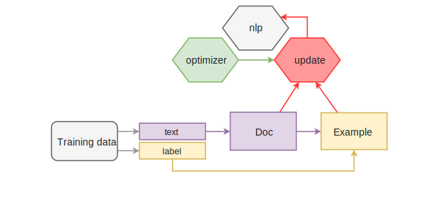

This guide describes how to train new statistical models for spaCy's
part-of-speech tagger, named entity recognizer and dependency parser. Once the
model is trained, you can then [save and load](/usage/saving-loading#models) it.

## Training basics {#basics}

import Training101 from 'usage/101/\_training.md'

<Training101 />

### Training via the command-line interface {#spacy-train-cli}

For most purposes, the best way to train spaCy is via the command-line
interface. The [`spacy train`](/api/cli#train) command takes care of many
details for you, including making sure that the data is minibatched and shuffled
correctly, progress is printed, and models are saved after each epoch. You can
prepare your data for use in [`spacy train`](/api/cli#train) using the
[`spacy convert`](/api/cli#convert) command, which accepts many common NLP data
formats, including `.iob` for named entities, and the CoNLL format for
dependencies:

```bash
git clone https://github.com/UniversalDependencies/UD_Spanish-AnCora
mkdir ancora-json
python -m spacy convert UD_Spanish-AnCora/es_ancora-ud-train.conllu ancora-json
python -m spacy convert UD_Spanish-AnCora/es_ancora-ud-dev.conllu ancora-json
mkdir models
python -m spacy train es models ancora-json/es_ancora-ud-train.json ancora-json/es_ancora-ud-dev.json
```

#### Understanding the training output

When you train a model using the [`spacy train`](/api/cli#train) command, you'll
see a table showing metrics after each pass over the data. Here's what those
metrics means:

> #### Tokenization metrics
>
> Note that if the development data has raw text, some of the gold-standard
> entities might not align to the predicted tokenization. These tokenization
> errors are **excluded from the NER evaluation**. If your tokenization makes it
> impossible for the model to predict 50% of your entities, your NER F-score
> might still look good.

| Name       | Description                                                                                       |
| ---------- | ------------------------------------------------------------------------------------------------- |
| `Dep Loss` | Training loss for dependency parser. Should decrease, but usually not to 0.                       |
| `NER Loss` | Training loss for named entity recognizer. Should decrease, but usually not to 0.                 |
| `UAS`      | Unlabeled attachment score for parser. The percentage of unlabeled correct arcs. Should increase. |
| `NER P.`   | NER precision on development data. Should increase.                                               |
| `NER R.`   | NER recall on development data. Should increase.                                                  |
| `NER F.`   | NER F-score on development data. Should increase.                                                 |
| `Tag %`    | Fine-grained part-of-speech tag accuracy on development data. Should increase.                    |
| `Token %`  | Tokenization accuracy on development data.                                                        |
| `CPU WPS`  | Prediction speed on CPU in words per second, if available. Should stay stable.                    |
| `GPU WPS`  | Prediction speed on GPU in words per second, if available. Should stay stable.                    |

### Improving accuracy with transfer learning {#transfer-learning new="2.1"}

In most projects, you'll usually have a small amount of labelled data, and
access to a much bigger sample of raw text. The raw text contains a lot of
information about the language in general. Learning this general information
from the raw text can help your model use the smaller labelled data more
efficiently.

The two main ways to use raw text in your spaCy models are **word vectors** and
**language model pretraining**. Word vectors provide information about the
definitions of words. The vectors are a look-up table, so each word only has one
representation, regardless of its context. Language model pretraining lets you
learn contextualized word representations. Instead of initializing spaCy's
convolutional neural network layers with random weights, the `spacy pretrain`
command trains a language model to predict each word's word vector based on the
surrounding words. The information used to predict this task is a good starting
point for other tasks such as named entity recognition, text classification or
dependency parsing.

<Infobox title="📖 Vectors and pretraining">

For more details, see the documentation on
[vectors and similarity](/usage/vectors-similarity) and the
[`spacy pretrain`](/api/cli#pretrain) command.

</Infobox>

### How do I get training data? {#training-data}

Collecting training data may sound incredibly painful – and it can be, if you're
planning a large-scale annotation project. However, if your main goal is to
update an existing model's predictions – for example, spaCy's named entity
recognition – the hard part is usually not creating the actual annotations. It's
finding representative examples and **extracting potential candidates**. The
good news is, if you've been noticing bad performance on your data, you likely
already have some relevant text, and you can use spaCy to **bootstrap a first
set of training examples**. For example, after processing a few sentences, you
may end up with the following entities, some correct, some incorrect.

> #### How many examples do I need?
>
> As a rule of thumb, you should allocate at least 10% of your project resources
> to creating training and evaluation data. If you're looking to improve an
> existing model, you might be able to start off with only a handful of
> examples. Keep in mind that you'll always want a lot more than that for
> **evaluation** – especially previous errors the model has made. Otherwise, you
> won't be able to sufficiently verify that the model has actually made the
> **correct generalizations** required for your use case.

| Text                               |  Entity | Start | End  | Label    |     |
| ---------------------------------- | ------- | ----- | ---- | -------- | --- |
| Uber blew through 1 million a week | Uber    | `0`   | `4`  | `ORG`    | ✅  |
| Android Pay expands to Canada      | Android | `0`   | `7`  | `PERSON` | ❌  |
| Android Pay expands to Canada      | Canada  | `23`  | `30` | `GPE`    | ✅  |
| Spotify steps up Asia expansion    | Spotify | `0`   | `8`  | `ORG`    | ✅  |
| Spotify steps up Asia expansion    | Asia    | `17`  | `21` | `NORP`   | ❌  |

Alternatively, the [rule-based matcher](/usage/rule-based-matching) can be a
useful tool to extract tokens or combinations of tokens, as well as their start
and end index in a document. In this case, we'll extract mentions of Google and
assume they're an `ORG`.

| Text                                  |  Entity | Start | End  | Label |     |
| ------------------------------------- | ------- | ----- | ---- | ----- | --- |
| let me google this for you            | google  | `7`   | `13` | `ORG` | ❌  |
| Google Maps launches location sharing | Google  | `0`   | `6`  | `ORG` | ❌  |
| Google rebrands its business apps     | Google  | `0`   | `6`  | `ORG` | ✅  |
| look what i found on google! 😂       | google  | `21`  | `27` | `ORG` | ✅  |

Based on the few examples above, you can already create six training sentences
with eight entities in total. Of course, what you consider a "correct
annotation" will always depend on **what you want the model to learn**. While
there are some entity annotations that are more or less universally correct –
like Canada being a geopolitical entity – your application may have its very own
definition of the [NER annotation scheme](/api/annotation#named-entities).

```python
train_data = [
    ("Uber blew through $1 million a week", [(0, 4, 'ORG')]),
    ("Android Pay expands to Canada", [(0, 11, 'PRODUCT'), (23, 30, 'GPE')]),
    ("Spotify steps up Asia expansion", [(0, 8, "ORG"), (17, 21, "LOC")]),
    ("Google Maps launches location sharing", [(0, 11, "PRODUCT")]),
    ("Google rebrands its business apps", [(0, 6, "ORG")]),
    ("look what i found on google! 😂", [(21, 27, "PRODUCT")])]
```

<Infobox title="Tip: Try the Prodigy annotation tool">

[](https://prodi.gy)

If you need to label a lot of data, check out [Prodigy](https://prodi.gy), a
new, active learning-powered annotation tool we've developed. Prodigy is fast
and extensible, and comes with a modern **web application** that helps you
collect training data faster. It integrates seamlessly with spaCy, pre-selects
the **most relevant examples** for annotation, and lets you train and evaluate
ready-to-use spaCy models.

</Infobox>

### Training with annotations {#annotations}

The [`GoldParse`](/api/goldparse) object collects the annotated training
examples, also called the **gold standard**. It's initialized with the
[`Doc`](/api/doc) object it refers to, and keyword arguments specifying the
annotations, like `tags` or `entities`. Its job is to encode the annotations,
keep them aligned and create the C-level data structures required for efficient
access. Here's an example of a simple `GoldParse` for part-of-speech tags:

```python
vocab = Vocab(tag_map={"N": {"pos": "NOUN"}, "V": {"pos": "VERB"}})
doc = Doc(vocab, words=["I", "like", "stuff"])
gold = GoldParse(doc, tags=["N", "V", "N"])
```

Using the `Doc` and its gold-standard annotations, the model can be updated to
learn a sentence of three words with their assigned part-of-speech tags. The
[tag map](/usage/adding-languages#tag-map) is part of the vocabulary and defines
the annotation scheme. If you're training a new language model, this will let
you map the tags present in the treebank you train on to spaCy's tag scheme.

```python
doc = Doc(Vocab(), words=["Facebook", "released", "React", "in", "2014"])
gold = GoldParse(doc, entities=["U-ORG", "O", "U-TECHNOLOGY", "O", "U-DATE"])
```

The same goes for named entities. The letters added before the labels refer to
the tags of the [BILUO scheme](/usage/linguistic-features#updating-biluo) – `O`
is a token outside an entity, `U` an single entity unit, `B` the beginning of an
entity, `I` a token inside an entity and `L` the last token of an entity.

> - **Training data**: The training examples.
> - **Text and label**: The current example.
> - **Doc**: A `Doc` object created from the example text.
> - **GoldParse**: A `GoldParse` object of the `Doc` and label.
> - **nlp**: The `nlp` object with the model.
> - **Optimizer**: A function that holds state between updates.
> - **Update**: Update the model's weights.



Of course, it's not enough to only show a model a single example once.
Especially if you only have few examples, you'll want to train for a **number of
iterations**. At each iteration, the training data is **shuffled** to ensure the
model doesn't make any generalizations based on the order of examples. Another
technique to improve the learning results is to set a **dropout rate**, a rate
at which to randomly "drop" individual features and representations. This makes
it harder for the model to memorize the training data. For example, a `0.25`
dropout means that each feature or internal representation has a 1/4 likelihood
of being dropped.

> - [`begin_training()`](/api/language#begin_training): Start the training and
>   return an optimizer function to update the model's weights. Can take an
>   optional function converting the training data to spaCy's training
>   format. -[`update()`](/api/language#update): Update the model with the
>   training example and gold data. -[`to_disk()`](/api/language#to_disk): Save
>   the updated model to a directory.

```python
### Example training loop
optimizer = nlp.begin_training(get_data)
for itn in range(100):
    random.shuffle(train_data)
    for raw_text, entity_offsets in train_data:
        doc = nlp.make_doc(raw_text)
        gold = GoldParse(doc, entities=entity_offsets)
        nlp.update([doc], [gold], drop=0.5, sgd=optimizer)
nlp.to_disk("/model")
```

The [`nlp.update`](/api/language#update) method takes the following arguments:

| Name    | Description                                                                                                                                                                                                   |
| ------- | ------------------------------------------------------------------------------------------------------------------------------------------------------------------------------------------------------------- |
| `docs`  | [`Doc`](/api/doc) objects. The `update` method takes a sequence of them, so you can batch up your training examples. Alternatively, you can also pass in a sequence of raw texts.                             |
| `golds` | [`GoldParse`](/api/goldparse) objects. The `update` method takes a sequence of them, so you can batch up your training examples. Alternatively, you can also pass in a dictionary containing the annotations. |
| `drop`  | Dropout rate. Makes it harder for the model to just memorize the data.                                                                                                                                        |
| `sgd`   | An optimizer, i.e. a callable to update the model's weights. If not set, spaCy will create a new one and save it for further use.                                                                             |

Instead of writing your own training loop, you can also use the built-in
[`train`](/api/cli#train) command, which expects data in spaCy's
[JSON format](/api/annotation#json-input). On each epoch, a model will be saved
out to the directory. After training, you can use the
[`package`](/api/cli#package) command to generate an installable Python package
from your model.

```bash
python -m spacy convert /tmp/train.conllu /tmp/data
python -m spacy train en /tmp/model /tmp/data/train.json -n 5
```

### Simple training style {#training-simple-style new="2"}

Instead of sequences of `Doc` and `GoldParse` objects, you can also use the
"simple training style" and pass **raw texts** and **dictionaries of
annotations** to [`nlp.update`](/api/language#update). The dictionaries can have
the keys `entities`, `heads`, `deps`, `tags` and `cats`. This is generally
recommended, as it removes one layer of abstraction, and avoids unnecessary
imports. It also makes it easier to structure and load your training data.

> #### Example Annotations
>
> ```python
> {
>    "entities": [(0, 4, "ORG")],
>    "heads": [1, 1, 1, 5, 5, 2, 7, 5],
>    "deps": ["nsubj", "ROOT", "prt", "quantmod", "compound", "pobj", "det", "npadvmod"],
>    "tags": ["PROPN", "VERB", "ADP", "SYM", "NUM", "NUM", "DET", "NOUN"],
>    "cats": {"BUSINESS": 1.0},
> }
> ```

```python
### Simple training loop
TRAIN_DATA = [
        (u"Uber blew through $1 million a week", {"entities": [(0, 4, "ORG")]}),
        (u"Google rebrands its business apps", {"entities": [(0, 6, "ORG")]})]

nlp = spacy.blank('en')
optimizer = nlp.begin_training()
for i in range(20):
    random.shuffle(TRAIN_DATA)
    for text, annotations in TRAIN_DATA:
        nlp.update([text], [annotations], sgd=optimizer)
nlp.to_disk("/model")
```

The above training loop leaves out a few details that can really improve
accuracy – but the principle really is _that_ simple. Once you've got your
pipeline together and you want to tune the accuracy, you usually want to process
your training examples in batches, and experiment with
[`minibatch`](/api/top-level#util.minibatch) sizes and dropout rates, set via
the `drop` keyword argument. See the [`Language`](/api/language) and
[`Pipe`](/api/pipe) API docs for available options.

## Training the named entity recognizer {#ner}

All [spaCy models](/models) support online learning, so you can update a
pre-trained model with new examples. You'll usually need to provide many
**examples** to meaningfully improve the system — a few hundred is a good start,
although more is better.

You should avoid iterating over the same few examples multiple times, or the
model is likely to "forget" how to annotate other examples. If you iterate over
the same few examples, you're effectively changing the loss function. The
optimizer will find a way to minimize the loss on your examples, without regard
for the consequences on the examples it's no longer paying attention to. One way
to avoid this
["catastrophic forgetting" problem](https://explosion.ai/blog/pseudo-rehearsal-catastrophic-forgetting)
is to "remind" the model of other examples by augmenting your annotations with
sentences annotated with entities automatically recognized by the original
model. Ultimately, this is an empirical process: you'll need to **experiment on
your data** to find a solution that works best for you.

> #### Tip: Converting entity annotations
>
> You can train the entity recognizer with entity offsets or annotations in the
> [BILUO scheme](/api/annotation#biluo). The `spacy.gold` module also exposes
> [two helper functions](/api/goldparse#util) to convert offsets to BILUO tags,
> and BILUO tags to entity offsets.

### Updating the Named Entity Recognizer {#example-train-ner}

This example shows how to update spaCy's entity recognizer with your own
examples, starting off with an existing, pre-trained model, or from scratch
using a blank `Language` class. To do this, you'll need **example texts** and
the **character offsets** and **labels** of each entity contained in the texts.

```python
https://github.com/explosion/spaCy/tree/master/examples/training/train_ner.py
```

#### Step by step guide {#step-by-step-ner}

1. **Load the model** you want to start with, or create an **empty model** using
   [`spacy.blank`](/api/top-level#spacy.blank) with the ID of your language. If
   you're using a blank model, don't forget to add the entity recognizer to the
   pipeline. If you're using an existing model, make sure to disable all other
   pipeline components during training using
   [`nlp.disable_pipes`](/api/language#disable_pipes). This way, you'll only be
   training the entity recognizer.
2. **Shuffle and loop over** the examples. For each example, **update the
   model** by calling [`nlp.update`](/api/language#update), which steps through
   the words of the input. At each word, it makes a **prediction**. It then
   consults the annotations to see whether it was right. If it was wrong, it
   adjusts its weights so that the correct action will score higher next time.
3. **Save** the trained model using [`nlp.to_disk`](/api/language#to_disk).
4. **Test** the model to make sure the entities in the training data are
   recognized correctly.

### Training an additional entity type {#example-new-entity-type}

This script shows how to add a new entity type `ANIMAL` to an existing
pre-trained NER model, or an empty `Language` class. To keep the example short
and simple, only a few sentences are provided as examples. In practice, you'll
need many more — a few hundred would be a good start. You will also likely need
to mix in examples of other entity types, which might be obtained by running the
entity recognizer over unlabelled sentences, and adding their annotations to the
training set.

```python
https://github.com/explosion/spaCy/tree/master/examples/training/train_new_entity_type.py
```

<Infobox title="Important note" variant="warning">

If you're using an existing model, make sure to mix in examples of **other
entity types** that spaCy correctly recognized before. Otherwise, your model
might learn the new type, but "forget" what it previously knew. This is also
referred to as the "catastrophic forgetting" problem.

</Infobox>

#### Step by step guide {#step-by-step-ner-new}

1. **Load the model** you want to start with, or create an **empty model** using
   [`spacy.blank`](/api/top-level#spacy.blank) with the ID of your language. If
   you're using a blank model, don't forget to add the entity recognizer to the
   pipeline. If you're using an existing model, make sure to disable all other
   pipeline components during training using
   [`nlp.disable_pipes`](/api/language#disable_pipes). This way, you'll only be
   training the entity recognizer.
2. **Add the new entity label** to the entity recognizer using the
   [`add_label`](/api/entityrecognizer#add_label) method. You can access the
   entity recognizer in the pipeline via `nlp.get_pipe('ner')`.
3. **Loop over** the examples and call [`nlp.update`](/api/language#update),
   which steps through the words of the input. At each word, it makes a
   **prediction**. It then consults the annotations, to see whether it was
   right. If it was wrong, it adjusts its weights so that the correct action
   will score higher next time.
4. **Save** the trained model using [`nlp.to_disk`](/api/language#to_disk).
5. **Test** the model to make sure the new entity is recognized correctly.

## Training the tagger and parser {#tagger-parser}

### Updating the Dependency Parser {#example-train-parser}

This example shows how to train spaCy's dependency parser, starting off with an
existing model or a blank model. You'll need a set of **training examples** and
the respective **heads** and **dependency label** for each token of the example
texts.

```python
https://github.com/explosion/spaCy/tree/master/examples/training/train_parser.py
```

#### Step by step guide {#step-by-step-parser}

1. **Load the model** you want to start with, or create an **empty model** using
   [`spacy.blank`](/api/top-level#spacy.blank) with the ID of your language. If
   you're using a blank model, don't forget to add the parser to the pipeline.
   If you're using an existing model, make sure to disable all other pipeline
   components during training using
   [`nlp.disable_pipes`](/api/language#disable_pipes). This way, you'll only be
   training the parser.
2. **Add the dependency labels** to the parser using the
   [`add_label`](/api/dependencyparser#add_label) method. If you're starting off
   with a pre-trained spaCy model, this is usually not necessary – but it
   doesn't hurt either, just to be safe.
3. **Shuffle and loop over** the examples. For each example, **update the
   model** by calling [`nlp.update`](/api/language#update), which steps through
   the words of the input. At each word, it makes a **prediction**. It then
   consults the annotations to see whether it was right. If it was wrong, it
   adjusts its weights so that the correct action will score higher next time.
4. **Save** the trained model using [`nlp.to_disk`](/api/language#to_disk).
5. **Test** the model to make sure the parser works as expected.

### Updating the Part-of-speech Tagger {#example-train-tagger}

In this example, we're training spaCy's part-of-speech tagger with a custom tag
map. We start off with a blank `Language` class, update its defaults with our
custom tags and then train the tagger. You'll need a set of **training
examples** and the respective **custom tags**, as well as a dictionary mapping
those tags to the
[Universal Dependencies scheme](http://universaldependencies.github.io/docs/u/pos/index.html).

```python
https://github.com/explosion/spaCy/tree/master/examples/training/train_tagger.py
```

#### Step by step guide {#step-by-step-tagger}

1. **Load the model** you want to start with, or create an **empty model** using
   [`spacy.blank`](/api/top-level#spacy.blank) with the ID of your language. If
   you're using a blank model, don't forget to add the tagger to the pipeline.
   If you're using an existing model, make sure to disable all other pipeline
   components during training using
   [`nlp.disable_pipes`](/api/language#disable_pipes). This way, you'll only be
   training the tagger.
2. **Add the tag map** to the tagger using the
   [`add_label`](/api/tagger#add_label) method. The first argument is the new
   tag name, the second the mapping to spaCy's coarse-grained tags, e.g.
   `{'pos': 'NOUN'}`.
3. **Shuffle and loop over** the examples. For each example, **update the
   model** by calling [`nlp.update`](/api/language#update), which steps through
   the words of the input. At each word, it makes a **prediction**. It then
   consults the annotations to see whether it was right. If it was wrong, it
   adjusts its weights so that the correct action will score higher next time.
4. **Save** the trained model using [`nlp.to_disk`](/api/language#to_disk).
5. **Test** the model to make sure the parser works as expected.

### Training a parser for custom semantics {#intent-parser}

spaCy's parser component can be used to be trained to predict any type of tree
structure over your input text – including **semantic relations** that are not
syntactic dependencies. This can be useful to for **conversational
applications**, which need to predict trees over whole documents or chat logs,
with connections between the sentence roots used to annotate discourse
structure. For example, you can train spaCy's parser to label intents and their
targets, like attributes, quality, time and locations. The result could look
like this:


```python
doc = nlp(u"find a hotel with good wifi")
print([(t.text, t.dep_, t.head.text) for t in doc if t.dep_ != '-'])
# [('find', 'ROOT', 'find'), ('hotel', 'PLACE', 'find'),
#  ('good', 'QUALITY', 'wifi'), ('wifi', 'ATTRIBUTE', 'hotel')]
```

The above tree attaches "wifi" to "hotel" and assigns the dependency label
`ATTRIBUTE`. This may not be a correct syntactic dependency – but in this case,
it expresses exactly what we need: the user is looking for a hotel with the
attribute "wifi" of the quality "good". This query can then be processed by your
application and used to trigger the respective action – e.g. search the database
for hotels with high ratings for their wifi offerings.

> #### Tip: merge phrases and entities
>
> To achieve even better accuracy, try merging multi-word tokens and entities
> specific to your domain into one token before parsing your text. You can do
> this by running the entity recognizer or
> [rule-based matcher](/usage/rule-based-matching) to find relevant spans, and
> merging them using [`Doc.retokenize`](/api/doc#retokenize). You could even add
> your own custom
> [pipeline component](/usage/processing-pipelines#custom-components) to do this
> automatically – just make sure to add it `before='parser'`.

The following example shows a full implementation of a training loop for a
custom message parser for a common "chat intent": finding local businesses. Our
message semantics will have the following types of relations: `ROOT`, `PLACE`,
`QUALITY`, `ATTRIBUTE`, `TIME` and `LOCATION`.

```python
https://github.com/explosion/spaCy/tree/master/examples/training/train_intent_parser.py
```

#### Step by step guide {#step-by-step-parser-custom}

1. **Create the training data** consisting of words, their heads and their
   dependency labels in order. A token's head is the index of the token it is
   attached to. The heads don't need to be syntactically correct – they should
   express the **semantic relations** you want the parser to learn. For words
   that shouldn't receive a label, you can choose an arbitrary placeholder, for
   example `-`.
2. **Load the model** you want to start with, or create an **empty model** using
   [`spacy.blank`](/api/top-level#spacy.blank) with the ID of your language. If
   you're using a blank model, don't forget to add the custom parser to the
   pipeline. If you're using an existing model, make sure to **remove the old
   parser** from the pipeline, and disable all other pipeline components during
   training using [`nlp.disable_pipes`](/api/language#disable_pipes). This way,
   you'll only be training the parser.
3. **Add the dependency labels** to the parser using the
   [`add_label`](/api/dependencyparser#add_label) method.
4. **Shuffle and loop over** the examples. For each example, **update the
   model** by calling [`nlp.update`](/api/language#update), which steps through
   the words of the input. At each word, it makes a **prediction**. It then
   consults the annotations to see whether it was right. If it was wrong, it
   adjusts its weights so that the correct action will score higher next time.
5. **Save** the trained model using [`nlp.to_disk`](/api/language#to_disk).
6. **Test** the model to make sure the parser works as expected.

## Training a text classification model {#textcat}

### Adding a text classifier to a spaCy model {#example-textcat new="2"}

This example shows how to train a convolutional neural network text classifier
on IMDB movie reviews, using spaCy's new
[`TextCategorizer`](/api/textcategorizer) component. The dataset will be loaded
automatically via Thinc's built-in dataset loader. Predictions are available via
[`Doc.cats`](/api/doc#attributes).

```python
https://github.com/explosion/spaCy/tree/master/examples/training/train_textcat.py
```

#### Step by step guide {#step-by-step-textcat}

1. **Load the model** you want to start with, or create an **empty model** using
   [`spacy.blank`](/api/top-level#spacy.blank) with the ID of your language. If
   you're using an existing model, make sure to disable all other pipeline
   components during training using
   [`nlp.disable_pipes`](/api/language#disable_pipes). This way, you'll only be
   training the text classifier.
2. **Add the text classifier** to the pipeline, and add the labels you want to
   train – for example, `POSITIVE`.
3. **Load and pre-process the dataset**, shuffle the data and split off a part
   of it to hold back for evaluation. This way, you'll be able to see results on
   each training iteration.
4. **Loop over** the training examples and partition them into batches using
   spaCy's [`minibatch`](/api/top-level#util.minibatch) and
   [`compounding`](/api/top-level#util.compounding) helpers.
5. **Update the model** by calling [`nlp.update`](/api/language#update), which
   steps through the examples and makes a **prediction**. It then consults the
   annotations to see whether it was right. If it was wrong, it adjusts its
   weights so that the correct prediction will score higher next time.
6. Optionally, you can also **evaluate the text classifier** on each iteration,
   by checking how it performs on the development data held back from the
   dataset. This lets you print the **precision**, **recall** and **F-score**.
7. **Save** the trained model using [`nlp.to_disk`](/api/language#to_disk).
8. **Test** the model to make sure the text classifier works as expected.

## Optimization tips and advice {#tips}

There are lots of conflicting "recipes" for training deep neural networks at the
moment. The cutting-edge models take a very long time to train, so most
researchers can't run enough experiments to figure out what's _really_ going on.
For what it's worth, here's a recipe that seems to work well on a lot of NLP
problems:

1. Initialize with batch size 1, and compound to a maximum determined by your
   data size and problem type.
2. Use Adam solver with fixed learning rate.
3. Use averaged parameters
4. Use L2 regularization.
5. Clip gradients by L2 norm to 1.
6. On small data sizes, start at a high dropout rate, with linear decay.

This recipe has been cobbled together experimentally. Here's why the various
elements of the recipe made enough sense to try initially, and what you might
try changing, depending on your problem.

### Compounding batch size {#tips-batch-size}

The trick of increasing the batch size is starting to become quite popular (see
[Smith et al., 2017](https://arxiv.org/abs/1711.00489)). Their recipe is quite
different from how spaCy's models are being trained, but there are some
similarities. In training the various spaCy models, we haven't found much
advantage from decaying the learning rate – but starting with a low batch size
has definitely helped. You should try it out on your data, and see how you go.
Here's our current strategy:

```python
### Batch heuristic
def get_batches(train_data, model_type):
    max_batch_sizes = {"tagger": 32, "parser": 16, "ner": 16, "textcat": 64}
    max_batch_size = max_batch_sizes[model_type]
    if len(train_data) < 1000:
        max_batch_size /= 2
    if len(train_data) < 500:
        max_batch_size /= 2
    batch_size = compounding(1, max_batch_size, 1.001)
    batches = minibatch(train_data, size=batch_size)
    return batches
```

This will set the batch size to start at `1`, and increase each batch until it
reaches a maximum size. The tagger, parser and entity recognizer all take whole
sentences as input, so they're learning a lot of labels in a single example. You
therefore need smaller batches for them. The batch size for the text categorizer
should be somewhat larger, especially if your documents are long.

### Learning rate, regularization and gradient clipping {#tips-hyperparams}

By default spaCy uses the Adam solver, with default settings (learning rate
`0.001`, `beta1=0.9`, `beta2=0.999`). Some researchers have said they found
these settings terrible on their problems – but they've always performed very
well in training spaCy's models, in combination with the rest of our recipe. You
can change these settings directly, by modifying the corresponding attributes on
the `optimizer` object. You can also set environment variables, to adjust the
defaults.

There are two other key hyper-parameters of the solver: `L2` **regularization**,
and **gradient clipping** (`max_grad_norm`). Gradient clipping is a hack that's
not discussed often, but everybody seems to be using. It's quite important in
helping to ensure the network doesn't diverge, which is a fancy way of saying
"fall over during training". The effect is sort of similar to setting the
learning rate low. It can also compensate for a large batch size (this is a good
example of how the choices of all these hyper-parameters intersect).

### Dropout rate {#tips-dropout}

For small datasets, it's useful to set a **high dropout rate at first**, and
**decay** it down towards a more reasonable value. This helps avoid the network
immediately overfitting, while still encouraging it to learn some of the more
interesting things in your data. spaCy comes with a
[`decaying`](/api/top-level#util.decaying) utility function to facilitate this.
You might try setting:

```python
from spacy.util import decaying
dropout = decaying(0.6, 0.2, 1e-4)
```

You can then draw values from the iterator with `next(dropout)`, which you would
pass to the `drop` keyword argument of [`nlp.update`](/api/language#update).
It's pretty much always a good idea to use at least **some dropout**. All of the
models currently use Bernoulli dropout, for no particularly principled reason –
we just haven't experimented with another scheme like Gaussian dropout yet.

### Parameter averaging {#tips-param-avg}

The last part of our optimization recipe is **parameter averaging**, an old
trick introduced by
[Freund and Schapire (1999)](https://cseweb.ucsd.edu/~yfreund/papers/LargeMarginsUsingPerceptron.pdf),
popularized in the NLP community by
[Collins (2002)](http://www.aclweb.org/anthology/P04-1015), and explained in
more detail by [Leon Bottou](http://leon.bottou.org/projects/sgd). Just about
the only other people who seem to be using this for neural network training are
the SyntaxNet team (one of whom is Michael Collins) – but it really seems to
work great on every problem.

The trick is to store the moving average of the weights during training. We
don't optimize this average – we just track it. Then when we want to actually
use the model, we use the averages, not the most recent value. In spaCy (and
[Thinc](https://github.com/explosion/thinc)) this is done by using a context
manager, [`use_params`](/api/language#use_params), to temporarily replace the
weights:

```python
with nlp.use_params(optimizer.averages):
    nlp.to_disk("/model")
```

The context manager is handy because you naturally want to evaluate and save the
model at various points during training (e.g. after each epoch). After
evaluating and saving, the context manager will exit and the weights will be
restored, so you resume training from the most recent value, rather than the
average. By evaluating the model after each epoch, you can remove one
hyper-parameter from consideration (the number of epochs). Having one less magic
number to guess is extremely nice – so having the averaging under a context
manager is very convenient.
