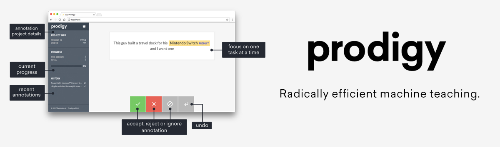

## Introduction to training models {#basics hidden="true"}

import Training101 from 'usage/101/\_training.md'

<Training101 />

<Infobox title="Tip: Try the Prodigy annotation tool">

[](https://prodi.gy)

If you need to label a lot of data, check out [Prodigy](https://prodi.gy), a
new, active learning-powered annotation tool we've developed. Prodigy is fast
and extensible, and comes with a modern **web application** that helps you
collect training data faster. It integrates seamlessly with spaCy, pre-selects
the **most relevant examples** for annotation, and lets you train and evaluate
ready-to-use spaCy models.

</Infobox>

## Quickstart {#quickstart}

The recommended way to train your spaCy models is via the
[`spacy train`](/api/cli#train) command on the command line. It only needs a
single [`config.cfg`](#config) **configuration file** that includes all settings
and hyperparameters. You can optionally [overwritten](#config-overrides)
settings on the command line, and load in a Python file to register
[custom functions](#custom-code) and architectures. This quickstart widget helps
you generate a starter config with the **recommended settings** for your
specific use case. It's also available in spaCy as the
[`init config`](/api/cli#init-config) command.

> #### Instructions: widget
>
> 1. Select your requirements and settings.
> 2. Use the buttons at the bottom to save the result to your clipboard or a
>    file `base_config.cfg`.
> 3. Run [`init fill-config`](/api/cli#init-fill-config) to create a full
>    config.
> 4. Run [`train`](/api/cli#train) with your config and data.
>
> #### Instructions: CLI
>
> 1. Run the [`init config`](/api/cli#init-config) command and specify your
>    requirements and settings as CLI arguments.
> 2. Run [`train`](/api/cli#train) with the exported config and data.

import QuickstartTraining from 'widgets/quickstart-training.js'

<QuickstartTraining download="base_config.cfg" />

After you've saved the starter config to a file `base_config.cfg`, you can use
the [`init fill-config`](/api/cli#init-fill-config) command to fill in the
remaining defaults. Training configs should always be **complete and without
hidden defaults**, to keep your experiments reproducible.

```bash
$ python -m spacy init fill-config base_config.cfg config.cfg
```

> #### Tip: Debug your data
>
> The [`debug data` command](/api/cli#debug-data) lets you analyze and validate
> your training and development data, get useful stats, and find problems like
> invalid entity annotations, cyclic dependencies, low data labels and more.
>
> ```bash
> $ python -m spacy debug data config.cfg --verbose
> ```

Instead of exporting your starter config from the quickstart widget and
auto-filling it, you can also use the [`init config`](/api/cli#init-config)
command and specify your requirement and settings and CLI arguments. You can now
add your data and run [`train`](/api/cli#train) with your config. See the
[`convert`](/api/cli#convert) command for details on how to convert your data to
spaCy's binary `.spacy` format. You can either include the data paths in the
`[paths]` section of your config, or pass them in via the command line.

```bash
$ python -m spacy train config.cfg --output ./output --paths.train ./train.spacy --paths.dev ./dev.spacy
```

<Project id="some_example_project">

The easiest way to get started with an end-to-end training process is to clone a
[project](/usage/projects) template. Projects let you manage multi-step
workflows, from data preprocessing to training and packaging your model.

</Project>

## Training config {#config}

> #### Migration from spaCy v2.x
>
> TODO: once we have an answer for how to update the training command
> (`spacy migrate`?), add details here

Training config files include all **settings and hyperparameters** for training
your model. Instead of providing lots of arguments on the command line, you only
need to pass your `config.cfg` file to [`spacy train`](/api/cli#train). Under
the hood, the training config uses the
[configuration system](https://thinc.ai/docs/usage-config) provided by our
machine learning library [Thinc](https://thinc.ai). This also makes it easy to
integrate custom models and architectures, written in your framework of choice.
Some of the main advantages and features of spaCy's training config are:

- **Structured sections.** The config is grouped into sections, and nested
  sections are defined using the `.` notation. For example, `[components.ner]`
  defines the settings for the pipeline's named entity recognizer. The config
  can be loaded as a Python dict.
- **References to registered functions.** Sections can refer to registered
  functions like [model architectures](/api/architectures),
  [optimizers](https://thinc.ai/docs/api-optimizers) or
  [schedules](https://thinc.ai/docs/api-schedules) and define arguments that are
  passed into them. You can also register your own functions to define
  [custom architectures](#custom-models), reference them in your config and
  tweak their parameters.
- **Interpolation.** If you have hyperparameters or other settings used by
  multiple components, define them once and reference them as
  [variables](#config-interpolation).
- **Reproducibility with no hidden defaults.** The config file is the "single
  source of truth" and includes all settings. <!-- TODO: explain this better -->
- **Automated checks and validation.** When you load a config, spaCy checks if
  the settings are complete and if all values have the correct types. This lets
  you catch potential mistakes early. In your custom architectures, you can use
  Python [type hints](https://docs.python.org/3/library/typing.html) to tell the
  config which types of data to expect.

```ini
https://github.com/explosion/spaCy/blob/develop/spacy/default_config.cfg
```

Under the hood, the config is parsed into a dictionary. It's divided into
sections and subsections, indicated by the square brackets and dot notation. For
example, `[training]` is a section and `[training.batch_size]` a subsections.
Subsections can define values, just like a dictionary, or use the `@` syntax to
refer to [registered functions](#config-functions). This allows the config to
not just define static settings, but also construct objects like architectures,
schedules, optimizers or any other custom components. The main top-level
sections of a config file are:

| Section       | Description                                                                                                                                                     |
| ------------- | --------------------------------------------------------------------------------------------------------------------------------------------------------------- |
| `nlp`         | Definition of the `nlp` object, its tokenizer and [processing pipeline](/usage/processing-pipelines) component names.                                           |
| `components`  | Definitions of the [pipeline components](/usage/processing-pipelines) and their models.                                                                         |
| `paths`       | Paths to data and other assets. Re-used across the config as variables, e.g. `${paths:train}`, and can be [overwritten](#config-overrides) on the CLI.          |
| `system`      | Settings related to system and hardware. Re-used across the config as variables, e.g. `${system.seed}`, and can be [overwritten](#config-overrides) on the CLI. |
| `training`    | Settings and controls for the training and evaluation process.                                                                                                  |
| `pretraining` | Optional settings and controls for the [language model pretraining](#pretraining).                                                                              |

<Infobox title="Config format and settings" emoji="📖">

For a full overview of spaCy's config format and settings, see the
[data format documentation](/api/data-formats#config) and
[Thinc's config system docs](https://thinc.ai/usage/config). The settings
available for the different architectures are documented with the
[model architectures API](/api/architectures). See the Thinc documentation for
[optimizers](https://thinc.ai/docs/api-optimizers) and
[schedules](https://thinc.ai/docs/api-schedules).

</Infobox>

### Overwriting config settings on the command line {#config-overrides}

The config system means that you can define all settings **in one place** and in
a consistent format. There are no command-line arguments that need to be set,
and no hidden defaults. However, there can still be scenarios where you may want
to override config settings when you run [`spacy train`](/api/cli#train). This
includes **file paths** to vectors or other resources that shouldn't be
hard-code in a config file, or **system-dependent settings**.

For cases like this, you can set additional command-line options starting with
`--` that correspond to the config section and value to override. For example,
`--paths.train ./corpus/train.spacy` sets the `train` value in the `[paths]`
block.

```bash
$ python -m spacy train config.cfg --paths.train ./corpus/train.spacy
--paths.dev ./corpus/dev.spacy --training.batch_size 128
```

Only existing sections and values in the config can be overwritten. At the end
of the training, the final filled `config.cfg` is exported with your model, so
you'll always have a record of the settings that were used, including your
overrides. Overrides are added before [variables](#config-interpolation) are
resolved, by the way – so if you need to use a value in multiple places,
reference it across your config and override it on the CLI once.

### Defining pipeline components {#config-components}

When you train a model, you typically train a
[pipeline](/usage/processing-pipelines) of **one or more components**. The
`[components]` block in the config defines the available pipeline components and
how they should be created – either by a built-in or custom
[factory](/usage/processing-pipelines#built-in), or
[sourced](/usage/processing-pipelines#sourced-components) from an existing
pretrained model. For example, `[components.parser]` defines the component named
`"parser"` in the pipeline. There are different ways you might want to treat
your components during training, and the most common scenarios are:

1. Train a **new component** from scratch on your data.
2. Update an existing **pretrained component** with more examples.
3. Include an existing pretrained component without updating it.
4. Include a non-trainable component, like a rule-based
   [`EntityRuler`](/api/entityruler) or [`Sentencizer`](/api/sentencizer), or a
   fully [custom component](/usage/processing-pipelines#custom-components).

If a component block defines a `factory`, spaCy will look it up in the
[built-in](/usage/processing-pipelines#built-in) or
[custom](/usage/processing-pipelines#custom-components) components and create a
new component from scratch. All settings defined in the config block will be
passed to the component factory as arguments. This lets you configure the model
settings and hyperparameters. If a component block defines a `source`, the
component will be copied over from an existing pretrained model, with its
existing weights. This lets you include an already trained component in your
model pipeline, or update a pretrained components with more data specific to
your use case.

```ini
### config.cfg (excerpt)
[components]

# "parser" and "ner" are sourced from pretrained model
[components.parser]
source = "en_core_web_sm"

[components.ner]
source = "en_core_web_sm"

# "textcat" and "custom" are created blank from built-in / custom factory
[components.textcat]
factory = "textcat"

[components.custom]
factory = "your_custom_factory"
your_custom_setting = true
```

The `pipeline` setting in the `[nlp]` block defines the pipeline components
added to the pipeline, in order. For example, `"parser"` here references
`[components.parser]`. By default, spaCy will **update all components that can
be updated**. Trainable components that are created from scratch are initialized
with random weights. For sourced components, spaCy will keep the existing
weights and [resume training](/api/language#resume_training).

If you don't want a component to be updated, you can **freeze** it by adding it
to the `frozen_components` list in the `[training]` block. Frozen components are
**not updated** during training and are included in the final trained model
as-is.

> #### Note on frozen components
>
> Even though frozen components are not **updated** during training, they will
> still **run** during training and evaluation. This is very important, because
> they may still impact your model's performance – for instance, a sentence
> boundary detector can impact what the parser or entity recognizer considers a
> valid parse. So the evaluation results should always reflect what your model
> will produce at runtime.

```ini
[nlp]
lang = "en"
pipeline = ["parser", "ner", "textcat", "custom"]

[training]
frozen_components = ["parser", "custom"]
```

### Using registered functions {#config-functions}

The training configuration defined in the config file doesn't have to only
consist of static values. Some settings can also be **functions**. For instance,
the `batch_size` can be a number that doesn't change, or a schedule, like a
sequence of compounding values, which has shown to be an effective trick (see
[Smith et al., 2017](https://arxiv.org/abs/1711.00489)).

```ini
### With static value
[training]
batch_size = 128
```

To refer to a function instead, you can make `[training.batch_size]` its own
section and use the `@` syntax specify the function and its arguments – in this
case [`compounding.v1`](https://thinc.ai/docs/api-schedules#compounding) defined
in the [function registry](/api/top-level#registry). All other values defined in
the block are passed to the function as keyword arguments when it's initialized.
You can also use this mechanism to register
[custom implementations and architectures](#custom-models) and reference them
from your configs.

> #### How the config is resolved
>
> The config file is parsed into a regular dictionary and is resolved and
> validated **bottom-up**. Arguments provided for registered functions are
> checked against the function's signature and type annotations. The return
> value of a registered function can also be passed into another function – for
> instance, a learning rate schedule can be provided as the an argument of an
> optimizer.

```ini
### With registered function
[training.batch_size]
@schedules = "compounding.v1"
start = 100
stop = 1000
compound = 1.001
```

### Using variable interpolation {#config-interpolation}

Another very useful feature of the config system is that it supports variable
interpolation for both **values and sections**. This means that you only need to
define a setting once and can reference it across your config using the
`${section:value}` or `${section.block}` syntax. In this example, the value of
`seed` is reused within the `[training]` block, and the whole block of
`[training.optimizer]` is reused in `[pretraining]` and will become
`pretraining.optimizer`.

> #### Note on syntax
>
> There are two different ways to format your variables, depending on whether
> you want to reference a single value or a block. Values are specified after a
> `:`, while blocks are specified with a `.`:
>
> 1. `${section:value}`, `${section.subsection:value}`
> 2. `${section.block}`, `${section.subsection.block}`

```ini
### config.cfg (excerpt) {highlight="5,18"}
[system]
seed = 0

[training]
seed = ${system:seed}

[training.optimizer]
@optimizers = "Adam.v1"
beta1 = 0.9
beta2 = 0.999
L2_is_weight_decay = true
L2 = 0.01
grad_clip = 1.0
use_averages = false
eps = 1e-8

[pretraining]
optimizer = ${training.optimizer}
```

You can also use variables inside strings. In that case, it works just like
f-strings in Python. If the value of a variable is not a string, it's converted
to a string.

```ini
[paths]
version = 5
root = "/Users/you/data"
train = "${paths:root}/train_${paths:version}.spacy"
# Result: /Users/you/data/train_5.spacy
```

<Infobox title="Tip: Override variables on the CLI" emoji="💡">

If you need to change certain values between training runs, you can define them
once, reference them as variables and then [override](#config-overrides) them on
the CLI. For example, `--paths.root /other/root` will change the value of `root`
in the block `[paths]` and the change will be reflected across all other values
that reference this variable.

</Infobox>

### Model architectures {#model-architectures}

<!-- TODO: refer to architectures API: /api/architectures -->

### Metrics, training output and weighted scores {#metrics}

When you train a model using the [`spacy train`](/api/cli#train) command, you'll
see a table showing the metrics after each pass over the data. The available
metrics **depend on the pipeline components**. Pipeline components also define
which scores are shown and how they should be **weighted in the final score**
that decides about the best model.

The `training.score_weights` setting in your `config.cfg` lets you customize the
scores shown in the table and how they should be weighted. In this example, the
labeled dependency accuracy and NER F-score count towards the final score with
40% each and the tagging accuracy makes up the remaining 20%. The tokenization
accuracy and speed are both shown in the table, but not counted towards the
score.

> #### Why do I need score weights?
>
> At the end of your training process, you typically want to select the **best
> model** – but what "best" means depends on the available components and your
> specific use case. For instance, you may prefer a model with higher NER and
> lower POS tagging accuracy over a model with lower NER and higher POS
> accuracy. You can express this preference in the score weights, e.g. by
> assigning `ents_f` (NER F-score) a higher weight.

```ini
[training.score_weights]
dep_las = 0.4
ents_f = 0.4
tag_acc = 0.2
token_acc = 0.0
speed = 0.0
```

The `score_weights` don't _have to_ sum to `1.0` – but it's recommended. When
you generate a config for a given pipeline, the score weights are generated by
combining and normalizing the default score weights of the pipeline components.
The default score weights are defined by each pipeline component via the
`default_score_weights` setting on the
[`@Language.component`](/api/language#component) or
[`@Language.factory`](/api/language#factory). By default, all pipeline
components are weighted equally.

<Accordion title="Understanding the training output and score types" spaced>

<!-- TODO: come up with good short explanation of precision and recall -->

| Name                       | Description                                                                                                             |
| -------------------------- | ----------------------------------------------------------------------------------------------------------------------- |
| **Loss**                   | The training loss representing the amount of work left for the optimizer. Should decrease, but usually not to `0`.      |
| **Precision** (P)          | Should increase.                                                                                                        |
| **Recall** (R)             | Should increase.                                                                                                        |
| **F-Score** (F)            | The weighted average of precision and recall. Should increase.                                                          |
| **UAS** / **LAS**          | Unlabeled and labeled attachment score for the dependency parser, i.e. the percentage of correct arcs. Should increase. |
| **Words per second** (WPS) | Prediction speed in words per second. Should stay stable.                                                               |

<!-- TODO: is this still relevant? -->

Note that if the development data has raw text, some of the gold-standard
entities might not align to the predicted tokenization. These tokenization
errors are **excluded from the NER evaluation**. If your tokenization makes it
impossible for the model to predict 50% of your entities, your NER F-score might
still look good.

</Accordion>

## Custom model implementations and architectures {#custom-models}

<!-- TODO: intro, should summarise what spaCy v3 can do and that you can now use fully custom implementations, models defined in PyTorch and TF, etc. etc. -->

### Training with custom code {#custom-code}

> ```bash
> ### Example {wrap="true"}
> $ python -m spacy train config.cfg --code functions.py
> ```

The [`spacy train`](/api/cli#train) recipe lets you specify an optional argument
`--code` that points to a Python file. The file is imported before training and
allows you to add custom functions and architectures to the function registry
that can then be referenced from your `config.cfg`. This lets you train spaCy
models with custom components, without having to re-implement the whole training
workflow.

#### Example: Modifying the nlp object {#custom-code-nlp-callbacks}

For many use cases, you don't necessarily want to implement the whole `Language`
subclass and language data from scratch – it's often enough to make a few small
modifications, like adjusting the
[tokenization rules](/usage/linguistic-features#native-tokenizer-additions) or
[language defaults](/api/language#defaults) like stop words. The config lets you
provide three optional **callback functions** that give you access to the
language class and `nlp` object at different points of the lifecycle:

| Callback                  | Description                                                                                                                                                                              |
| ------------------------- | ---------------------------------------------------------------------------------------------------------------------------------------------------------------------------------------- |
| `before_creation`         | Called before the `nlp` object is created and receives the language subclass like `English` (not the instance). Useful for writing to the [`Language.Defaults`](/api/language#defaults). |
| `after_creation`          | Called right after the `nlp` object is created, but before the pipeline components are added to the pipeline and receives the `nlp` object. Useful for modifying the tokenizer.          |
| `after_pipeline_creation` | Called right after the pipeline components are created and added and receives the `nlp` object. Useful for modifying pipeline components.                                                |

The `@spacy.registry.callbacks` decorator lets you register that function in the
`callbacks` [registry](/api/top-level#registry) under a given name. You can then
reference the function in a config block using the `@callbacks` key. If a block
contains a key starting with an `@`, it's interpreted as a reference to a
function. Because you've registered the function, spaCy knows how to create it
when you reference `"customize_language_data"` in your config. Here's an example
of a callback that runs before the `nlp` object is created and adds a few custom
tokenization rules to the defaults:

> #### config.cfg
>
> ```ini
> [nlp.before_creation]
> @callbacks = "customize_language_data"
> ```

```python
### functions.py {highlight="3,6"}
import spacy

@spacy.registry.callbacks("customize_language_data")
def create_callback():
    def customize_language_data(lang_cls):
        lang_cls.Defaults.suffixes = lang_cls.Defaults.suffixes + (r"-+$",)
        return lang_cls

    return customize_language_data
```

<Infobox variant="warning">

Remember that a registered function should always be a function that spaCy
**calls to create something**. In this case, it **creates a callback** – it's
not the callback itself.

</Infobox>

Any registered function – in this case `create_callback` – can also take
**arguments** that can be **set by the config**. This lets you implement and
keep track of different configurations, without having to hack at your code. You
can choose any arguments that make sense for your use case. In this example,
we're adding the arguments `extra_stop_words` (a list of strings) and `debug`
(boolean) for printing additional info when the function runs.

> #### config.cfg
>
> ```ini
> [nlp.before_creation]
> @callbacks = "customize_language_data"
> extra_stop_words = ["ooh", "aah"]
> debug = true
> ```

```python
### functions.py {highlight="5,8-10"}
from typing import List
import spacy

@spacy.registry.callbacks("customize_language_data")
def create_callback(extra_stop_words: List[str] = [], debug: bool = False):
    def customize_language_data(lang_cls):
        lang_cls.Defaults.suffixes = lang_cls.Defaults.suffixes + (r"-+$",)
        lang_cls.Defaults.stop_words.add(extra_stop_words)
        if debug:
            print("Updated stop words and tokenizer suffixes")
        return lang_cls

    return customize_language_data
```

<Infobox title="Tip: Use Python type hints" emoji="💡">

spaCy's configs are powered by our machine learning library Thinc's
[configuration system](https://thinc.ai/docs/usage-config), which supports
[type hints](https://docs.python.org/3/library/typing.html) and even
[advanced type annotations](https://thinc.ai/docs/usage-config#advanced-types)
using [`pydantic`](https://github.com/samuelcolvin/pydantic). If your registered
function provides type hints, the values that are passed in will be checked
against the expected types. For example, `debug: bool` in the example above will
ensure that the value received as the argument `debug` is an boolean. If the
value can't be coerced into a boolean, spaCy will raise an error.
`start: pydantic.StrictBool` will force the value to be an boolean and raise an
error if it's not – for instance, if your config defines `1` instead of `true`.

</Infobox>

With your `functions.py` defining additional code and the updated `config.cfg`,
you can now run [`spacy train`](/api/cli#train) and point the argument `--code`
to your Python file. Before loading the config, spaCy will import the
`functions.py` module and your custom functions will be registered.

```bash
### Training with custom code {wrap="true"}
python -m spacy train config.cfg --output ./output --code ./functions.py
```

#### Example: Custom batch size schedule {#custom-code-schedule}

For example, let's say you've implemented your own batch size schedule to use
during training. The `@spacy.registry.schedules` decorator lets you register
that function in the `schedules` [registry](/api/top-level#registry) and assign
it a string name:

> #### Why the version in the name?
>
> A big benefit of the config system is that it makes your experiments
> reproducible. We recommend versioning the functions you register, especially
> if you expect them to change (like a new model architecture). This way, you
> know that a config referencing `v1` means a different function than a config
> referencing `v2`.

```python
### functions.py
import spacy

@spacy.registry.schedules("my_custom_schedule.v1")
def my_custom_schedule(start: int = 1, factor: int = 1.001):
   while True:
      yield start
      start = start * factor
```

In your config, you can now reference the schedule in the
`[training.batch_size]` block via `@schedules`. If a block contains a key
starting with an `@`, it's interpreted as a reference to a function. All other
settings in the block will be passed to the function as keyword arguments. Keep
in mind that the config shouldn't have any hidden defaults and all arguments on
the functions need to be represented in the config. If your function defines
**default argument values**, spaCy is able to auto-fill your config when you run
[`init fill-config`](/api/cli#init-fill-config).

```ini
### config.cfg (excerpt)
[training.batch_size]
@schedules = "my_custom_schedule.v1"
start = 2
factor = 1.005
```

#### Example: Custom data reading and batching {#custom-code-readers-batchers}

<!-- TODO: -->

### Wrapping PyTorch and TensorFlow {#custom-frameworks}

<!-- TODO:  -->

<Project id="example_pytorch_model">

Lorem ipsum dolor sit amet, consectetur adipiscing elit. Phasellus interdum
sodales lectus, ut sodales orci ullamcorper id. Sed condimentum neque ut erat
mattis pretium.

</Project>

### Defining custom architectures {#custom-architectures}

<!-- TODO: this could maybe be a more general example of using Thinc to compose some layers? We don't want to go too deep here and probably want to focus on a simple architecture example to show how it works -->

## Transfer learning {#transfer-learning}

### Using transformer models like BERT {#transformers}

spaCy v3.0 lets you use almost any statistical model to power your pipeline. You
can use models implemented in a variety of frameworks. A transformer model is
just a statistical model, so the
[`spacy-transformers`](https://github.com/explosion/spacy-transformers) package
actually has very little work to do: it just has to provide a few functions that
do the required plumbing. It also provides a pipeline component,
[`Transformer`](/api/transformer), that lets you do multi-task learning and lets
you save the transformer outputs for later use.

<Project id="en_core_bert">

Try out a BERT-based model pipeline using this project template: swap in your
data, edit the settings and hyperparameters and train, evaluate, package and
visualize your model.

</Project>

For more details on how to integrate transformer models into your training
config and customize the implementations, see the usage guide on
[training transformers](/usage/transformers#training).

### Pretraining with spaCy {#pretraining}

<!-- TODO: document spacy pretrain, objectives etc. -->

## Parallel Training with Ray {#parallel-training}

<!-- TODO: document Ray integration -->

<Project id="some_example_project">

Lorem ipsum dolor sit amet, consectetur adipiscing elit. Phasellus interdum
sodales lectus, ut sodales orci ullamcorper id. Sed condimentum neque ut erat
mattis pretium.

</Project>

## Internal training API {#api}

<Infobox variant="warning">

spaCy gives you full control over the training loop. However, for most use
cases, it's recommended to train your models via the
[`spacy train`](/api/cli#train) command with a [`config.cfg`](#config) to keep
track of your settings and hyperparameters, instead of writing your own training
scripts from scratch.
[Custom registered functions](/usage/training/#custom-code) should typically
give you everything you need to train fully custom models with
[`spacy train`](/api/cli#train).

</Infobox>

The [`Example`](/api/example) object contains annotated training data, also
called the **gold standard**. It's initialized with a [`Doc`](/api/doc) object
that will hold the predictions, and another `Doc` object that holds the
gold-standard annotations. It also includes the **alignment** between those two
documents if they differ in tokenization. The `Example` class ensures that spaCy
can rely on one **standardized format** that's passed through the pipeline.
Here's an example of a simple `Example` for part-of-speech tags:

```python
words = ["I", "like", "stuff"]
predicted = Doc(vocab, words=words)
# create the reference Doc with gold-standard TAG annotations
tags = ["NOUN", "VERB", "NOUN"]
tag_ids = [vocab.strings.add(tag) for tag in tags]
reference = Doc(vocab, words=words).from_array("TAG", numpy.array(tag_ids, dtype="uint64"))
example = Example(predicted, reference)
```

Alternatively, the `reference` `Doc` with the gold-standard annotations can be
created from a dictionary with keyword arguments specifying the annotations,
like `tags` or `entities`. Using the `Example` object and its gold-standard
annotations, the model can be updated to learn a sentence of three words with
their assigned part-of-speech tags.

> #### About the tag map
>
> The tag map is part of the vocabulary and defines the annotation scheme. If
> you're training a new language model, this will let you map the tags present
> in the treebank you train on to spaCy's tag scheme:
>
> ```python
> tag_map = {"N": {"pos": "NOUN"}, "V": {"pos": "VERB"}}
> vocab = Vocab(tag_map=tag_map)
> ```

```python
words = ["I", "like", "stuff"]
tags = ["NOUN", "VERB", "NOUN"]
predicted = Doc(nlp.vocab, words=words)
example = Example.from_dict(predicted, {"tags": tags})
```

Here's another example that shows how to define gold-standard named entities.
The letters added before the labels refer to the tags of the
[BILUO scheme](/usage/linguistic-features#updating-biluo) – `O` is a token
outside an entity, `U` an single entity unit, `B` the beginning of an entity,
`I` a token inside an entity and `L` the last token of an entity.

```python
doc = Doc(nlp.vocab, words=["Facebook", "released", "React", "in", "2014"])
example = Example.from_dict(doc, {"entities": ["U-ORG", "O", "U-TECHNOLOGY", "O", "U-DATE"]})
```

<Infobox title="Migrating from v2.x" variant="warning">

As of v3.0, the [`Example`](/api/example) object replaces the `GoldParse` class.
It can be constructed in a very similar way, from a `Doc` and a dictionary of
annotations. For more details, see the
[migration guide](/usage/v3#migrating-training).

```diff
- gold = GoldParse(doc, entities=entities)
+ example = Example.from_dict(doc, {"entities": entities})
```

</Infobox>

Of course, it's not enough to only show a model a single example once.
Especially if you only have few examples, you'll want to train for a **number of
iterations**. At each iteration, the training data is **shuffled** to ensure the
model doesn't make any generalizations based on the order of examples. Another
technique to improve the learning results is to set a **dropout rate**, a rate
at which to randomly "drop" individual features and representations. This makes
it harder for the model to memorize the training data. For example, a `0.25`
dropout means that each feature or internal representation has a 1/4 likelihood
of being dropped.

> - [`nlp`](/api/language): The `nlp` object with the model.
> - [`nlp.begin_training`](/api/language#begin_training): Start the training and
>   return an optimizer to update the model's weights.
> - [`Optimizer`](https://thinc.ai/docs/api-optimizers): Function that holds
>   state between updates.
> - [`nlp.update`](/api/language#update): Update model with examples.
> - [`Example`](/api/example): object holding predictions and gold-standard
>   annotations.
> - [`nlp.to_disk`](/api/language#to_disk): Save the updated model to a
>   directory.

```python
### Example training loop
optimizer = nlp.begin_training()
for itn in range(100):
    random.shuffle(train_data)
    for raw_text, entity_offsets in train_data:
        doc = nlp.make_doc(raw_text)
        example = Example.from_dict(doc, {"entities": entity_offsets})
        nlp.update([example], sgd=optimizer)
nlp.to_disk("/model")
```

The [`nlp.update`](/api/language#update) method takes the following arguments:

| Name       | Description                                                                                                                                                            |
| ---------- | ---------------------------------------------------------------------------------------------------------------------------------------------------------------------- |
| `examples` | [`Example`](/api/example) objects. The `update` method takes a sequence of them, so you can batch up your training examples.                                           |
| `drop`     | Dropout rate. Makes it harder for the model to just memorize the data.                                                                                                 |
| `sgd`      | An [`Optimizer`](https://thinc.ai/docs/api-optimizers) object, which updated the model's weights. If not set, spaCy will create a new one and save it for further use. |

<Infobox title="Migrating from v2.x" variant="warning">

As of v3.0, the [`Example`](/api/example) object replaces the `GoldParse` class
and the "simple training style" of calling `nlp.update` with a text and a
dictionary of annotations. Updating your code to use the `Example` object should
be very straightforward: you can call
[`Example.from_dict`](/api/example#from_dict) with a [`Doc`](/api/doc) and the
dictionary of annotations:

```diff
text = "Facebook released React in 2014"
annotations = {"entities": ["U-ORG", "O", "U-TECHNOLOGY", "O", "U-DATE"]}
+ example = Example.from_dict(nlp.make_doc(text), {"entities": entities})
- nlp.update([text], [annotations])
+ nlp.update([example])
```

</Infobox>
