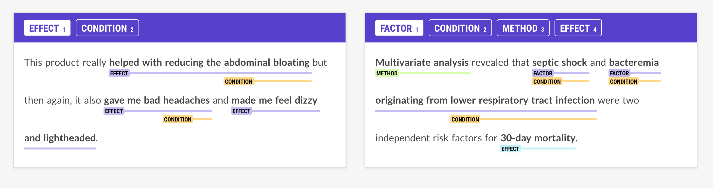

## New Features {#features hidden="true"}

<!-- TODO: intro -->

### Using predicted annotations during training {#predicted-annotations-training}

By default, components are updated in isolation during training, which means
that they don't see the predictions of any earlier components in the pipeline.
The new
[`[training.annotating_components]`](/usage/training#annotating-components)
config setting lets you specify pipeline component names that should set
annotations on the predicted docs during training. This makes it easy to use the
predictions of a previous component in the pipeline as features for a subsequent
component, e.g. the dependency labels in the tagger:

```ini
### config.cfg (excerpt) {highlight="7,12"}
[nlp]
pipeline = ["parser", "tagger"]

[components.tagger.model.tok2vec.embed]
@architectures = "spacy.MultiHashEmbed.v1"
width = ${components.tagger.model.tok2vec.encode.width}
attrs = ["NORM","DEP"]
rows = [5000,2500]
include_static_vectors = false

[training]
annotating_components = ["parser"]
```

<Project id="pipelines/tagger_parser_predicted_annotations">

This project shows how to use the `token.dep` attribute predicted by the parser
as a feature for a subsequent tagger component in the pipeline.

</Project>

### SpanCategorizer for predicting arbitrary and overlapping spans {#spancategorizer tag="experimental"}

A common task in applied NLP is extracting spans of texts from documents,
including longer phrases or nested expressions. Named entity recognition isn't
the right tool for this problem, since an entity recognizer typically predicts
single token-based tags that are very sensitive to boundaries. This is effective
for proper nouns and self-contained expressions, but less useful for other types
of phrases or overlapping spans. The new
[`SpanCategorizer`](/api/spancategorizer) component and
[SpanCategorizer](/api/architectures#spancategorizer) architecture let you label
arbitrary and potentially overlapping spans of texts. A span categorizer
consists of two parts: a [suggester function](/api/spancategorizer#suggesters)
that proposes candidate spans, which may or may not overlap, and a labeler model
that predicts zero or more labels for each candidate. The predicted spans are
available via the [`Doc.spans`](/api/doc#spans) container.

<!-- TODO: example, getting started (init config?), maybe project template -->

<Infobox title="Tip: Create data with Prodigy's new span annotation UI">

[](https://support.prodi.gy/t/3861)

The upcoming version of our annotation tool [Prodigy](https://prodi.gy)
(currently available as a [pre-release](https://support.prodi.gy/t/3861) for all
users) features a [new workflow and UI](https://support.prodi.gy/t/3861) for
annotating overlapping and nested spans. You can use it to create training data
for spaCy's `SpanCategorizer` component.

</Infobox>

### Update the entity recognizer with partial incorrect annotations {#negative-samples}

> #### config.cfg (excerpt)
>
> ```ini
> [components.ner]
> factory = "ner"
> incorrect_spans_key = "incorrect_spans"
> moves = null
> update_with_oracle_cut_size = 100
> ```

The [`EntityRecognizer`](/api/entityrecognizer) can now be updated with known
incorrect annotations, which lets you take advantage of partial and sparse data.
For example, you'll be able to use the information that certain spans of text
are definitely **not** `PERSON` entities, without having to provide the complete
gold-standard annotations for the given example. The incorrect span annotations
can be added via the [`Doc.spans`](/api/doc#spans) in the training data under
the key defined as [`incorrect_spans_key`](/api/entityrecognizer#init) in the
component config.

```python
train_doc = nlp.make_doc("Barack Obama was born in Hawaii.")
# The doc.spans key can be defined in the config
train_doc.spans["incorrect_spans"] = [
  Span(doc, 0, 2, label="ORG"),
  Span(doc, 5, 6, label="PRODUCT")
]
```

<!-- TODO: more details and/or example project? -->

### New pipeline packages for Catalan and Danish {#pipeline-packages}

spaCy v3.1 adds 5 new pipeline packages, including a new core family for Catalan
and a new transformer-based pipeline for Danish using the
[`danish-bert-botxo`](http://huggingface.co/Maltehb/danish-bert-botxo) weights.
See the [models directory](/models) for an overview of all available trained
pipelines and the [training guide](/usage/training) for details on how to train
your own.

Thanks to Carlos Rodríguez Penagos and the
[Barcelona Supercomputing Center](https://temu.bsc.es/) for their contributions
for Catalan and to Kenneth Enevoldsen for Danish. For additional Danish
pipelines, check out [DaCy](https://github.com/KennethEnevoldsen/DaCy).

| Package                                           | Language | UPOS | Parser LAS |  NER F |
| ------------------------------------------------- | -------- | ---: | ---------: | -----: |
| [`ca_core_news_sm`](/models/ca#ca_core_news_sm)   | Catalan  | 98.2 |       87.4 |   79.8 |
| [`ca_core_news_md`](/models/ca#ca_core_news_md)   | Catalan  | 98.3 |       88.2 |   84.0 |
| [`ca_core_news_lg`](/models/ca#ca_core_news_lg)   | Catalan  | 98.5 |       88.4 |   84.2 |
| [`ca_core_news_trf`](/models/ca#ca_core_news_trf) | Catalan  | 98.9 |       93.0 |   91.2 |
| [`da_core_news_trf`](/models/da#da_core_news_trf) | Danish   | 98.0 |       85.0 |   82.9 |

### Resizable text classification architectures {#resizable-textcat}

Previously, the [`TextCategorizer`](/api/textcategorizer) architectures could
not be resized, meaning that you couldn't add new labels to an already trained
model. In spaCy v3.1, the [TextCatCNN](/api/architectures#TextCatCNN) and
[TextCatBOW](/api/architectures#TextCatBOW) architectures are now resizable,
while ensuring that the predictions for the old labels remain the same.

### CLI command to assemble pipeline from config {#assemble}

The [`spacy assemble`](/api/cli#assemble) command lets you assemble a pipeline
from a config file without additional training. It can be especially useful for
creating a blank pipeline with a custom tokenizer, rule-based components or word
vectors.

```cli
$ python -m spacy assemble config.cfg ./output
```

### Pretty pipeline package READMEs {#package-readme}

The [`spacy package`](/api/cli#package) command now auto-generates a pretty
`README.md` based on the pipeline information defined in the `meta.json`. This
includes a table with a general overview, as well as the label scheme and
accuracy figures, if available. For an example, see the
[model releases](https://github.com/explosion/spacy-models/releases).

### Support for streaming large or infinite corpora {#streaming-corpora}

> #### config.cfg (excerpt)
>
> ```ini
> [training]
> max_epochs = -1
> ```

The training process now supports streaming large or infinite corpora
out-of-the-box, which can be controlled via the
[`[training.max_epochs]`](/api/data-formats#training) config setting. Setting it
to `-1` means that the train corpus should be streamed rather than loaded into
memory with no shuffling within the training loop. For details on how to
implement a custom corpus loader, e.g. to stream in data from a remote storage,
see the usage guide on
[custom data reading](/usage/training#custom-code-readers-batchers).

When streaming a corpus, only the first 100 examples will be used for
[initialization](/usage/training#config-lifecycle). This is no problem if you're
training a component like the text classifier with data that specifies all
available labels in every example. If necessary, you can use the
[`init labels`](/api/cli#init-labels) command to pre-generate the labels for
your components using a representative sample so the model can be initialized
correctly before training.

### New lemmatizers for Catalan and Italian {#pos-lemmatizers}

The trained pipelines for [Catalan](/models/ca) and [Italian](/models/it) now
include lemmatizers that use the predicted part-of-speech tags as part of the
lookup lemmatization for higher lemmatization accuracy. If you're training your
own pipelines for these languages and you want to include a lemmatizer, make
sure you have the
[`spacy-lookups-data`](https://github.com/explosion/spacy-lookups-data) package
installed, which provides the relevant tables.

## Notes about upgrading from v3.0 {#upgrading}

### Pipeline package version compatibility {#version-compat}

> #### Using legacy implementations
>
> In spaCy v3, you'll still be able to load and reference legacy implementations
> via [`spacy-legacy`](https://github.com/explosion/spacy-legacy), even if the
> components or architectures change and newer versions are available in the
> core library.

When you're loading a pipeline package trained with spaCy v3.0, you will see a
warning telling you that the pipeline may be incompatible. This doesn't
necessarily have to be true, but we recommend running your pipelines against
your test suite or evaluation data to make sure there are no unexpected results.
If you're using one of the [trained pipelines](/models) we provide, you should
run [`spacy download`](/api/cli#download) to update to the latest version. To
see an overview of all installed packages and their compatibility, you can run
[`spacy validate`](/api/cli#validate).

If you've trained your own custom pipeline and you've confirmed that it's still
working as expected, you can update the spaCy version requirements in the
[`meta.json`](/api/data-formats#meta):

```diff
- "spacy_version": ">=3.0.0,<3.1.0",
+ "spacy_version": ">=3.0.0,<3.2.0",
```

<!-- TODO: vectors initialization and anything else we want to mention -->
