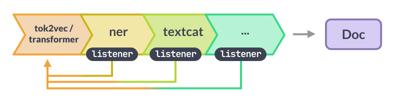
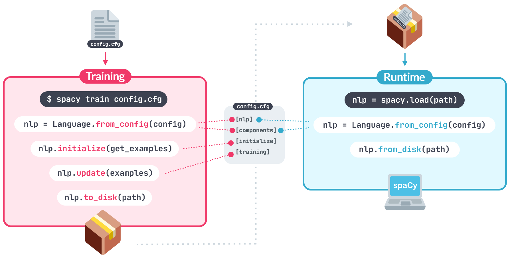
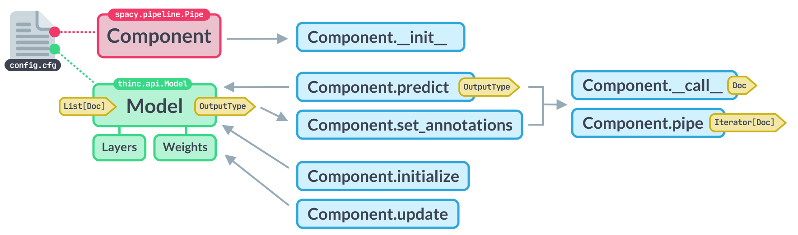
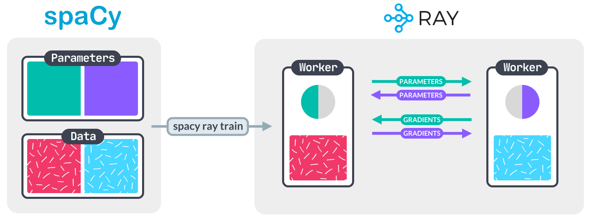
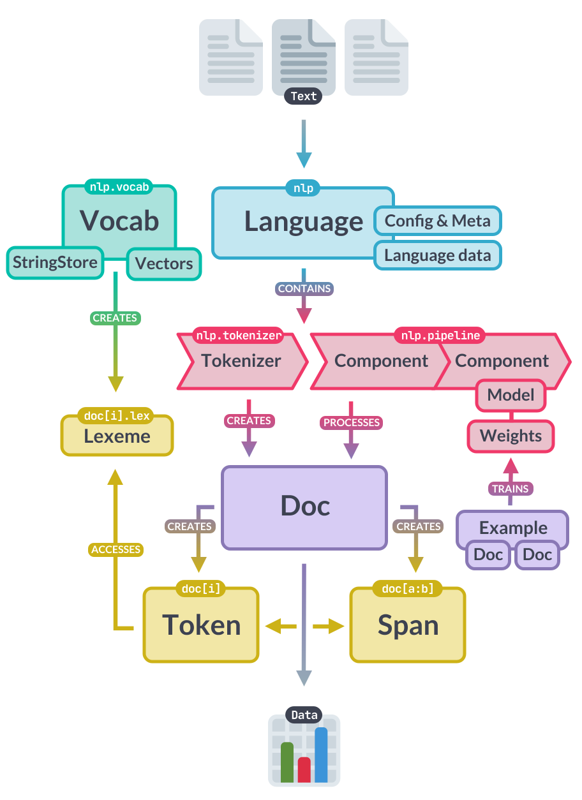

## Summary {#summary hidden="true"}

> #### 📖 Looking for the old docs?
>
> To help you make the transition from v2.x to v3.0, we've uploaded the old
> website to [**v2.spacy.io**](https://v2.spacy.io/docs).

<Infobox title="New: Commercial migration support for your spaCy pipelines" variant="warning" emoji="📣">

Want to make the transition from spaCy v2 to spaCy v3 as smooth as possible for
you and your organization? We're now offering commercial **migration support**
for your spaCy pipelines! We've put a lot of work into making it easy to upgrade
your existing code and training workflows – but custom projects may always need
some custom work, especially when it comes to taking advantage of the new
capabilities.
[**Details & application &rarr;**](https://form.typeform.com/to/vMs2zSjM)

</Infobox>

<Grid cols={2} gutterBottom={false}>

<div>

spaCy v3.0 features all new **transformer-based pipelines** that bring spaCy's
accuracy right up to the current **state-of-the-art**. You can use any
pretrained transformer to train your own pipelines, and even share one
transformer between multiple components with **multi-task learning**. Training
is now fully configurable and extensible, and you can define your own custom
models using **PyTorch**, **TensorFlow** and other frameworks. The new spaCy
projects system lets you describe whole **end-to-end workflows** in a single
file, giving you an easy path from prototype to production, and making it easy
to clone and adapt best-practice projects for your own use cases.

</div>

<Infobox title="Table of Contents" id="toc">

- [Summary](#summary)
- [New features](#features)
- [Transformer-based pipelines](#features-transformers)
- [Training & config system](#features-training)
- [Custom models](#features-custom-models)
- [End-to-end project workflows](#features-projects)
- [Parallel training with Ray](#features-parallel-training)
- [New built-in components](#features-pipeline-components)
- [New custom component API](#features-components)
- [Dependency matching](#features-dep-matcher)
- [Python type hints](#features-types)
- [New methods & attributes](#new-methods)
- [New & updated documentation](#new-docs)
- [Backwards incompatibilities](#incompat)
- [Migrating from spaCy v2.x](#migrating)

</Infobox>

</Grid>

## New Features {#features}

This section contains an overview of the most important **new features and
improvements**. The [API docs](/api) include additional deprecation notes. New
methods and functions that were introduced in this version are marked with the
tag <Tag variant="new">3</Tag>.

<YouTube id="9k_EfV7Cns0"></YouTube>

<Grid cols={2} gutterBottom={false} narrow>

<YouTube id="BWhh3r6W-qE"></YouTube>

<YouTube id="8HL-Ap5_Axo"></YouTube>

</Grid>

### Transformer-based pipelines {#features-transformers}

> #### Example
>
> ```cli
> $ python -m spacy download en_core_web_trf
> ```

spaCy v3.0 features all new transformer-based pipelines that bring spaCy's
accuracy right up to the current **state-of-the-art**. You can use any
pretrained transformer to train your own pipelines, and even share one
transformer between multiple components with **multi-task learning**. spaCy's
transformer support interoperates with [PyTorch](https://pytorch.org) and the
[HuggingFace `transformers`](https://huggingface.co/transformers/) library,
giving you access to thousands of pretrained models for your pipelines.



import Benchmarks from 'usage/\_benchmarks-models.md'

<Benchmarks />

#### New trained transformer-based pipelines {#features-transformers-pipelines}

> #### Notes on model capabilities
>
> The models are each trained with a **single transformer** shared across the
> pipeline, which requires it to be trained on a single corpus. For
> [English](/models/en) and [Chinese](/models/zh), we used the OntoNotes 5
> corpus, which has annotations across several tasks. For [French](/models/fr),
> [Spanish](/models/es) and [German](/models/de), we didn't have a suitable
> corpus that had both syntactic and entity annotations, so the transformer
> models for those languages do not include NER.

| Package                                          | Language | Transformer                                                                                   | Tagger | Parser |  NER |
| ------------------------------------------------ | -------- | --------------------------------------------------------------------------------------------- | -----: | -----: | ---: |
| [`en_core_web_trf`](/models/en#en_core_web_trf)  | English  | [`roberta-base`](https://huggingface.co/roberta-base)                                         |   97.8 |   95.2 | 89.9 |
| [`de_dep_news_trf`](/models/de#de_dep_news_trf)  | German   | [`bert-base-german-cased`](https://huggingface.co/bert-base-german-cased)                     |   99.0 |   95.8 |    - |
| [`es_dep_news_trf`](/models/es#es_dep_news_trf)  | Spanish  | [`bert-base-spanish-wwm-cased`](https://huggingface.co/dccuchile/bert-base-spanish-wwm-cased) |   98.2 |   94.6 |    - |
| [`fr_dep_news_trf`](/models/fr#fr_dep_news_trf)  | French   | [`camembert-base`](https://huggingface.co/camembert-base)                                     |   95.7 |   94.4 |    - |
| [`zh_core_web_trf`](/models/zh#zh_core_news_trf) | Chinese  | [`bert-base-chinese`](https://huggingface.co/bert-base-chinese)                               |   92.5 |   76.6 | 75.4 |

<Infobox title="Details & Documentation" emoji="📖" list>

- **Usage:** [Embeddings & Transformers](/usage/embeddings-transformers),
  [Training pipelines and models](/usage/training),
  [Benchmarks](/usage/facts-figures#benchmarks)
- **API:** [`Transformer`](/api/transformer),
  [`TransformerData`](/api/transformer#transformerdata),
  [`FullTransformerBatch`](/api/transformer#fulltransformerbatch)
- **Architectures: ** [TransformerModel](/api/architectures#TransformerModel),
  [TransformerListener](/api/architectures#TransformerListener),
  [Tok2VecTransformer](/api/architectures#Tok2VecTransformer)
- **Implementation:**
  [`spacy-transformers`](https://github.com/explosion/spacy-transformers)

</Infobox>

### New training workflow and config system {#features-training}

> #### Example
>
> ```ini
> [training]
> accumulate_gradient = 3
>
> [training.optimizer]
> @optimizers = "Adam.v1"
>
> [training.optimizer.learn_rate]
> @schedules = "warmup_linear.v1"
> warmup_steps = 250
> total_steps = 20000
> initial_rate = 0.01
> ```

spaCy v3.0 introduces a comprehensive and extensible system for **configuring
your training runs**. A single configuration file describes every detail of your
training run, with no hidden defaults, making it easy to rerun your experiments
and track changes. You can use the
[quickstart widget](/usage/training#quickstart) or the `init config` command to
get started. Instead of providing lots of arguments on the command line, you
only need to pass your `config.cfg` file to [`spacy train`](/api/cli#train).
Training config files include all **settings and hyperparameters** for training
your pipeline. Some settings can also be registered **functions** that you can
swap out and customize, making it easy to implement your own custom models and
architectures.



<Infobox title="Details & Documentation" emoji="📖" list>

- **Usage:** [Training pipelines and models](/usage/training)
- **Thinc:** [Thinc's config system](https://thinc.ai/docs/usage-config),
  [`Config`](https://thinc.ai/docs/api-config#config)
- **CLI:** [`init config`](/api/cli#init-config),
  [`init fill-config`](/api/cli#init-fill-config), [`train`](/api/cli#train),
  [`pretrain`](/api/cli#pretrain), [`evaluate`](/api/cli#evaluate)
- **API:** [Config format](/api/data-formats#config),
  [`registry`](/api/top-level#registry)

</Infobox>

### Custom models using any framework {#features-custom-models}

> #### Example
>
> ```python
> from torch import nn
> from thinc.api import PyTorchWrapper
>
> torch_model = nn.Sequential(
>     nn.Linear(32, 32),
>     nn.ReLU(),
>     nn.Softmax(dim=1)
> )
> model = PyTorchWrapper(torch_model)
> ```

spaCy's new configuration system makes it easy to customize the neural network
models used by the different pipeline components. You can also implement your
own architectures via spaCy's machine learning library [Thinc](https://thinc.ai)
that provides various layers and utilities, as well as thin wrappers around
frameworks like **PyTorch**, **TensorFlow** and **MXNet**. Component models all
follow the same unified [`Model`](https://thinc.ai/docs/api-model) API and each
`Model` can also be used as a sublayer of a larger network, allowing you to
freely combine implementations from different frameworks into a single model.



<Infobox title="Details & Documentation" emoji="📖" list>

- **Usage: ** [Layers and architectures](/usage/layers-architectures),
  [Trainable component API](/usage/processing-pipelines#trainable-components),
  [Trainable components and models](/usage/layers-architectures#components)
- **Thinc: **
  [Wrapping PyTorch, TensorFlow & MXNet](https://thinc.ai/docs/usage-frameworks),
  [`Model` API](https://thinc.ai/docs/api-model)
- **API:** [Model architectures](/api/architectures),
  [`TrainablePipe`](/api/pipe)

</Infobox>

### Manage end-to-end workflows with projects {#features-projects}

> #### Example
>
> ```cli
> # Clone a project template
> $ python -m spacy project clone pipelines/tagger_parser_ud
> $ cd tagger_parser_ud
> # Download data assets
> $ python -m spacy project assets
> # Run a workflow
> $ python -m spacy project run all
> ```

spaCy projects let you manage and share **end-to-end spaCy workflows** for
different **use cases and domains**, and orchestrate training, packaging and
serving your custom pipelines. You can start off by cloning a pre-defined
project template, adjust it to fit your needs, load in your data, train a
pipeline, export it as a Python package, upload your outputs to a remote storage
and share your results with your team.


spaCy projects also make it easy to **integrate with other tools** in the data
science and machine learning ecosystem, including [DVC](/usage/projects#dvc) for
data version control, [Prodigy](/usage/projects#prodigy) for creating labelled
data, [Streamlit](/usage/projects#streamlit) for building interactive apps,
[FastAPI](/usage/projects#fastapi) for serving models in production,
[Ray](/usage/projects#ray) for parallel training,
[Weights & Biases](/usage/projects#wandb) for experiment tracking, and more!

<Infobox title="Details & Documentation" emoji="📖" list>

- **Usage:** [spaCy projects](/usage/projects),
  [Training pipelines and models](/usage/training)
- **CLI:** [`project`](/api/cli#project), [`train`](/api/cli#train)
- **Templates:** [`projects`](https://github.com/explosion/projects)

</Infobox>

<Project id="pipelines/tagger_parser_ud">

The easiest way to get started is to clone a [project template](/usage/projects)
and run it – for example, this end-to-end template that lets you train a
**part-of-speech tagger** and **dependency parser** on a Universal Dependencies
treebank.

</Project>

### Parallel and distributed training with Ray {#features-parallel-training}

> #### Example
>
> ```cli
> $ pip install -U %%SPACY_PKG_NAME[ray]%%SPACY_PKG_FLAGS
> # Check that the CLI is registered
> $ python -m spacy ray --help
> # Train a pipeline
> $ python -m spacy ray train config.cfg --n-workers 2
> ```

[Ray](https://ray.io/) is a fast and simple framework for building and running
**distributed applications**. You can use Ray to train spaCy on one or more
remote machines, potentially speeding up your training process. The Ray
integration is powered by a lightweight extension package,
[`spacy-ray`](https://github.com/explosion/spacy-ray), that automatically adds
the [`ray`](/api/cli#ray) command to your spaCy CLI if it's installed in the
same environment. You can then run [`spacy ray train`](/api/cli#ray-train) for
parallel training.



<Infobox title="Details & Documentation" emoji="📖" list>

- **Usage: **
  [Parallel and distributed training](/usage/training#parallel-training),
  [spaCy Projects integration](/usage/projects#ray)
- **CLI:** [`ray`](/api/cli#ray), [`ray train`](/api/cli#ray-train)
- **Implementation:** [`spacy-ray`](https://github.com/explosion/spacy-ray)

</Infobox>

### New built-in pipeline components {#features-pipeline-components}

spaCy v3.0 includes several new trainable and rule-based components that you can
add to your pipeline and customize for your use case:

> #### Example
>
> ```python
> # pip install -U %%SPACY_PKG_NAME[lookups]%%SPACY_PKG_FLAGS
> nlp = spacy.blank("en")
> nlp.add_pipe("lemmatizer")
> ```

| Name                                                  | Description                                                                                                                                                                                                             |
| ----------------------------------------------------- | ----------------------------------------------------------------------------------------------------------------------------------------------------------------------------------------------------------------------- |
| [`SentenceRecognizer`](/api/sentencerecognizer)       | Trainable component for sentence segmentation.                                                                                                                                                                          |
| [`Morphologizer`](/api/morphologizer)                 | Trainable component to predict morphological features.                                                                                                                                                                  |
| [`Lemmatizer`](/api/lemmatizer)                       | Standalone component for rule-based and lookup lemmatization.                                                                                                                                                           |
| [`AttributeRuler`](/api/attributeruler)               | Component for setting token attributes using match patterns.                                                                                                                                                            |
| [`Transformer`](/api/transformer)                     | Component for using [transformer models](/usage/embeddings-transformers) in your pipeline, accessing outputs and aligning tokens. Provided via [`spacy-transformers`](https://github.com/explosion/spacy-transformers). |
| [`TrainablePipe`](/api/pipe)                          | Base class for trainable pipeline components.                                                                                                                                                                           |
| [`Multi-label TextCategorizer`](/api/textcategorizer) | Trainable component for multi-label text classification.                                                                                                                                                                |

<Infobox title="Details & Documentation" emoji="📖" list>

- **Usage:** [Processing pipelines](/usage/processing-pipelines)
- **API:** [Built-in pipeline components](/api#architecture-pipeline)
- **Implementation:** [`spacy/pipeline`](%%GITHUB_SPACY/spacy/pipeline)

</Infobox>

### New and improved pipeline component APIs {#features-components}

> #### Example
>
> ```python
> @Language.component("my_component")
> def my_component(doc):
>     return doc
>
> nlp.add_pipe("my_component")
> nlp.add_pipe("ner", source=other_nlp)
> nlp.analyze_pipes(pretty=True)
> ```

Defining, configuring, reusing, training and analyzing pipeline components is
now easier and more convenient. The `@Language.component` and
`@Language.factory` decorators let you register your component, define its
default configuration and meta data, like the attribute values it assigns and
requires. Any custom component can be included during training, and sourcing
components from existing trained pipelines lets you **mix and match custom
pipelines**. The `nlp.analyze_pipes` method outputs structured information about
the current pipeline and its components, including the attributes they assign,
the scores they compute during training and whether any required attributes
aren't set.

<Infobox title="Details & Documentation" emoji="📖" list>

- **Usage:** [Custom components](/usage/processing-pipelines#custom_components),
  [Defining components for training](/usage/training#config-components)
- **API:** [`@Language.component`](/api/language#component),
  [`@Language.factory`](/api/language#factory),
  [`Language.add_pipe`](/api/language#add_pipe),
  [`Language.analyze_pipes`](/api/language#analyze_pipes)
- **Implementation:** [`spacy/language.py`](%%GITHUB_SPACY/spacy/language.py)

</Infobox>

### Dependency matching {#features-dep-matcher}

> #### Example
>
> ```python
> from spacy.matcher import DependencyMatcher
>
> matcher = DependencyMatcher(nlp.vocab)
> pattern = [
>     {"RIGHT_ID": "anchor_founded", "RIGHT_ATTRS": {"ORTH": "founded"}},
>     {"LEFT_ID": "anchor_founded", "REL_OP": ">", "RIGHT_ID": "subject", "RIGHT_ATTRS": {"DEP": "nsubj"}}
> ]
> matcher.add("FOUNDED", [pattern])
> ```

The new [`DependencyMatcher`](/api/dependencymatcher) lets you match patterns
within the dependency parse using
[Semgrex](https://nlp.stanford.edu/nlp/javadoc/javanlp/edu/stanford/nlp/semgraph/semgrex/SemgrexPattern.html)
operators. It follows the same API as the token-based [`Matcher`](/api/matcher).
A pattern added to the dependency matcher consists of a **list of
dictionaries**, with each dictionary describing a **token to match** and its
**relation to an existing token** in the pattern.


<Infobox title="Details & Documentation" emoji="📖" list>

- **Usage:**
  [Dependency matching](/usage/rule-based-matching#dependencymatcher),
- **API:** [`DependencyMatcher`](/api/dependencymatcher),
- **Implementation:**
  [`spacy/matcher/dependencymatcher.pyx`](%%GITHUB_SPACY/spacy/matcher/dependencymatcher.pyx)

</Infobox>

### Type hints and type-based data validation {#features-types}

> #### Example
>
> ```python
> from spacy.language import Language
> from pydantic import StrictBool
>
> @Language.factory("my_component")
> def create_my_component(
>     nlp: Language,
>     name: str,
>     custom: StrictBool
> ):
>    ...
> ```

spaCy v3.0 officially drops support for Python 2 and now requires **Python
3.6+**. This also means that the code base can take full advantage of
[type hints](https://docs.python.org/3/library/typing.html). spaCy's user-facing
API that's implemented in pure Python (as opposed to Cython) now comes with type
hints. The new version of spaCy's machine learning library
[Thinc](https://thinc.ai) also features extensive
[type support](https://thinc.ai/docs/usage-type-checking/), including custom
types for models and arrays, and a custom `mypy` plugin that can be used to
type-check model definitions.

For data validation, spaCy v3.0 adopts
[`pydantic`](https://github.com/samuelcolvin/pydantic). It also powers the data
validation of Thinc's [config system](https://thinc.ai/docs/usage-config), which
lets you register **custom functions with typed arguments**, reference them in
your config and see validation errors if the argument values don't match.

<Infobox title="Details & Documentation" emoji="📖" list>

- **Usage: **
  [Component type hints and validation](/usage/processing-pipelines#type-hints),
  [Training with custom code](/usage/training#custom-code)
- **Thinc: **
  [Type checking in Thinc](https://thinc.ai/docs/usage-type-checking),
  [Thinc's config system](https://thinc.ai/docs/usage-config)

</Infobox>

### New methods, attributes and commands {#new-methods}

The following methods, attributes and commands are new in spaCy v3.0.

| Name                                                                                                                            | Description                                                                                                                                                                                      |
| ------------------------------------------------------------------------------------------------------------------------------- | ------------------------------------------------------------------------------------------------------------------------------------------------------------------------------------------------ |
| [`Token.lex`](/api/token#attributes)                                                                                            | Access a token's [`Lexeme`](/api/lexeme).                                                                                                                                                        |
| [`Token.morph`](/api/token#attributes)                                                                                          | Access a token's morphological analysis.                                                                                                                                                         |
| [`Doc.spans`](/api/doc#spans)                                                                                                   | Named span groups to store and access collections of potentially overlapping spans. Uses the new [`SpanGroup`](/api/spangroup) data structure.                                                   |
| [`Doc.has_annotation`](/api/doc#has_annotation)                                                                                 | Check whether a doc has annotation on a token attribute.                                                                                                                                         |
| [`Language.select_pipes`](/api/language#select_pipes)                                                                           | Context manager for enabling or disabling specific pipeline components for a block.                                                                                                              |
| [`Language.disable_pipe`](/api/language#disable_pipe), [`Language.enable_pipe`](/api/language#enable_pipe)                      | Disable or enable a loaded pipeline component (but don't remove it).                                                                                                                             |
| [`Language.analyze_pipes`](/api/language#analyze_pipes)                                                                         | [Analyze](/usage/processing-pipelines#analysis) components and their interdependencies.                                                                                                          |
| [`Language.resume_training`](/api/language#resume_training)                                                                     | Experimental: continue training a trained pipeline and initialize "rehearsal" for components that implement a `rehearse` method to prevent catastrophic forgetting.                              |
| [`@Language.factory`](/api/language#factory), [`@Language.component`](/api/language#component)                                  | Decorators for [registering](/usage/processing-pipelines#custom-components) pipeline component factories and simple stateless component functions.                                               |
| [`Language.has_factory`](/api/language#has_factory)                                                                             | Check whether a component factory is registered on a language class.                                                                                                                             |
| [`Language.get_factory_meta`](/api/language#get_factory_meta), [`Language.get_pipe_meta`](/api/language#get_factory_meta)       | Get the [`FactoryMeta`](/api/language#factorymeta) with component metadata for a factory or instance name.                                                                                       |
| [`Language.config`](/api/language#config)                                                                                       | The [config](/usage/training#config) used to create the current `nlp` object. An instance of [`Config`](https://thinc.ai/docs/api-config#config) and can be saved to disk and used for training. |
| [`Language.components`](/api/language#attributes), [`Language.component_names`](/api/language#attributes)                       | All available components and component names, including disabled components that are not run as part of the pipeline.                                                                            |
| [`Language.disabled`](/api/language#attributes)                                                                                 | Names of disabled components that are not run as part of the pipeline.                                                                                                                           |
| [`TrainablePipe.score`](/api/pipe#score)                                                                                        | Method on pipeline components that returns a dictionary of evaluation scores.                                                                                                                    |
| [`registry`](/api/top-level#registry)                                                                                           | Function registry to map functions to string names that can be referenced in [configs](/usage/training#config).                                                                                  |
| [`util.load_meta`](/api/top-level#util.load_meta), [`util.load_config`](/api/top-level#util.load_config)                        | Updated helpers for loading a pipeline's [`meta.json`](/api/data-formats#meta) and [`config.cfg`](/api/data-formats#config).                                                                     |
| [`util.get_installed_models`](/api/top-level#util.get_installed_models)                                                         | Names of all pipeline packages installed in the environment.                                                                                                                                     |
| [`init config`](/api/cli#init-config), [`init fill-config`](/api/cli#init-fill-config), [`debug config`](/api/cli#debug-config) | CLI commands for initializing, auto-filling and debugging [training configs](/usage/training).                                                                                                   |
| [`init vectors`](/api/cli#init-vectors)                                                                                         | Convert word vectors for use with spaCy.                                                                                                                                                         |
| [`init labels`](/api/cli#init-labels)                                                                                           | Generate JSON files for the labels in the data to speed up training.                                                                                                                             |
| [`project`](/api/cli#project)                                                                                                   | Suite of CLI commands for cloning, running and managing [spaCy projects](/usage/projects).                                                                                                       |
| [`ray`](/api/cli#ray)                                                                                                           | Suite of CLI commands for parallel training with [Ray](https://ray.io/), provided by the [`spacy-ray`](https://github.com/explosion/spacy-ray) extension package.                                |

### New and updated documentation {#new-docs}

<Grid cols={2} gutterBottom={false}>

<div>

To help you get started with spaCy v3.0 and the new features, we've added
several new or rewritten documentation pages, including a new usage guide on
[embeddings, transformers and transfer learning](/usage/embeddings-transformers),
a guide on [training pipelines and models](/usage/training) rewritten from
scratch, a page explaining the new [spaCy projects](/usage/projects) and updated
usage documentation on
[custom pipeline components](/usage/processing-pipelines#custom-components).
We've also added a bunch of new illustrations and new API reference pages
documenting spaCy's machine learning [model architectures](/api/architectures)
and the expected [data formats](/api/data-formats). API pages about
[pipeline components](/api/#architecture-pipeline) now include more information,
like the default config and implementation, and we've adopted a more detailed
format for documenting argument and return types.

</div>

[](/api)

</Grid>

<Infobox title="New or reworked documentation" emoji="📖" list>

- **Usage: ** [Embeddings & Transformers](/usage/embeddings-transformers),
  [Training models](/usage/training),
  [Layers & Architectures](/usage/layers-architectures),
  [Projects](/usage/projects),
  [Custom pipeline components](/usage/processing-pipelines#custom-components),
  [Custom tokenizers](/usage/linguistic-features#custom-tokenizer),
  [Morphology](/usage/linguistic-features#morphology),
  [Lemmatization](/usage/linguistic-features#lemmatization),
  [Mapping & Exceptions](/usage/linguistic-features#mappings-exceptions),
  [Dependency matching](/usage/rule-based-matching#dependencymatcher)
- **API Reference: ** [Library architecture](/api),
  [Model architectures](/api/architectures), [Data formats](/api/data-formats)
- **New Classes: ** [`Example`](/api/example), [`Tok2Vec`](/api/tok2vec),
  [`Transformer`](/api/transformer), [`Lemmatizer`](/api/lemmatizer),
  [`Morphologizer`](/api/morphologizer),
  [`AttributeRuler`](/api/attributeruler),
  [`SentenceRecognizer`](/api/sentencerecognizer),
  [`DependencyMatcher`](/api/dependencymatcher), [`TrainablePipe`](/api/pipe),
  [`Corpus`](/api/corpus), [`SpanGroup`](/api/spangroup),

</Infobox>

## Backwards Incompatibilities {#incompat}

As always, we've tried to keep the breaking changes to a minimum and focus on
changes that were necessary to support the new features, fix problems or improve
usability. The following section lists the relevant changes to the user-facing
API. For specific examples of how to rewrite your code, check out the
[migration guide](#migrating).

<Infobox variant="warning">

Note that spaCy v3.0 now requires **Python 3.6+**.

</Infobox>

### API changes {#incompat-api}

- Pipeline package symlinks, the `link` command and shortcut names are now
  deprecated. There can be many [different trained pipelines](/models) and not
  just one "English model", so you should always use the full package name like
  `en_core_web_sm` explicitly.
- A pipeline's `meta.json` is now only used to provide meta information like the
  package name, author, license and labels. It's **not** used to construct the
  processing pipeline anymore. This is all defined in the
  [`config.cfg`](/api/data-formats#config), which also includes all settings
  used to train the pipeline.
- The `train`, `pretrain` and `debug data` commands now only take a
  `config.cfg`.
- [`Language.add_pipe`](/api/language#add_pipe) now takes the **string name** of
  the component factory instead of the component function.
- **Custom pipeline components** now need to be decorated with the
  [`@Language.component`](/api/language#component) or
  [`@Language.factory`](/api/language#factory) decorator.
- The [`Language.update`](/api/language#update),
  [`Language.evaluate`](/api/language#evaluate) and
  [`TrainablePipe.update`](/api/pipe#update) methods now all take batches of
  [`Example`](/api/example) objects instead of `Doc` and `GoldParse` objects, or
  raw text and a dictionary of annotations.
- The `begin_training` methods have been renamed to `initialize` and now take a
  function that returns a sequence of `Example` objects to initialize the model
  instead of a list of tuples.
- [`Matcher.add`](/api/matcher#add) and
  [`PhraseMatcher.add`](/api/phrasematcher#add) now only accept a list of
  patterns as the second argument (instead of a variable number of arguments).
  The `on_match` callback becomes an optional keyword argument.
- The `Doc` flags like `Doc.is_parsed` or `Doc.is_tagged` have been replaced by
  [`Doc.has_annotation`](/api/doc#has_annotation).
- The `spacy.gold` module has been renamed to
  [`spacy.training`](%%GITHUB_SPACY/spacy/training).
- The `PRON_LEMMA` symbol and `-PRON-` as an indicator for pronoun lemmas has
  been removed.
- The `TAG_MAP` and `MORPH_RULES` in the language data have been replaced by the
  more flexible [`AttributeRuler`](/api/attributeruler).
- The [`Lemmatizer`](/api/lemmatizer) is now a standalone pipeline component and
  doesn't provide lemmas by default or switch automatically between lookup and
  rule-based lemmas. You can now add it to your pipeline explicitly and set its
  mode on initialization.
- Various keyword arguments across functions and methods are now explicitly
  declared as **keyword-only** arguments. Those arguments are documented
  accordingly across the API reference using the <Tag>keyword-only</Tag> tag.
- The `textcat` pipeline component is now only applicable for classification of
  mutually exclusives classes - i.e. one predicted class per input sentence or
  document. To perform multi-label classification, use the new
  `textcat_multilabel` component instead.

### Removed or renamed API {#incompat-removed}

| Removed                                                                                      | Replacement                                                                                                                                                                                                              |
| -------------------------------------------------------------------------------------------- | ------------------------------------------------------------------------------------------------------------------------------------------------------------------------------------------------------------------------ |
| `Language.disable_pipes`                                                                     | [`Language.select_pipes`](/api/language#select_pipes), [`Language.disable_pipe`](/api/language#disable_pipe), [`Language.enable_pipe`](/api/language#enable_pipe)                                                        |
| `Language.begin_training`, `Pipe.begin_training`, ...                                        | [`Language.initialize`](/api/language#initialize), [`Pipe.initialize`](/api/pipe#initialize), ...                                                                                                                        |
| `Doc.is_tagged`, `Doc.is_parsed`, ...                                                        | [`Doc.has_annotation`](/api/doc#has_annotation)                                                                                                                                                                          |
| `GoldParse`                                                                                  | [`Example`](/api/example)                                                                                                                                                                                                |
| `GoldCorpus`                                                                                 | [`Corpus`](/api/corpus)                                                                                                                                                                                                  |
| `KnowledgeBase.load_bulk`, `KnowledgeBase.dump`                                              | [`KnowledgeBase.from_disk`](/api/kb#from_disk), [`KnowledgeBase.to_disk`](/api/kb#to_disk)                                                                                                                               |
| `KnowledgeBase.get_candidates`                                                               | [`KnowledgeBase.get_alias_candidates`](/api/kb#get_alias_candidates)                                                                                                                                                     |
| `Matcher.pipe`, `PhraseMatcher.pipe`                                                         | not needed                                                                                                                                                                                                               |
| `gold.offsets_from_biluo_tags`, `gold.spans_from_biluo_tags`, `gold.biluo_tags_from_offsets` | [`training.biluo_tags_to_offsets`](/api/top-level#biluo_tags_to_offsets), [`training.biluo_tags_to_spans`](/api/top-level#biluo_tags_to_spans), [`training.offsets_to_biluo_tags`](/api/top-level#offsets_to_biluo_tags) |
| `spacy init-model`                                                                           | [`spacy init vectors`](/api/cli#init-vectors)                                                                                                                                                                            |
| `spacy debug-data`                                                                           | [`spacy debug data`](/api/cli#debug-data)                                                                                                                                                                                |
| `spacy profile`                                                                              | [`spacy debug profile`](/api/cli#debug-profile)                                                                                                                                                                          |
| `spacy link`, `util.set_data_path`, `util.get_data_path`                                     | not needed, symlinks are deprecated                                                                                                                                                                                      |

The following methods, attributes and arguments were removed in v3.0. Most of
them have been **deprecated for a while** and many would previously raise
errors. Many of them were also mostly internals. If you've been working with
more recent versions of spaCy v2.x, it's **unlikely** that your code relied on
them.

| Removed                                                                                                                 | Replacement                                                                                                                                                |
| ----------------------------------------------------------------------------------------------------------------------- | ---------------------------------------------------------------------------------------------------------------------------------------------------------- |
| `Doc.tokens_from_list`                                                                                                  | [`Doc.__init__`](/api/doc#init)                                                                                                                            |
| `Doc.merge`, `Span.merge`                                                                                               | [`Doc.retokenize`](/api/doc#retokenize)                                                                                                                    |
| `Token.string`, `Span.string`, `Span.upper`, `Span.lower`                                                               | [`Span.text`](/api/span#attributes), [`Token.text`](/api/token#attributes)                                                                                 |
| `Language.tagger`, `Language.parser`, `Language.entity`                                                                 | [`Language.get_pipe`](/api/language#get_pipe)                                                                                                              |
| keyword-arguments like `vocab=False` on `to_disk`, `from_disk`, `to_bytes`, `from_bytes`                                | `exclude=["vocab"]`                                                                                                                                        |
| `n_threads` argument on [`Tokenizer`](/api/tokenizer), [`Matcher`](/api/matcher), [`PhraseMatcher`](/api/phrasematcher) | `n_process`                                                                                                                                                |
| `verbose` argument on [`Language.evaluate`](/api/language#evaluate)                                                     | logging (`DEBUG`)                                                                                                                                          |
| `SentenceSegmenter` hook, `SimilarityHook`                                                                              | [user hooks](/usage/processing-pipelines#custom-components-user-hooks), [`Sentencizer`](/api/sentencizer), [`SentenceRecognizer`](/api/sentencerecognizer) |

## Migrating from v2.x {#migrating}

### Downloading and loading trained pipelines {#migrating-downloading-models}

Symlinks and shortcuts like `en` have been deprecated for a while, and are now
not supported anymore. There are [many different trained pipelines](/models)
with different capabilities and not just one "English model". In order to
download and load a package, you should always use its full name – for instance,
[`en_core_web_sm`](/models/en#en_core_web_sm).

```diff
- python -m spacy download en
+ python -m spacy download en_core_web_sm
```

```diff
- nlp = spacy.load("en")
+ nlp = spacy.load("en_core_web_sm")
```

### Custom pipeline components and factories {#migrating-pipeline-components}

Custom pipeline components now have to be registered explicitly using the
[`@Language.component`](/api/language#component) or
[`@Language.factory`](/api/language#factory) decorator. For simple functions
that take a `Doc` and return it, all you have to do is add the
`@Language.component` decorator to it and assign it a name:

```diff
### Stateless function components
+ from spacy.language import Language

+ @Language.component("my_component")
def my_component(doc):
    return doc
```

For class components that are initialized with settings and/or the shared `nlp`
object, you can use the `@Language.factory` decorator. Also make sure that that
the method used to initialize the factory has **two named arguments**: `nlp`
(the current `nlp` object) and `name` (the string name of the component
instance).

```diff
### Stateful class components
+ from spacy.language import Language

+ @Language.factory("my_component")
class MyComponent:
-   def __init__(self, nlp):
+   def __init__(self, nlp, name):
        self.nlp = nlp

    def __call__(self, doc):
        return doc
```

Instead of decorating your class, you could also add a factory function that
takes the arguments `nlp` and `name` and returns an instance of your component:

```diff
### Stateful class components with factory function
+ from spacy.language import Language

+ @Language.factory("my_component")
+ def create_my_component(nlp, name):
+     return MyComponent(nlp)

class MyComponent:
    def __init__(self, nlp):
        self.nlp = nlp

    def __call__(self, doc):
        return doc
```

The `@Language.component` and `@Language.factory` decorators now take care of
adding an entry to the component factories, so spaCy knows how to load a
component back in from its string name. You won't have to write to
`Language.factories` manually anymore.

```diff
- Language.factories["my_component"] = lambda nlp, **cfg: MyComponent(nlp)
```

#### Adding components to the pipeline {#migrating-add-pipe}

The [`nlp.add_pipe`](/api/language#add_pipe) method now takes the **string
name** of the component factory instead of a callable component. This allows
spaCy to track and serialize components that have been added and their settings.

```diff
+ @Language.component("my_component")
def my_component(doc):
    return doc

- nlp.add_pipe(my_component)
+ nlp.add_pipe("my_component")
```

[`nlp.add_pipe`](/api/language#add_pipe) now also returns the pipeline component
itself, so you can access its attributes. The
[`nlp.create_pipe`](/api/language#create_pipe) method is now mostly internals
and you typically shouldn't have to use it in your code.

```diff
- parser = nlp.create_pipe("parser")
- nlp.add_pipe(parser)
+ parser = nlp.add_pipe("parser")
```

If you need to add a component from an existing trained pipeline, you can now
use the `source` argument on [`nlp.add_pipe`](/api/language#add_pipe). This will
check that the component is compatible, and take care of porting over all
config. During training, you can also reference existing trained components in
your [config](/usage/training#config-components) and decide whether or not they
should be updated with more data.

> #### config.cfg (excerpt)
>
> ```ini
> [components.ner]
> source = "en_core_web_sm"
> component = "ner"
> ```

```diff
source_nlp = spacy.load("en_core_web_sm")
nlp = spacy.blank("en")
- ner = source_nlp.get_pipe("ner")
- nlp.add_pipe(ner)
+ nlp.add_pipe("ner", source=source_nlp)
```

#### Configuring pipeline components with settings {#migrating-configure-pipe}

Because pipeline components are now added using their string names, you won't
have to instantiate the [component classes](/api/#architecture-pipeline)
directly anymore. To configure the component, you can now use the `config`
argument on [`nlp.add_pipe`](/api/language#add_pipe).

> #### config.cfg (excerpt)
>
> ```ini
> [components.sentencizer]
> factory = "sentencizer"
> punct_chars = ["!", ".", "?"]
> ```

```diff
punct_chars = ["!", ".", "?"]
- sentencizer = Sentencizer(punct_chars=punct_chars)
+ sentencizer = nlp.add_pipe("sentencizer", config={"punct_chars": punct_chars})
```

The `config` corresponds to the component settings in the
[`config.cfg`](/usage/training#config-components) and will overwrite the default
config defined by the components.

<Infobox variant="warning" title="Important note on config values">

Config values you pass to components **need to be JSON-serializable** and can't
be arbitrary Python objects. Otherwise, the settings you provide can't be
represented in the `config.cfg` and spaCy has no way of knowing how to re-create
your component with the same settings when you load the pipeline back in. If you
need to pass arbitrary objects to a component, use a
[registered function](/usage/processing-pipelines#example-stateful-components):

```diff
- config = {"model": MyTaggerModel()}
+ config= {"model": {"@architectures": "MyTaggerModel"}}
tagger = nlp.add_pipe("tagger", config=config)
```

</Infobox>

### Adding match patterns {#migrating-matcher}

The [`Matcher.add`](/api/matcher#add),
[`PhraseMatcher.add`](/api/phrasematcher#add) and
[`DependencyMatcher.add`](/api/dependencymatcher#add) methods now only accept a
**list of patterns** as the second argument (instead of a variable number of
arguments). The `on_match` callback becomes an optional keyword argument.

```diff
matcher = Matcher(nlp.vocab)
patterns = [[{"TEXT": "Google"}, {"TEXT": "Now"}], [{"TEXT": "GoogleNow"}]]
- matcher.add("GoogleNow", on_match, *patterns)
+ matcher.add("GoogleNow", patterns, on_match=on_match)
```

```diff
matcher = PhraseMatcher(nlp.vocab)
patterns = [nlp("health care reform"), nlp("healthcare reform")]
- matcher.add("HEALTH", on_match, *patterns)
+ matcher.add("HEALTH", patterns, on_match=on_match)
```

### Migrating attributes in tokenizer exceptions {#migrating-tokenizer-exceptions}

Tokenizer exceptions are now only allowed to set `ORTH` and `NORM` values as
part of the token attributes. Exceptions for other attributes such as `TAG` and
`LEMMA` should be moved to an [`AttributeRuler`](/api/attributeruler) component:

```diff
nlp = spacy.blank("en")
- nlp.tokenizer.add_special_case("don't", [{"ORTH": "do"}, {"ORTH": "n't", "LEMMA": "not"}])
+ nlp.tokenizer.add_special_case("don't", [{"ORTH": "do"}, {"ORTH": "n't"}])
+ ruler = nlp.add_pipe("attribute_ruler")
+ ruler.add(patterns=[[{"ORTH": "n't"}]], attrs={"LEMMA": "not"})
```

### Migrating tag maps and morph rules {#migrating-training-mappings-exceptions}

Instead of defining a `tag_map` and `morph_rules` in the language data, spaCy
v3.0 now manages mappings and exceptions with a separate and more flexible
pipeline component, the [`AttributeRuler`](/api/attributeruler). See the
[usage guide](/usage/linguistic-features#mappings-exceptions) for examples. If
you have tag maps and morph rules in the v2.x format, you can load them into the
attribute ruler before training using the `[initialize]` block of your config.

### Using Lexeme Tables

To use tables like `lexeme_prob` when training a model from scratch, you need
to add an entry to the `initialize` block in your config. Here's what that
looks like for the existing trained pipelines:

```ini
[initialize.lookups]
@misc = "spacy.LookupsDataLoader.v1"
lang = ${nlp.lang}
tables = ["lexeme_norm"]
```

> #### What does the initialization do?
>
> The `[initialize]` block is used when
> [`nlp.initialize`](/api/language#initialize) is called (usually right before
> training). It lets you define data resources for initializing the pipeline in
> your `config.cfg`. After training, the rules are saved to disk with the
> exported pipeline, so your runtime model doesn't depend on local data. For
> details see the [config lifecycle](/usage/training/#config-lifecycle) and
> [initialization](/usage/training/#initialization) docs.

```ini
### config.cfg (excerpt)
[initialize.components.attribute_ruler]

[initialize.components.attribute_ruler.tag_map]
@readers = "srsly.read_json.v1"
path = "./corpus/tag_map.json"
```

The `AttributeRuler` also provides two handy helper methods
[`load_from_tag_map`](/api/attributeruler#load_from_tag_map) and
[`load_from_morph_rules`](/api/attributeruler#load_from_morph_rules) that let
you load in your existing tag map or morph rules:

```diff
nlp = spacy.blank("en")
- nlp.vocab.morphology.load_tag_map(YOUR_TAG_MAP)
+ ruler = nlp.add_pipe("attribute_ruler")
+ ruler.load_from_tag_map(YOUR_TAG_MAP)
```

### Migrating Doc flags {#migrating-doc-flags}

The [`Doc`](/api/doc) flags `Doc.is_tagged`, `Doc.is_parsed`, `Doc.is_nered` and
`Doc.is_sentenced` are deprecated in v3.0 and replaced by
[`Doc.has_annotation`](/api/doc#has_annotation) method, which refers to the
token attribute symbols (the same symbols used in [`Matcher`](/api/matcher)
patterns):

```diff
doc = nlp(text)
- doc.is_parsed
+ doc.has_annotation("DEP")
- doc.is_tagged
+ doc.has_annotation("TAG")
- doc.is_sentenced
+ doc.has_annotation("SENT_START")
- doc.is_nered
+ doc.has_annotation("ENT_IOB")
```

### Training pipelines and models {#migrating-training}

To train your pipelines, you should now pretty much always use the
[`spacy train`](/api/cli#train) CLI. You shouldn't have to put together your own
training scripts anymore, unless you _really_ want to. The training commands now
use a [flexible config file](/usage/training#config) that describes all training
settings and hyperparameters, as well as your pipeline, components and
architectures to use. The `--code` argument lets you pass in code containing
[custom registered functions](/usage/training#custom-code) that you can
reference in your config. To get started, check out the
[quickstart widget](/usage/training#quickstart).

#### Binary .spacy training data format {#migrating-training-format}

spaCy v3.0 uses a new
[binary training data format](/api/data-formats#binary-training) created by
serializing a [`DocBin`](/api/docbin), which represents a collection of `Doc`
objects. This means that you can train spaCy pipelines using the same format it
outputs: annotated `Doc` objects. The binary format is extremely **efficient in
storage**, especially when packing multiple documents together. You can convert
your existing JSON-formatted data using the [`spacy convert`](/api/cli#convert)
command, which outputs `.spacy` files:

```cli
$ python -m spacy convert ./training.json ./output
```

#### Training config {#migrating-training-config}

The easiest way to get started with a training config is to use the
[`init config`](/api/cli#init-config) command or the
[quickstart widget](/usage/training#quickstart). You can define your
requirements, and it will auto-generate a starter config with the best-matching
default settings.

```cli
$ python -m spacy init config ./config.cfg --lang en --pipeline tagger,parser
```

If you've exported a starter config from our
[quickstart widget](/usage/training#quickstart), you can use the
[`init fill-config`](/api/cli#init-fill-config) to fill it with all default
values. You can then use the auto-generated `config.cfg` for training:

```diff
- python -m spacy train en ./output ./train.json ./dev.json
--pipeline tagger,parser --cnn-window 1 --bilstm-depth 0
+ python -m spacy train ./config.cfg --output ./output
```

<Project id="pipelines/tagger_parser_ud">

The easiest way to get started is to clone a [project template](/usage/projects)
and run it – for example, this end-to-end template that lets you train a
**part-of-speech tagger** and **dependency parser** on a Universal Dependencies
treebank.

</Project>

#### Modifying tokenizer settings

If you were using a base model with `spacy train` to customize the tokenizer
settings in v2, your modifications can be provided in the
`[initialize.before_init]` callback.

Write a registered callback that modifies the tokenizer settings and specify
this callback in your config:

> #### config.cfg
>
> ```ini
> [initialize]
>
> [initialize.before_init]
> @callbacks = "customize_tokenizer"
> ```

```python
### functions.py
from spacy.util import registry, compile_suffix_regex

@registry.callbacks("customize_tokenizer")
def make_customize_tokenizer():
    def customize_tokenizer(nlp):
        # remove a suffix
        suffixes = list(nlp.Defaults.suffixes)
        suffixes.remove("\\[")
        suffix_regex = compile_suffix_regex(suffixes)
        nlp.tokenizer.suffix_search = suffix_regex.search

        # add a special case
        nlp.tokenizer.add_special_case("_SPECIAL_", [{"ORTH": "_SPECIAL_"}])
    return customize_tokenizer
```

When training, provide the function above with the `--code` option:

```cli
$ python -m spacy train config.cfg --code ./functions.py
```

The train step requires the `--code` option with your registered functions from
the `[initialize]` block, but since those callbacks are only required during the
initialization step, you don't need to provide them with the final pipeline
package. However, to make it easier for others to replicate your training setup,
you can choose to package the initialization callbacks with the pipeline package
or to publish them separately.

#### Training via the Python API {#migrating-training-python}

For most use cases, you **shouldn't** have to write your own training scripts
anymore. Instead, you can use [`spacy train`](/api/cli#train) with a
[config file](/usage/training#config) and custom
[registered functions](/usage/training#custom-code) if needed. You can even
register callbacks that can modify the `nlp` object at different stages of its
lifecycle to fully customize it before training.

If you do decide to use the [internal training API](/usage/training#api) from
Python, you should only need a few small modifications to convert your scripts
from spaCy v2.x to v3.x. The [`Example.from_dict`](/api/example#from_dict)
classmethod takes a reference `Doc` and a
[dictionary of annotations](/api/data-formats#dict-input), similar to the
"simple training style" in spaCy v2.x:

```diff
### Migrating Doc and GoldParse
doc = nlp.make_doc("Mark Zuckerberg is the CEO of Facebook")
entities = [(0, 15, "PERSON"), (30, 38, "ORG")]
- gold = GoldParse(doc, entities=entities)
+ example = Example.from_dict(doc, {"entities": entities})
```

```diff
### Migrating simple training style
text = "Mark Zuckerberg is the CEO of Facebook"
annotations = {"entities": [(0, 15, "PERSON"), (30, 38, "ORG")]}
+ doc = nlp.make_doc(text)
+ example = Example.from_dict(doc, annotations)
```

The [`Language.update`](/api/language#update),
[`Language.evaluate`](/api/language#evaluate) and
[`TrainablePipe.update`](/api/pipe#update) methods now all take batches of
[`Example`](/api/example) objects instead of `Doc` and `GoldParse` objects, or
raw text and a dictionary of annotations.

```python
### Training loop {highlight="5-8,12"}
TRAIN_DATA = [
    ("Who is Shaka Khan?", {"entities": [(7, 17, "PERSON")]}),
    ("I like London.", {"entities": [(7, 13, "LOC")]}),
]
examples = []
for text, annots in TRAIN_DATA:
    examples.append(Example.from_dict(nlp.make_doc(text), annots))
nlp.initialize(lambda: examples)
for i in range(20):
    random.shuffle(examples)
    for batch in minibatch(examples, size=8):
        nlp.update(batch)
```

`Language.begin_training` and `TrainablePipe.begin_training` have been renamed
to [`Language.initialize`](/api/language#initialize) and
[`TrainablePipe.initialize`](/api/pipe#initialize), and the methods now take a
function that returns a sequence of `Example` objects to initialize the model
instead of a list of tuples. The data examples are used to **initialize the
models** of trainable pipeline components, which includes validating the
network,
[inferring missing shapes](https://thinc.ai/docs/usage-models#validation) and
setting up the label scheme.

```diff
- nlp.begin_training()
+ nlp.initialize(lambda: examples)
```

#### Packaging trained pipelines {#migrating-training-packaging}

The [`spacy package`](/api/cli#package) command now automatically builds the
installable `.tar.gz` sdist of the Python package, so you don't have to run this
step manually anymore. To disable the behavior, you can set `--build none`. You
can also choose to build a binary wheel (which installs more efficiently) by
setting `--build wheel`, or to build both the sdist and wheel by setting
`--build sdist,wheel`.

```diff
python -m spacy package ./output ./packages
- cd /output/en_pipeline-0.0.0
- python setup.py sdist
```

#### Data utilities and gold module {#migrating-gold}

The `spacy.gold` module has been renamed to `spacy.training` and the conversion
utilities now follow the naming format of `x_to_y`. This mostly affects
internals, but if you've been using the span offset conversion utilities
[`offsets_to_biluo_tags`](/api/top-level#offsets_to_biluo_tags),
[`biluo_tags_to_offsets`](/api/top-level#biluo_tags_to_offsets) or
[`biluo_tags_to_spans`](/api/top-level#biluo_tags_to_spans), you'll have to
change your names and imports:

```diff
- from spacy.gold import biluo_tags_from_offsets, offsets_from_biluo_tags, spans_from_biluo_tags
+ from spacy.training import offsets_to_biluo_tags, biluo_tags_to_offsets, biluo_tags_to_spans
```

#### Migration notes for plugin maintainers {#migrating-plugins}

Thanks to everyone who's been contributing to the spaCy ecosystem by developing
and maintaining one of the many awesome [plugins and extensions](/universe).
We've tried to make it as easy as possible for you to upgrade your packages for
spaCy v3.0. The most common use case for plugins is providing pipeline
components and extension attributes. When migrating your plugin, double-check
the following:

- Use the [`@Language.factory`](/api/language#factory) decorator to register
  your component and assign it a name. This allows users to refer to your
  components by name and serialize pipelines referencing them. Remove all manual
  entries to the `Language.factories`.
- Make sure your component factories take at least two **named arguments**:
  `nlp` (the current `nlp` object) and `name` (the instance name of the added
  component so you can identify multiple instances of the same component).
- Update all references to [`nlp.add_pipe`](/api/language#add_pipe) in your docs
  to use **string names** instead of the component functions.

```python
### {highlight="1-5"}
from spacy.language import Language

@Language.factory("my_component", default_config={"some_setting": False})
def create_component(nlp: Language, name: str, some_setting: bool):
    return MyCoolComponent(some_setting=some_setting)


class MyCoolComponent:
    def __init__(self, some_setting):
        self.some_setting = some_setting

    def __call__(self, doc):
        # Do something to the doc
        return doc
```

> #### Result in config.cfg
>
> ```ini
> [components.my_component]
> factory = "my_component"
> some_setting = true
> ```

```diff
import spacy
from your_plugin import MyCoolComponent

nlp = spacy.load("en_core_web_sm")
- component = MyCoolComponent(some_setting=True)
- nlp.add_pipe(component)
+ nlp.add_pipe("my_component", config={"some_setting": True})
```

<Infobox title="Important note on registering factories" variant="warning">

The [`@Language.factory`](/api/language#factory) decorator takes care of letting
spaCy know that a component of that name is available. This means that your
users can add it to the pipeline using its **string name**. However, this
requires the decorator to be executed – so users will still have to **import
your plugin**. Alternatively, your plugin could expose an
[entry point](/usage/saving-loading#entry-points), which spaCy can read from.
This means that spaCy knows how to initialize `my_component`, even if your
package isn't imported.

</Infobox>

#### Using GPUs in Jupyter notebooks {#jupyter-notebook-gpu}

In Jupyter notebooks, run [`prefer_gpu`](/api/top-level#spacy.prefer_gpu),
[`require_gpu`](/api/top-level#spacy.require_gpu) or
[`require_cpu`](/api/top-level#spacy.require_cpu) in the same cell as
[`spacy.load`](/api/top-level#spacy.load) to ensure that the model is loaded on
the correct device.

Due to a bug related to `contextvars` (see the
[bug report](https://github.com/ipython/ipython/issues/11565)), the GPU settings
may not be preserved correctly across cells, resulting in models being loaded on
the wrong device or only partially on GPU.
